# SQL - Funkcje okna (Window functions) 

# Lab 1-2

---
**Imię i nazwisko:**
Mateusz Skowron, Bartłomiej Wiśniewski, Karol Wrona
--- 


Celem ćwiczenia jest zapoznanie się z działaniem funkcji okna (window functions) w SQL, analiza wydajności zapytań i porównanie z rozwiązaniami przy wykorzystaniu "tradycyjnych" konstrukcji SQL

Swoje odpowiedzi wpisuj w miejsca oznaczone jako:

```sql
-- wyniki ...
```

Ważne/wymagane są komentarze.

Zamieść kod rozwiązania oraz zrzuty ekranu pokazujące wyniki, (dołącz kod rozwiązania w formie tekstowej/źródłowej)

Zwróć uwagę na formatowanie kodu

---

## Oprogramowanie - co jest potrzebne?

Do wykonania ćwiczenia potrzebne jest następujące oprogramowanie:
- MS SQL Server - wersja 2019, 2022
- PostgreSQL - wersja 15/16
- SQLite
- Narzędzia do komunikacji z bazą danych
	- SSMS - Microsoft SQL Managment Studio
	- DtataGrip lub DBeaver
-  Przykładowa baza Northwind
	- W wersji dla każdego z wymienionych serwerów

Oprogramowanie dostępne jest na przygotowanej maszynie wirtualnej

## Dokumentacja/Literatura

- Kathi Kellenberger,  Clayton Groom, Ed Pollack, Expert T-SQL Window Functions in SQL Server 2019, Apres 2019
- Itzik Ben-Gan, T-SQL Window Functions: For Data Analysis and Beyond, Microsoft 2020

- Kilka linków do materiałów które mogą być pomocne
	 - https://learn.microsoft.com/en-us/sql/t-sql/queries/select-over-clause-transact-sql?view=sql-server-ver16
	- https://www.sqlservertutorial.net/sql-server-window-functions/
	- https://www.sqlshack.com/use-window-functions-sql-server/
	- https://www.postgresql.org/docs/current/tutorial-window.html
	- https://www.postgresqltutorial.com/postgresql-window-function/
	-  https://www.sqlite.org/windowfunctions.html
	- https://www.sqlitetutorial.net/sqlite-window-functions/

- Ikonki używane w graficznej prezentacji planu zapytania w SSMS opisane są tutaj:
	- [https://docs.microsoft.com/en-us/sql/relational-databases/showplan-logical-and-physical-operators-reference](https://docs.microsoft.com/en-us/sql/relational-databases/showplan-logical-and-physical-operators-reference)

---
# Zadanie 1 - obserwacja

Wykonaj i porównaj wyniki następujących poleceń.

```sql
select avg(unitprice) avgprice
from products p;

select avg(unitprice) over () as avgprice
from products p;

select categoryid, avg(unitprice) avgprice
from products p
group by categoryid

select avg(unitprice) over (partition by categoryid) as avgprice
from products p;
```

Jaka jest są podobieństwa, jakie różnice pomiędzy grupowaniem danych a działaniem funkcji okna?

### Wyniki

Zapytania zrealizowane w bazie danych **Postgres**
#### Zapytanie 1
```sql
select avg(unitprice) avgprice
from products p;
```

 ![[_img/Pasted image 20240304183527.png]]

To zapytanie policzyło średnią z **unitprice** z wszystkich wierszy w tabeli.
#### Zapytanie 2
```sql
select avg(unitprice) over () as avgprice
from products p;
```
![[_img/Pasted image 20240304183602.png]]
Funkcja okna bez Partition policzyła średnią **unitPrice** z wszystkich wierszów, następnie zwróciła tą wartość dla każdego wiersza w tabeli.
#### Zapytanie 3
```sql
select categoryid, avg(unitprice) avgprice
from products p
group by categoryid
```

![[_img/Pasted image 20240304183631.png]]
Powyższe zapytanie pogrupowało produkty po **categoryId** a następnie dla każdej grupy policzyła średnią z **unitPrice**. Jako wynik zwróciła tabele pogrupowaną po **categoryId**

#### Zapytanie 4
```sql
select avg(unitprice) over (partition by categoryid) as avgprice
from products p;
```

![[_img/Pasted image 20240304183652.png]]
Funkcja okna z partition policzyła średnią dla każdej kategorii, następnie jako wynik zwróciła wszystkie wiersze z wartością odpowiadającej średniej dla kategorii do której dany wiersz należy

---
# Zadanie 2 - obserwacja

Wykonaj i porównaj wyniki następujących poleceń.

```sql
--1)

select p.productid, p.ProductName, p.unitprice,
       (select avg(unitprice) from products) as avgprice
from products p
where productid < 10

--2)
select p.productid, p.ProductName, p.unitprice,
       avg(unitprice) over () as avgprice
from products p
where productid < 10
```


Jaka jest różnica? Czego dotyczy warunek w każdym z przypadków? Napisz polecenie równoważne 
- 1) z wykorzystaniem funkcji okna. Napisz polecenie równoważne 
- 2) z wykorzystaniem podzapytania

### Wyniki

#### Zapytanie 1

```sql
select p.productid, p.ProductName, p.unitprice,
       (select avg(unitprice) from products) as avgprice
from products p
where productid < 10
```

![[_img/Pasted image 20240304185604.png]]

To zapytanie najpierw liczy średnią dla wszystkich produktów, następnie ogranicza wynikową tabele do wierszy z **productId** < 10
#### Zapytanie 2

```sql
select p.productid, p.ProductName, p.unitprice,
       avg(unitprice) over () as avgprice
from products p
where productid < 10
```

![[_img/Pasted image 20240304185721.png]]

Natomiast w tym zapytaniu średnia liczona jest z produktów gdzie **productId** < 10

#### Równoważne 1

```sql
select distinct p.productid, p.ProductName, p.unitprice,  
    avg(sp.unitprice) over () as avgprice  
from products p, (select * from products) sp  
where p.productid < 10;
```

Ponieważ funkcja okna wykonuje się po klauzuli **WHERE**, to dodaliśmy do zapytania kolejną tabele, która nie jest ograniczona przez **WHERE**  i to na niej policzyliśmy średnią

![[_img/Pasted image 20240304194655.png]]
#### Równoważne 2

```sql
select p.productid, p.ProductName, p.unitprice,  
    (select avg(unitprice) from (select * from products sp where sp.productid < 10 )) as avgprice  
from products p  
where productid < 10;
```

Sposobem na uniknięcie korzystania z funkcji okna jest policzenie średniej z tabeli już ograniczonej do **productId** < 10

![[_img/Pasted image 20240304194034.png]]
# Zadanie 3

Baza: Northwind, tabela: products

Napisz polecenie, które zwraca: id produktu, nazwę produktu, cenę produktu, średnią cenę wszystkich produktów.

Napisz polecenie z wykorzystaniem z wykorzystaniem podzapytania, join'a oraz funkcji okna. Porównaj czasy oraz plany wykonania zapytań.

Przetestuj działanie w różnych SZBD (MS SQL Server, PostgreSql, SQLite)

W SSMS włącz dwie opcje: Include Actual Execution Plan oraz Include Live Query Statistics

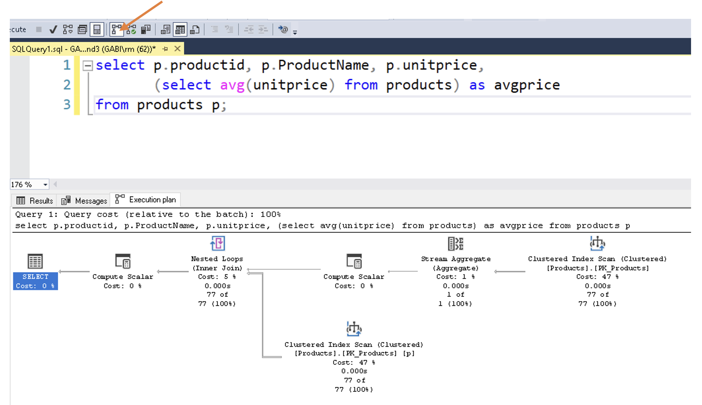

W DataGrip użyj opcji Explain Plan/Explain Analyze


### Wyniki

```sql
--- subquery)
select p.ProductID, p.ProductName, p.UnitPrice, (select avg(unitprice) from products) as avgprice
from Products p

--- join)
select p.productid, p.productname, p.unitprice, avgprices.avgprice
from Products p
inner join (select avg(unitprice) as avgprice from Products) avgprices on 1=1

--- window) 
select p.productid, p.productname, p.unitprice, avg(p.unitprice) over () as avgprice
from Products p
```
Brak porównania czasu wykonania, bo przy tabeli rozmiaru 77 nie ma ono większego sensu.

### MS SQL Server
#### Query with join


Cost: 0.007102

#### Query with widnow function


Cost: 0.0048

#### Query with subquery


Cost: 0.007109

Jak widać najmniejszy koszt ma wersja query z funkcją okna.

### PostgreSQL
#### Query with join


#### Query with widnow function


#### Query with subquery


Ponownie najmniejszy koszt ma wersja query z funkcją okna.

### SQLite
#### Query with join


#### Query with widnow function
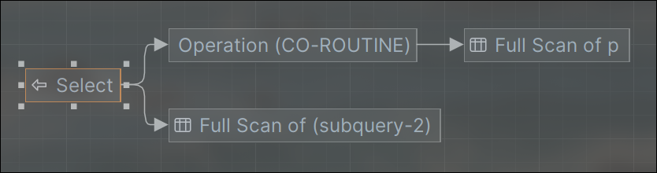

#### Query with subquery


Datagrip nie wpiera dokładnej analizy kosztu w przypadku SQLite.

---

# Zadanie 4

Baza: Northwind, tabela products

Napisz polecenie, które zwraca: id produktu, nazwę produktu, cenę produktu, średnią cenę produktów w kategorii, do której należy dany produkt. Wyświetl tylko pozycje (produkty) których cena jest większa niż średnia cena.

Napisz polecenie z wykorzystaniem podzapytania, join'a oraz funkcji okna. Porównaj zapytania. Porównaj czasy oraz plany wykonania zapytań.

Przetestuj działanie w różnych SZBD (MS SQL Server, PostgreSql, SQLite)

```sql
-- subquery
SELECT 
    productid, 
    productname, 
    unitprice, 
    (SELECT AVG(unitprice) FROM products AS P2 WHERE P2.categoryid = P1.categoryid) AS avg_price 
FROM 
    products AS P1
WHERE 
    unitprice > (SELECT AVG(unitprice) FROM products AS P2 WHERE P2.categoryid = P1.categoryid);

-- join
SELECT
    P1.productid,
    P1.productname,
    P1.unitprice,
    AVG(P2.unitprice) AS avg_price
FROM
    products AS P1
        JOIN
    products AS P2 ON P1.categoryid = P2.categoryid
GROUP BY
    P1.productid, P1.productname, P1.unitprice
HAVING P1.unitprice > AVG(P2.unitprice);

-- window function
WITH ProductsWithAvg AS (
    SELECT 
        productid, 
        productname, 
        unitprice, 
        AVG(unitprice) OVER (PARTITION BY categoryid) AS avg
    FROM 
        products
)
SELECT 
    productid, 
    productname, 
    unitprice, 
    avg
FROM 
    ProductsWithAvg
WHERE 
    unitprice > avg;
```

### Wyniki

### Zapytania

Zapytanie z wykorzystaniem funkcji okna jest krótkie i najprostsze do zrozumienia.

### Czasy

#### PostgreSQL
| Zapytanie | subquery  | join  | window function |
| ---       | ---       | ---   |---              |
| Czas      | 91ms      | 20ms  | 12ms            |

#### SQL Server
| Zapytanie | subquery  | join  | window function |
| ---       | ---       | ---   |---              |
| Czas      | 91ms      | 14ms  | 19ms             |

#### SQLite
| Zapytanie | subquery  | join  | window function |
| ---       | ---       | ---   |---              |
| Czas      | 42ms      | 10ms  | 8ms            |

Najszybszym rozwiązaniem pod względem czasu okazał się SQLite, jednakże liczba wierszy jest na tyle mała, że nie można na tej podstawie nic wywnioskować.

### Plany wykonania

#### PostgreSQL - subquery


#### PostgreSQL - join

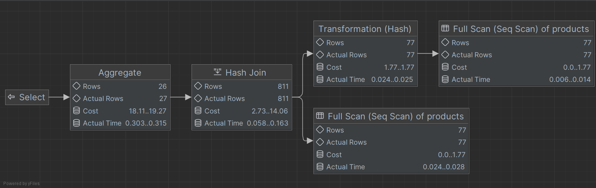

#### PostgreSQL - window function


Koszt zapytań jest najniższy w przypadku funkcji okna.

#### SQL Server - subquery


#### SQL Server - join


#### SQL Server - window function


Koszt zapytań jest również najniższy w przypadku funkcji okna, ale podobny wynik otrzymaliśnmy w przypadu wykorzystania join'a. Oba wyniki są sobie bardzo bliskie. 
    
W porównaniu do PostgreSQL plany zapytań serwera SQL Server są dużo bardziej rozbudowane, co jest szczególnie widoczne w przypadku zapytania wykorzystującego podzapytania. Patrząc jednak na liczbę równoległych ścieżek wykonania operacji dla serwera SQL Server można stwierdzić, że więcej operacji wykonuje on równolegle, gdzie PostgreSQL raczej stara się je sprowadzić do obliczeń sekwencyjnych.

#### SQLite
Dla tego serwera bazodanowego DataGrip nie pozwala zobaczyć analizy zapytań.

---
# Zadanie 5 - przygotowanie

Baza: Northwind

Tabela products zawiera tylko 77 wiersz. Warto zaobserwować działanie na większym zbiorze danych.

Wygeneruj tabelę zawierającą kilka milionów (kilkaset tys.) wierszy

Stwórz tabelę o następującej strukturze:

Skrypt dla SQL Srerver

```sql
create table product_history(
   id int identity(1,1) not null,
   productid int,
   productname varchar(40) not null,
   supplierid int null,
   categoryid int null,
   quantityperunit varchar(20) null,
   unitprice decimal(10,2) null,
   quantity int,
   value decimal(10,2),
   date date,
 constraint pk_product_history primary key clustered
    (id asc )
)
```

Wygeneruj przykładowe dane:

Dla 30000 iteracji, tabela będzie zawierała nieco ponad 2mln wierszy (dostostu ograniczenie do możliwości swojego komputera)

Skrypt dla SQL Srerver

```sql
declare @i int  
set @i = 1  
while @i <= 30000  
begin  
    insert product_history  
    select productid, ProductName, SupplierID, CategoryID,   
         QuantityPerUnit,round(RAND()*unitprice + 10,2),  
         cast(RAND() * productid + 10 as int), 0,  
         dateadd(day, @i, '1940-01-01')  
    from products  
    set @i = @i + 1;  
end;  
  
update product_history  
set value = unitprice * quantity  
where 1=1;
```


Skrypt dla Postgresql

```sql
create table product_history(
   id int generated always as identity not null  
       constraint pkproduct_history
            primary key,
   productid int,
   productname varchar(40) not null,
   supplierid int null,
   categoryid int null,
   quantityperunit varchar(20) null,
   unitprice decimal(10,2) null,
   quantity int,
   value decimal(10,2),
   date date
);
```

Wygeneruj przykładowe dane:

Skrypt dla Postgresql

```sql
do $$  
begin  
  for cnt in 1..30000 loop  
    insert into product_history(productid, productname, supplierid,   
           categoryid, quantityperunit,  
           unitprice, quantity, value, date)  
    select productid, productname, supplierid, categoryid,   
           quantityperunit,  
           round((random()*unitprice + 10)::numeric,2),  
           cast(random() * productid + 10 as int), 0,  
           cast('1940-01-01' as date) + cnt  
    from products;  
  end loop;  
end; $$;  
  
update product_history  
set value = unitprice * quantity  
where 1=1;
```

Skrypt dla SQLite

```sql
CREATE TABLE IF NOT EXISTS product_history (
    id INTEGER PRIMARY KEY AUTOINCREMENT,
    productid INTEGER,
    productname TEXT NOT NULL,
    supplierid INTEGER,
    categoryid INTEGER,
    quantityperunit TEXT,
    unitprice REAL,
    quantity INTEGER,
    value REAL,
    date DATE
);
```

Wygeneruj przykładowe dane:

Skrypt dla SQLite

```sql
WITH RECURSIVE cnt(i) AS (
    SELECT 1
    UNION ALL
    SELECT i+1 FROM cnt WHERE i < 30000
)
INSERT INTO product_history (productid, productname, supplierid, categoryid, quantityperunit, unitprice, quantity, value, date)
SELECT
    productid,
    productname,
    supplierid,
    categoryid,
    quantityperunit,
    ROUND((ABS(RANDOM() % 10)) * unitprice + 10, 2),
    CAST(ABS(RANDOM() % 10) * productid + 10 AS INTEGER),
    0,
    date('1940-01-01', '+' || cnt.i || ' days')
FROM
    products,
    cnt;

UPDATE product_history
SET value = unitprice * quantity;
```

Wykonaj polecenia: `select count(*) from product_history`,  potwierdzające wykonanie zadania

### Wyniki

```sql
select count(*) from product_history
```
### PostgreSQL


### SQL Server


### SQLite


---
# Zadanie 6

Baza: Northwind, tabela product_history

To samo co w zadaniu 3, ale dla większego zbioru danych

Napisz polecenie, które zwraca: id pozycji, id produktu, nazwę produktu, cenę produktu, średnią cenę produktów w kategorii do której należy dany produkt. Wyświetl tylko pozycje (produkty) których cena jest większa niż średnia cena.

Napisz polecenie z wykorzystaniem podzapytania, join'a oraz funkcji okna. Porównaj zapytania. Porównaj czasy oraz plany wykonania zapytań.

Przetestuj działanie w różnych SZBD (MS SQL Server, PostgreSql, SQLite)

### Wyniki

### Zapytania
```sql
-- subquery
SELECT 
    productid, 
    productname, 
    unitprice, 
    (
        SELECT AVG(unitprice) 
        FROM product_history AS P2 
        WHERE P2.categoryid = P1.categoryid
    ) AS avg_price 
FROM 
    product_history AS P1
WHERE 
    unitprice > (
        SELECT AVG(unitprice) 
        FROM product_history AS P2 
        WHERE P2.categoryid = P1.categoryid
    );
```

```sql
-- join
SELECT
    P1.productid,
    P1.productname,
    P1.unitprice,
    AVG(P2.unitprice) AS avg_price
FROM
    product_history AS P1
        JOIN
    product_history AS P2 ON P1.categoryid = P2.categoryid
GROUP BY
    P1.productid, P1.productname, P1.unitprice
HAVING P1.unitprice > AVG(P2.unitprice);
```
```sql
-- window function
WITH ProductsWithAvg AS (
    SELECT 
        productid, 
        productname, 
        unitprice, 
        AVG(unitprice) OVER (PARTITION BY categoryid) AS avg
    FROM 
        product_history
)
SELECT 
    productid, 
    productname, 
    unitprice, 
    avg
FROM 
    ProductsWithAvg
WHERE 
    unitprice > avg;
```

Zapytanie z wykorzystaniem funkcji okna jest krótkie i najprostsze do zrozumienia.

### Czasy
Dla dwóch milionów rekordów w tabelach `product_history` wykonanie zapytań szczególnie w przypadku PostgreSQL trwało bardzo długo. Po kilku minutach zdecydowaliśmy się zmniejszyć ilość rekordów w tabelach. Dopiero po zmniejszeniu ich do 2500 można było uzyskać wyniki w rozsądnym czasie.

#### PostgreSQL
| Zapytanie | subquery  | join   | window function |
| ---       | ---       | ---    |---              |
| Czas      | 3m 46s    | 607ms  | 210ms           |

#### SQL Server
| Zapytanie | subquery  | join  | window function |
| ---       | ---       | ---   |---              |
| Czas      | 1s 659ms  | 207ms | 148ms           |

#### SQLite
| Zapytanie | subquery  | join   | window function |
| ---       | ---       | ---    |---              |
| Czas      | 3s        | 1m 23s | 127ms           |

SQL Server wykazuje znacznie lepszą wydajność w porównaniu do PostgreSQL i SQLite w zapytaniach wykorzystujących podzapytania oraz joiny. SQLite wyróżnia się wyjątkowo szybkim czasem wykonywania window function oraz subquery, lecz znacznie traci na wydajności w przypadku join. PostgreSQL daje najgorsze wyniki w każdym przypadku.

### Plany wykonania

#### PostgreSQL - subquery
  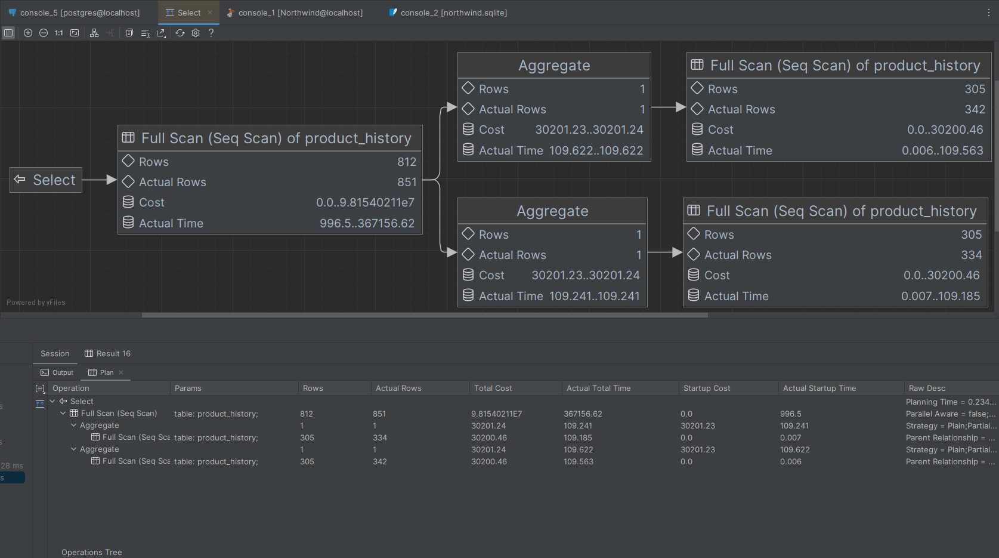

#### PostgreSQL - join
  

#### PostgreSQL - window function
  

Koszt zapytań jest najniższy w przypadku funkcji okna.

#### SQL Server - subquery
  

#### SQL Server - join
  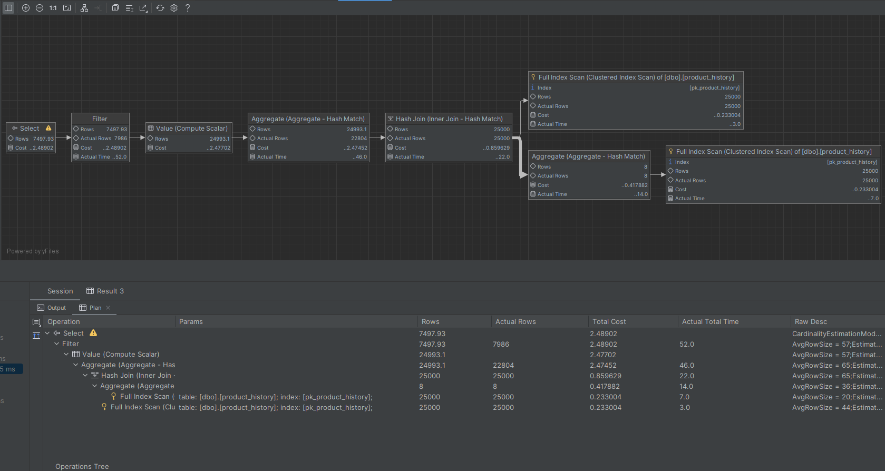

#### SQL Server - window function
  

W przypadku PostgreSQL koszt zapytań jest również najniższy w przypadku funkcji okna.

W porównaniu do PostgreSQL plany zapytań serwera SQL Server są dużo bardziej rozbudowane, co jest szczególnie widoczne w przypadku zapytania wykorzystującego podzapytania. Patrząc jednak na liczbę równoległych ścieżek wykonania operacji dla serwera SQL Server można stwierdzić, że więcej operacji wykonuje on równolegle, gdzie PostgreSQL raczej stara się je sprowadzić do obliczeń sekwencyjnych.

#### SQLite
Dla tego serwera bazodanowego DataGrip nie pozwala zobaczyć analizy zapytań.

---
# Zadanie 7

Baza: Northwind, tabela product_history

Lekka modyfikacja poprzedniego zadania

Napisz polecenie, które zwraca: id pozycji, id produktu, nazwę produktu, cenę produktu oraz
-  średnią cenę produktów w kategorii do której należy dany produkt.
-  łączną wartość sprzedaży produktów danej kategorii (suma dla pola value)
-  średnią cenę danego produktu w roku którego dotyczy dana pozycja
- łączną wartość sprzedaży produktów danej kategorii (suma dla pola value)

Napisz polecenie z wykorzystaniem podzapytania, join'a oraz funkcji okna. Porównaj zapytania. W przypadku funkcji okna spróbuj użyć klauzuli WINDOW.

Porównaj czasy oraz plany wykonania zapytań.

Przetestuj działanie w różnych SZBD (MS SQL Server, PostgreSql, SQLite)

### Wyniki

### Zapytania

```sql
--- subquery
SELECT
    ph.productid,
    ph.ProductName,
    ph.date,
    ph.unitprice,
    (SELECT AVG(unitprice) FROM product_history WHERE CategoryID = ph.CategoryID) AS avgPrice,
    (SELECT SUM(value) FROM product_history WHERE CategoryID = ph.CategoryID) AS total,
    (SELECT AVG(unitprice) FROM product_history WHERE productid = ph.productid AND YEAR(date) = YEAR(ph.date)) AS avgYear
FROM
    product_history ph
WHERE
    ph.UnitPrice > (SELECT AVG(unitprice) FROM product_history WHERE CategoryID = ph.CategoryID)
ORDER BY
    ph.productid, ph.date;
```

```sql
--- join
SELECT
    ph1.productid,
    ph1.ProductName,
    ph1.unitprice,
    ph1.date,
    AVG(ph2.UnitPrice) AS avgPrice,
    SUM(ph2.value) AS total,
    AVG(ph3.UnitPrice) AS avgYear
FROM product_history ph1
JOIN product_history ph2 ON ph2.CategoryID = ph1.CategoryID
JOIN product_history ph3 ON ph3.productid = ph1.productid AND YEAR(ph1.date) = YEAR(ph3.date)
GROUP BY
    ph1.productid,
    ph1.ProductName,
    ph1.unitprice,
    ph1.date
HAVING ph1.unitprice > AVG(ph2.UnitPrice)
ORDER BY ph1.productid, ph1.date;
```

```sql
--- window function
SELECT
    nph1.productid,
    nph1.ProductName,
    nph1.unitprice,
    nph1.date,
    nph1.avgPrice,
    nph1.total,
    nph1.avgYear
FROM (
         SELECT
             ph.productid,
             ph.ProductName,
             ph.unitprice,
             ph.date,
             AVG(ph.unitprice) OVER(PARTITION BY ph.CategoryID) AS avgPrice,
             SUM(ph.value) OVER(PARTITION BY ph.CategoryID) AS total,
             AVG(ph.unitprice) OVER(PARTITION BY ph.productid, YEAR(ph.date)) AS avgYear
         FROM product_history ph
     ) AS nph1
ORDER BY nph1.productid, nph1.date;
```

Mimo, że każde z zapytań jest długie, to zapytanie oparte na funkcji okna jest bardziej czytelne niż zapytania z subzapytaniami i złączeniami. Funkcje okna umożliwiają bardziej elastyczne obliczenia agregacyjne bez konieczności tworzenia wielu połączeń i subzapytań.

### Czasy

Dla dwóch milionów rekordów w tabelach `product_history` wykonanie zapytań szczególnie w przypadku PostgreSQL trwało bardzo długo. Po kilku minutach zdecydowaliśmy się zmniejszyć ilość rekordów w tabelach. Dopiero po zmniejszeniu ich do 1000 można było uzyskać wyniki w rozsądnym czasie.

#### PostgreSQL
| Zapytanie | subquery  | join     | window function |
| ---       | ---       | ---      |---              |
| Czas      | 3min 25s  | 2s 156ms | 235ms           |

#### SQL Server
| Zapytanie | subquery  | join     | window function |
| ---       | ---       | ---      |---              |
| Czas      | 104ms     | 1s 802ms | 118ms           |

#### SQLite
| Zapytanie | subquery  | join     | window function |
| ---       | ---       | ---      |---              |
| Czas      | 151ms     | 411ms    | 83ms            |

SQL Server wyróżnia się najkrótszym czasem wykonania funkcji okna oraz podzapytania, natomiast traci sporo czasu w przypadku zapytań korzystających z join. SQLite osiąga najkrótszy czas w przypadku funkcji okna i również niski czas przy podzapytaniu. PostgreSQL jest najmniej efektywny w przypadku podzapytań oraz join, jednak funkcje okna wykonują się stosunkowo szybko w porównaniu do pozostałych operacji.

Na podstawie otrzymanych wyników widać, jak bardzo funkcje okna potrafią przyspieszyć zapytania.

### Plany wykonania

#### PostgreSQL - subquery


#### PostgreSQL - join
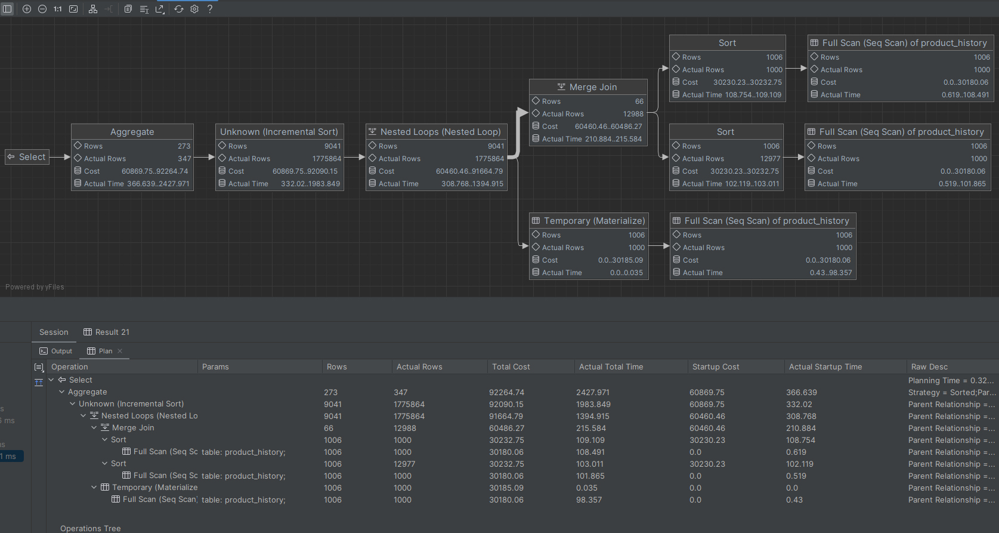

#### PostgreSQL - window function


Najniższy koszt zapytania jest w przypadku wykorzystującym funkcje okna. Różnica jest kilkukrotna.

#### SQL Server - subquery


#### SQL Server - join


#### SQL Server - window function


W przypadku SQL Server również najniższy koszt zapytania jest w przypadku wykorzystującym funkcje okna.

W porównaniu do PostgreSQL plany zapytań serwera SQL Server są dużo bardziej rozbudowane, co jest szczególnie widoczne w przypadku zapytania wykorzystującego podzapytania. Patrząc jednak na liczbę równoległych ścieżek wykonania operacji dla serwera SQL Server można stwierdzić, że więcej operacji wykonuje on równolegle, gdzie PostgreSQL raczej stara się je sprowadzić do obliczeń sekwencyjnych.

#### SQLite
Dla tego serwera bazodanowego DataGrip nie pozwala zobaczyć analizy zapytań.

---
# Zadanie 8 - obserwacja

Funkcje rankingu, `row_number()`, `rank()`, `dense_rank()`

Wykonaj polecenie, zaobserwuj wynik. Porównaj funkcje row_number(), rank(), dense_rank()

```sql 
select productid, productname, unitprice, categoryid,  
    row_number() over(partition by categoryid order by unitprice desc) as rowno,  
    rank() over(partition by categoryid order by unitprice desc) as rankprice,  
    dense_rank() over(partition by categoryid order by unitprice desc) as denserankprice  
from products;
```


Zadanie

Spróbuj uzyskać ten sam wynik bez użycia funkcji okna

```sql
SELECT 
    p.productid, p.productname, p.unitprice, p.categoryid,
	(
	select count(*) + 1 from products p2
	where (p2.categoryid = p.categoryid and p2.UnitPrice > p.UnitPrice) or (p2.categoryid = p.categoryid and p2.UnitPrice = p.UnitPrice and p2.ProductID < p.ProductID)
	) as rownno,
    (SELECT COUNT(*) + 1
     FROM products p2
     WHERE p2.categoryid = p.categoryid AND p2.unitprice > p.unitprice) AS rankprice,
    (SELECT COUNT(distinct unitprice) + 1
     FROM products p2
     WHERE p2.categoryid = p.categoryid AND p2.unitprice > p.unitprice) AS denserankprice
FROM products p
order by categoryid asc, unitprice desc, productid asc;
```


---
# Zadanie 9

Baza: Northwind, tabela product_history

Dla każdego produktu, podaj 4 najwyższe ceny tego produktu w danym roku. Zbiór wynikowy powinien zawierać:
- rok
- id produktu
- nazwę produktu
- cenę
- datę (datę uzyskania przez produkt takiej ceny)
- pozycję w rankingu

Uporządkuj wynik wg roku, nr produktu, pozycji w rankingu.

### Wyniki

#### Zapytania
```sql
--- PostgreSQL
WITH RankedPrice AS (
    SELECT
        EXTRACT(year from PH.date) AS Year,
        PH.ProductID,
        PH.ProductName,
        PH.UnitPrice,
        ROW_NUMBER() OVER (PARTITION BY PH.ProductID, EXTRACT(year from PH.date) ORDER BY PH.UnitPrice DESC) AS PriceRank
    FROM
        product_history PH
)
SELECT
    *
FROM
    RankedPrice
ORDER BY
    Year, ProductID, PriceRank;
```

```sql
--- SQLServer
WITH RankedPrice AS (
    SELECT
        YEAR(PH.Date) AS Year,
        PH.ProductID,
        PH.ProductName,
        PH.UnitPrice,
        ROW_NUMBER() OVER (PARTITION BY PH.ProductID, YEAR(PH.Date) ORDER BY PH.UnitPrice DESC) AS PriceRank
    FROM
        product_history PH
)
SELECT
    *
FROM
    RankedPrice
ORDER BY
    Year, ProductID, PriceRank;
```

```sql
--- SQLite
WITH RankedPrice AS (
    SELECT
        strftime('%Y', PH.date) AS Year,
        PH.ProductID,
        PH.ProductName,
        PH.UnitPrice,
        ROW_NUMBER() OVER (PARTITION BY PH.ProductID, strftime('%Y', PH.date) ORDER BY PH.UnitPrice DESC) AS PriceRank
    FROM
        product_history PH
)
SELECT
    *
FROM
    RankedPrice
ORDER BY
    Year, ProductID, PriceRank;
```

Spróbuj uzyskać ten sam wynik bez użycia funkcji okna, porównaj wyniki, czasy i plany zapytań. Przetestuj działanie w różnych SZBD (MS SQL Server, PostgreSql, SQLite)

### Wyniki

### Zapytania

```sql
--- PostgreSQL
SELECT
    EXTRACT(year from PH.date) AS Year,
    PH.ProductID,
    PH.ProductName,
    PH.UnitPrice,
    (
        SELECT
            COUNT(DISTINCT PH2.UnitPrice) + 1
        FROM
            product_history PH2
        WHERE
            EXTRACT(year from PH2.date) = EXTRACT(year from PH.date)
            AND PH2.ProductID = PH.ProductID
            AND PH2.UnitPrice > PH.UnitPrice
    ) AS PriceRank
FROM
    product_history PH
ORDER BY
    Year, ProductID, PriceRank;
```

```sql
--- SQLServer
SELECT
    YEAR(PH.date) AS Year,
    PH.ProductID,
    PH.ProductName,
    PH.UnitPrice,
    (
        SELECT
            COUNT(DISTINCT PH2.UnitPrice) + 1
        FROM
            product_history PH2
        WHERE
            YEAR(PH2.date) = YEAR(PH.date)
          AND PH2.ProductID = PH.ProductID
          AND PH2.UnitPrice > PH.UnitPrice
    ) AS PriceRank
FROM
    product_history PH
ORDER BY
    Year, ProductID, PriceRank;
```

```sql
--- SQLite
SELECT
    strftime('%Y', PH.date) AS Year,
    PH.ProductID,
    PH.ProductName,
    PH.UnitPrice,
    (
        SELECT
            COUNT(DISTINCT PH2.UnitPrice) + 1
        FROM
            product_history PH2
        WHERE
            strftime('%Y', PH2.date) = strftime('%Y', PH.date)
          AND PH2.ProductID = PH.ProductID
          AND PH2.UnitPrice > PH.UnitPrice
    ) AS PriceRank
FROM
    product_history PH
ORDER BY
    Year, ProductID, PriceRank;
```

### Czasy

W tym zadaniu również wykorzystano tabelę `product_history` z liczbą rekordów równą 2500.

#### PostgreSQL
| Zapytanie | bez window function  | z window function |
| ---       | ---                  | ---               |
| Czas      | 49s                  | 195ms             |

#### SQL Server
| Zapytanie | bez window function  | z window function |
| ---       | ---                  | ---               |
| Czas      | 152ms                | 71ms              |

#### SQLite
| Zapytanie | bez window function  | z window function |
| ---       | ---                  | ---               |
| Czas      | 448ms                | 66ms              |

Wyniki testów pokazują znaczącą różnicę w czasie wykonania zapytań pomiędzy użyciem funkcji okna a alternatywnym podejściem bez ich wykorzystania. W każdym systemie zarządzania bazą danych (SZBD), użycie funkcji okna znacznie przyspiesza wykonanie zapytania w porównaniu do alternatywnego podejścia bez ich wykorzystania. W szczególności w PostgreSQL różnica jest ogromna, podczas gdy w SQLite i SQL Server różnica również jest, ale mniej wyraźna w porównaniu z pozostałymi dwoma systemami.

### Plany wykonania

#### PostgreSQL - bez window function
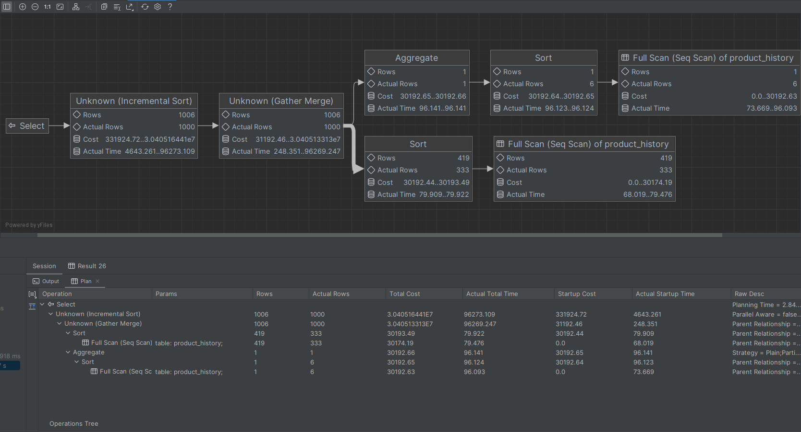

#### PostgreSQL - z window function
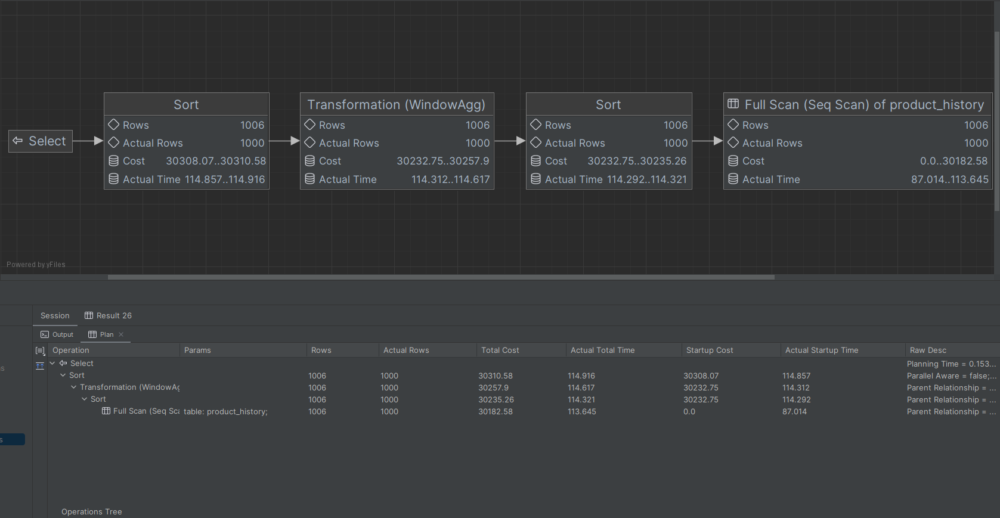

Koszt w przypadku wykorzystującym funkcje okna jest znacznie niższy.

#### SQL Server - bez window function
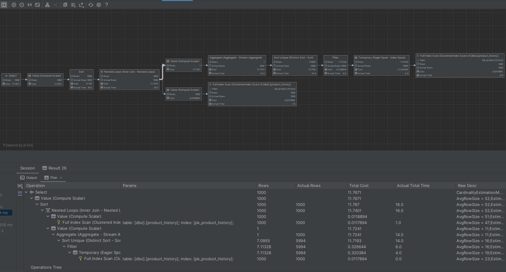

#### SQL Server - z window function


Koszt w przypadku wykorzystującym funkcje okna jest znacznie niższy.

Plany wykonań dla obu serwerów bazodanowych są proste i podobne do siebie.

#### SQLite
Dla tego serwera bazodanowego DataGrip nie pozwala zobaczyć analizy zapytań.

---
# Zadanie 10 - obserwacja

Funkcje `lag()`, `lead()`

Wykonaj polecenia, zaobserwuj wynik. Jak działają funkcje `lag()`, `lead()`

```sql
select productid, productname, categoryid, date, unitprice,  
       lag(unitprice) over (partition by productid order by date)   
as previousprodprice,  
       lead(unitprice) over (partition by productid order by date)   
as nextprodprice  
from product_history  
where productid = 1 and year(date) = 2022  
order by date;  
  
with t as (select productid, productname, categoryid, date, unitprice,  
                  lag(unitprice) over (partition by productid   
order by date) as previousprodprice,  
                  lead(unitprice) over (partition by productid   
order by date) as nextprodprice  
           from product_history  
           )  
select * from t  
where productid = 1 and year(date) = 2022  
order by date;
```

### Wyniki

#### Komentarz
Funkcja *lag(unitprice)* zwraca cenę produktu z poprzedniego rekordu (uporządkowanego według daty), natomiast *lead(unitprice)* zwraca cenę produktu z następnego rekordu.
Funkcje te pozwalają na porównywanie bieżących wartości z poprzednimi lub następnymi wartościami w uporządkowanym zestawie danych.

Zadanie

Spróbuj uzyskać ten sam wynik bez użycia funkcji okna, porównaj wyniki, czasy i plany zapytań. Przetestuj działanie w różnych SZBD (MS SQL Server, PostgreSql, SQLite)

### Wyniki

#### Zapytania

```sql
--- Zapytanie 1
SELECT
    ph1.productid,
    ph1.productname,
    ph1.categoryid,
    ph1.date,
    ph1.unitprice AS currentprodprice,
    ph2.unitprice AS previousprodprice,
    ph3.unitprice AS nextprodprice
FROM
    product_history ph1
LEFT JOIN
    product_history ph2 ON ph1.productid = ph2.productid
                       AND ph1.date > ph2.date
                       AND year(ph1.date) = 2022
                       AND ph2.date = (
                           SELECT MAX(date)
                           FROM product_history
                           WHERE productid = ph1.productid
                             AND date < ph1.date
                             AND year(date) = 2022
                       )
LEFT JOIN
    product_history ph3 ON ph1.productid = ph3.productid
                       AND ph1.date < ph3.date
                       AND year(ph1.date) = 2022
                       AND ph3.date = (
                           SELECT MIN(date)
                           FROM product_history
                           WHERE productid = ph1.productid
                             AND date > ph1.date
                             AND year(date) = 2022
                       )
WHERE
    ph1.productid = 1
    AND year(ph1.date) = 2022
ORDER BY
    ph1.date;
```

```sql
--- Zapytanie 2
WITH t AS (
    SELECT
        ph1.productid,
        ph1.productname,
        ph1.categoryid,
        ph1.date,
        ph1.unitprice AS currentprodprice,
        ph2.unitprice AS previousprodprice,
        ph3.unitprice AS nextprodprice
    FROM
        product_history ph1
    LEFT JOIN
        product_history ph2 ON ph1.productid = ph2.productid
                           AND ph1.date > ph2.date
                           AND year(ph1.date) = 2022
                           AND ph2.date = (
                               SELECT MAX(date)
                               FROM product_history
                               WHERE productid = ph1.productid
                                 AND date < ph1.date
                                 AND year(date) = 2022
                           )
    LEFT JOIN
        product_history ph3 ON ph1.productid = ph3.productid
                           AND ph1.date < ph3.date
                           AND year(ph1.date) = 2022
                           AND ph3.date = (
                               SELECT MIN(date)
                               FROM product_history
                               WHERE productid = ph1.productid
                                 AND date > ph1.date
                                 AND year(date) = 2022
                           )
)
SELECT *
FROM t
WHERE productid = 1
    AND year(date) = 2022
ORDER BY date;
```

Zapytania z funkcjami okna są znacznie krótsze, bardziej zwięzłe i czytelne niż równoważne zapytania bez funkcji okna.

### Czasy

Tutaj użyto tabeli `product_history` z liczbą rekordów równą 25000.

#### PostgreSQL
| Zapytanie | zapytanie 1 z window function  | zapytanie 2 z window function | zapytanie 1 bez window function  | zapytanie 2 bez window function |
| ---       | ---                            | ---                           | ---                              | ---                             |
| Czas      | 380ms                          | 321ms                         | 394ms                            | 340ms                           |

#### SQL Server
| Zapytanie | zapytanie 1 z window function  | zapytanie 2 z window function | zapytanie 1 bez window function  | zapytanie 2 bez window function |
| ---       | ---                            | ---                           | ---                              | ---                             |
| Czas      | 135ms                          | 189ms                         | 142ms                            | 184ms                           |

#### SQLite
| Zapytanie | zapytanie 1 z window function  | zapytanie 2 z window function | zapytanie 1 bez window function  | zapytanie 2 bez window function |
| ---       | ---                            | ---                           | ---                              | ---                             |
| Czas      | 118ms                          | 106ms                         | 135ms                            | 114ms                           |

W przypadku PostgreSQL i SQLite, zapytania z funkcjami okna są nieznacznie szybsze niż równoważne zapytania bez funkcji okna.
W przypadku SQL Server, zapytania bez funkcji okna są nieco szybsze niż z funkcjami okna.

#### Plany wykonania

#### PostgreSQL - zapytanie 1 z window function
  

#### PostgreSQL - zapytanie 1 bez window function
  

#### PostgreSQL - zapytanie 2 z window function
  

#### PostgreSQL - zapytanie 2 bez window function
  

Zapytania wykorzystujące funkcje okna mają wielokrotnie mniejszy koszt wykonania, a ich plan wykonania jest prosty i przejrzysty, gdzie w przypadku zapytania niewykorzystującego funkcji okna mamy bardziej skomplikowany.

#### SQL Server - zapytanie 1 z window function
  

#### SQL Server - zapytanie 1 bez window function
  

#### SQL Server - zapytanie 2 z window function
  

#### SQL Server - zapytanie 2 bez window function
  

W tym przypadku również zapytania wykorzystujące funkcje okna mają wielokrotnie mniejszy koszt wykonania i prostszy plan.

**SQLite**
Dla tego serwera bazodanowego DataGrip nie pozwala zobaczyć analizy zapytań.

---
# Zadanie 11

Baza: Northwind, tabele customers, orders, order details

Napisz polecenie które wyświetla inf. o zamówieniach

Zbiór wynikowy powinien zawierać:
- nazwę klienta, nr zamówienia,
- datę zamówienia,
- wartość zamówienia (wraz z opłatą za przesyłkę),
- nr poprzedniego zamówienia danego klienta,
- datę poprzedniego zamówienia danego klienta,
- wartość poprzedniego zamówienia danego klienta.

### Wyniki

```sql
with Data as (select
    O.OrderID,
    C.CompanyName,
    O.OrderDate,
    O.Freight + sum(OD.UnitPrice * OD.Quantity * (1 - OD.Discount)) as Cost,
    lag(O.OrderID) over (partition by C.CustomerID order by O.OrderDate) as PrevOrderID,
    lag(O.OrderDate) over (partition by C.CustomerID order by O.OrderDate) as PrevOrderDate
from
    Orders O
join Customers C
    on O.CustomerID = C.CustomerID
join [Order Details] OD
    on O.OrderID = OD.OrderID
group by
    O.OrderID, C.CustomerID, C.CompanyName, O.OrderDate, O.Freight)
select
    Data.*,
    O.Freight + sum(OD.UnitPrice * OD.Quantity * (1 - OD.Discount)) as PrevCost
from
    Data
left join Orders O
    on O.OrderID = PrevOrderID
left join [Order Details] OD
    on O.OrderID = OD.OrderID
group by
    O.Freight, Data.OrderID, Data.CompanyName, Data.OrderDate, Data.Cost, Data.PrevOrderID, Data.PrevOrderDate
order by
    Data.OrderID;
```

![[Pasted image 20240311192916.png]]

Komentarz:
Zapytanie zostało przetestowane zarówno na bazie msSql i postgresSql. W obu przypadkach czas wykonania wynosił mniej niż 500ms. Analiza planu wykonania także nie wskazała żadnych znaczących różnic pomiędzy sbzd.

---
# Zadanie 12 - obserwacja

Funkcje `first_value()`, `last_value()`

Wykonaj polecenia, zaobserwuj wynik. Jak działają funkcje `first_value()`, `last_value()`. Skomentuj uzyskane wyniki. Czy funkcja `first_value` pokazuje w tym przypadku najdroższy produkt w danej kategorii, czy funkcja `last_value()` pokazuje najtańszy produkt? Co jest przyczyną takiego działania funkcji `last_value`? Co trzeba zmienić żeby funkcja last_value pokazywała najtańszy produkt w danej kategorii?

```sql
select productid, productname, unitprice, categoryid,  
    first_value(productname) over (partition by categoryid   
order by unitprice desc) first,  
    last_value(productname) over (partition by categoryid   
order by unitprice desc) last
from products  
order by categoryid, unitprice desc;
```

### Wyniki


Domyślne okno dla funkcji `first_value` oraz `last_value` to `RANGE BETWEEN UNBOUNDED PRECEDING AND CURRENT ROW`, które bierze odpowiednio pierwszą albo ostatnią wartość dotychczas.

Aby funkcja `last_value` pokazywała najtańszy produkt w danej kategorii należy zamienić domyślny zakres funkcji z `RANGE BETWEEN UNBOUNDED PRECEDING AND CURRENT ROW` na `ROWS BETWEEN UNBOUNDED PRECEDING AND UNBOUNDED FOLLOWING`. Trzeba zmodyfikować nasze zapytanie w sposób następujący:
```sql
select productid, productname, unitprice, categoryid,
       first_value(productname) over (partition by categoryid
           order by unitprice desc ROWS BETWEEN UNBOUNDED PRECEDING AND UNBOUNDED FOLLOWING) first,
       last_value(productname) over (partition by categoryid
           order by unitprice desc ROWS BETWEEN UNBOUNDED PRECEDING AND UNBOUNDED FOLLOWING) last
from products
order by categoryid, unitprice desc;
```


Zadanie

Spróbuj uzyskać ten sam wynik bez użycia funkcji okna, porównaj wyniki, czasy i plany zapytań. Przetestuj działanie w różnych SZBD (MS SQL Server, PostgreSql, SQLite)

### Wyniki

#### Zapytania
```sql
--- PostgreSQL
select p.productid, p.productname, p.unitprice, p.categoryid,
       (select p2.productname from product_history p2 where p2.CategoryID=p.CategoryID order by p2.UnitPrice desc limit 1) first,
       (select p2.productname from product_history p2 where p2.CategoryID=p.CategoryID order by p2.UnitPrice limit 1) last
from product_history p
order by p.categoryid, p.unitprice desc;
```

```sql
--- SQLServer
select p.productid, p.productname, p.unitprice, p.categoryid,
       (select top 1 p2.productname from product_history p2 where p2.CategoryID=p.CategoryID order by p2.UnitPrice desc) first,
       (select top 1 p2.productname from product_history p2 where p2.CategoryID=p.CategoryID order by p2.UnitPrice) last
from product_history p
order by p.categoryid, p.unitprice desc;
```

```sql
--- SQLite
select p.productid, p.productname, p.unitprice, p.categoryid,
       (select p2.productname from product_history p2 where p2.CategoryID=p.CategoryID order by p2.UnitPrice desc limit 1) first,
       (select p2.productname from product_history p2 where p2.CategoryID=p.CategoryID order by p2.UnitPrice limit 1) last
from product_history p
order by p.categoryid, p.unitprice desc;
```

### Czasy

Tutaj użyto tabeli `product_history` z liczbą rekordów równą 2500.

#### PostgreSQL
| Zapytanie | funkcja okna | bez funkcji okna  |
| ---       | ---          | ---               |
| Czas      | 70 ms        | 1m 36s            | 

#### SQL Server
| Zapytanie | funkcja okna | bez funkcji okna  |
| ---       | ---          | ---               |
| Czas      | 71ms         | 100 ms            | 

#### SQLite
| Zapytanie | funkcja okna | bez funkcji okna  |
| ---       | ---          | ---               |
| Czas      | 60 ms        | 150ms              | 

W każdym przypadku wykorzystując funkcje okna otrzymujemy najniższy czas. Widoczna różnica jest dla PostgreSQL oraz dla SQLite. W przypadku SQLServera oba zapytania są szybkie. Najwolniejszą bazą okazał się PostgreSQL.

### Plany wykonania

#### PostgreSQL - funkcja okna


#### PostgreSQL - bez funkji okna
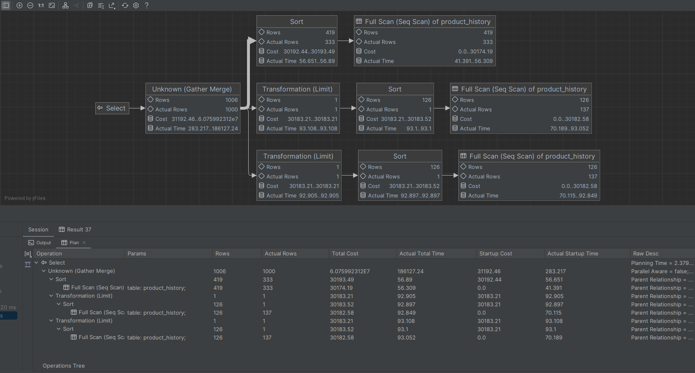

Koszt w przypadku wykorzystującym funkcje okna jest wielokrotnie niższy.

#### SQL Server - funkcja okna
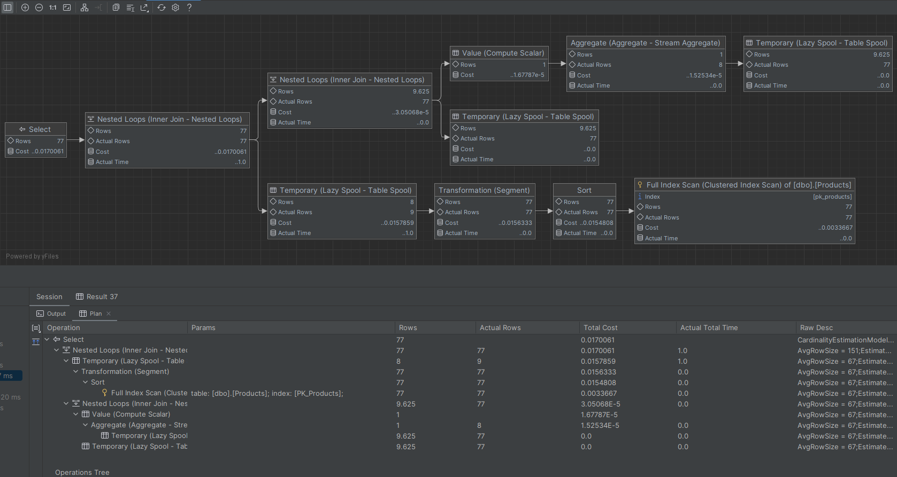

#### SQL Server - bez funkji okna
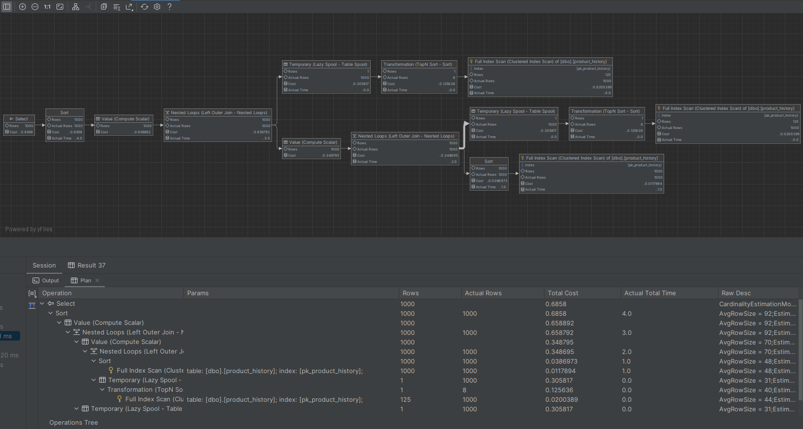

W przypadku SQL Servera również koszt w przypadku wykorzystującym funkcje okna jest wielokrotnie niższy.

W przypadku SQL Servera plan zapytań jest bardziej rozgałęziony przez co jest łatwiejszy do zwrównoleglenia, co może być przyczyną szybszego czasu wykonania.

#### SQLite
Dla tego serwera bazodanowego DataGrip nie pozwala zobaczyć analizy zapytań.

---
# Zadanie 13

Baza: Northwind, tabele orders, order details

Napisz polecenie które wyświetla inf. o zamówieniach

Zbiór wynikowy powinien zawierać:
- Id klienta,
- nr zamówienia,
- datę zamówienia,
- wartość zamówienia (wraz z opłatą za przesyłkę),
- dane zamówienia klienta o najniższej wartości w danym miesiącu
	- nr zamówienia o najniższej wartości w danym miesiącu
	- datę tego zamówienia
	- wartość tego zamówienia
- dane zamówienia klienta o najwyższej wartości w danym miesiącu
	- nr zamówienia o najniższej wartości w danym miesiącu
	- datę tego zamówienia
	- wartość tego zamówienia

### Wyniki

```sql
with Data as  
         (  
         select o.CustomerID as CustomerID, o.OrderID, o.OrderDate, o.Freight+od.UnitPrice*od.Quantity-od.Discount as value  
         from orders o  
         join orderdetails od  
            on od.OrderID = o.OrderID)  
select  
    d.CustomerID, d.OrderDate,d.OrderDate,d.value,  
    last_value(concat(d.OrderID,' ', d.OrderDate,' ', d.value)) over (partition by d.CustomerID order by d.value desc rows between unbounded preceding and unbounded following ) min_value_order,  
    first_value(concat(d.OrderID,' ', d.OrderDate,' ', d.value)) over (partition by d.CustomerID order by d.value desc ) max_value_order  
from Data d
```

Rezultat:

![[Pasted image 20240315194411.png]]

Czas wykonania około 0.5 sekundy, zapytanie przetestowane dla MsSql, Postgres i SQLite. Nie znaleźliśmy żadnych znaczących różnic pomiędzy poszczególnymi sbzd.

Plan wykonania: 
![[Pasted image 20240315194348.png]]

---
# Zadanie 14

Baza: Northwind, tabela product_history

Napisz polecenie które pokaże wartość sprzedaży każdego produktu narastająco od początku każdego miesiąca. Użyj funkcji okna

Zbiór wynikowy powinien zawierać:
- id pozycji
- id produktu
- datę
- wartość sprzedaży produktu w danym dniu
- wartość sprzedaży produktu narastające od początku miesiąca

### Wyniki


#### MS SQL Server

```sql
with Data as (
    select
        id,
        productid,
        date,
        sum(unitprice*quantity) over(partition by productid,convert(date,date)) dayValue
    from product_history
)
select distinct
    d.*,
    sum(d.dayValue) over(partition by d.productid, year(d.date), month(d.date) order by day(d.date) rows between unbounded preceding and current row) as accumulated
from Data d
order by d.date
```
Czas wykonania: 12s


Wersja bez funkcji okna. Wykonanie trwało bardzo długo więc dodatkowo dodałem filtrowanie po ProductId.

```sql
-- MS SQL Server)
with Data as (
    select
        id,
        productid,
        date,
        sum(unitprice*quantity) as dayValue
    from product_history
    where productid=1
    group by productid, convert(date, date), id
)
select distinct
    d.*,
    (select sum(d2.dayValue)
     from Data d2
     where d2.productid = d.productid and
           year(d2.date) = year(d.date) and
           month(d2.date) = month(d.date) and
           day(d2.date) <= day(d.date)
    ) as accumulated
from Data d
order by d.date
```
Czas wykonania: 14min


#### PostreSQL
Wersja z funkcją okna:
```sql
with Data as (
    select
        id,
        productid,
        date,
        sum(value) over(partition by productid, date) dayValue
    from product_history
)
select distinct
    d.*,
    sum(d.dayValue) over(
        partition by d.productid, date_part('Year', d.date), date_part('Month', d.date)
        order by date_part('Day', d.date)
        rows between unbounded preceding and current row
    ) as accumulated
from Data d
order by d.productid, d.date
```
Czas wykonania: 9s


Wersja bez funkcji okna:
```sql
with Data as (
    select
        id,
        productid,
        date,
        sum(unitprice*quantity) as dayValue
    from product_history
    group by productid, date, id
)
select distinct
    d.*,
    sum(d2.dayValue) over(partition by d.productid, date_part('Year', d.date), date_part('Month', d.date) order by date_part('Day', d.date) ) as accumulated
from Data d join Data d2
    on d.productid = d2.productid and
       date_part('Year', d.date) = date_part('Year', d2.date) and
       date_part('Month', d.date) = date_part('Month', d2.date) and
       date_part('Day', d.date) >= date_part('Day', d2.date)
order by d.date
```
Czas wykonania: 6m35s


#### SQLite
Wersja z funkcją okna:
```sql
with Data as (
    select
        id,
        productid,
        date,
        sum(value) over(partition by productid, date) dayValue
    from product_history
)
select distinct
    d.*,
    sum(d.dayValue) over(
        partition by d.productid, strftime('%Y', d.date), strftime('%m', d.date)
        order by strftime('%d', d.date)
        rows between unbounded preceding and current row
    ) as accumulated
from Data d
order by d.productid, d.date
```
Czas wykonania: 4m26s


Wersja bez funkcji okna. Ponownie dodałem filtrowanie po ProductId ze względu na długi czas wykonania.
```sql
with Data as (
    select
        id,
        productid,
        date,
        sum(unitprice*quantity) as dayValue
    from product_history
    where productid=1
    group by productid, date, id
)
select
    d.*,
    sum(d2.dayValue) over(partition by d.productid, strftime('%Y %m', d.date) order by strftime('%d', d.date) ) as accumulated
from Data d join Data d2
                 on d.productid = d2.productid and
                    strftime('%Y %m', d.date) = strftime('%Y %m', d2.date) and
                    strftime('%d', d.date) >= strftime('%d', d2.date)
order by d.date
```
Czas wykonania: 20min+, zatrzymałem po 20 minutach


W każdym z przypadków wersja query z użyciem funkcji okna jest przytłaczająco szybsza od wersji unikającej tej funkcji. Jest ona też zdecydowanie czytelniejsza.
Dla query bez funkcji okna PostgreSQL wydaje się lepiej od SQL Server'a zrównoleglać operacje w planie wykonania co rzutuje na rzeczywisty czas wykonania.
Zarówno w przypadku SQL Server jak i PostgreSQL plan wykonania query z funkcją okna jest w pełni liniowy, ale w przypadku PostgreSQL jest on nieco krótszy.
SQLite w tym przypadku nie poradził sobie dobrze z zapytaniem o tym stopniu skomplikowania i tak wielu wierszach. Wynik czasowy dla query z funkcją okna może być tolerowany, ale ten bez niej już nie.

---
# Zadanie 15

Wykonaj kilka "własnych" przykładowych analiz. Czy są jeszcze jakieś ciekawe/przydatne funkcje okna (z których nie korzystałeś w ćwiczeniu)? Spróbuj ich użyć w zaprezentowanych przykładach.

### Wyniki

**Klauzula `RANGE`**
```sql
WITH sums AS (  
    SELECT o.customerid,  
           o.orderdate,  
        SUM(od.unitprice * od.quantity) as sum  
        FROM orders o  
        LEFT JOIN orderdetails od  
        ON o.orderid = od.orderid  
        GROUP BY o.customerid, o.orderdate  
)  
SELECT customerid,  
       orderdate,  
       sum,  
       AVG(sum) OVER (  
           PARTITION BY customerid  
           ORDER BY orderdate ASC  
           RANGE BETWEEN INTERVAL '31' DAY PRECEDING AND CURRENT ROW  
           ) AS moving_avg  
FROM sums
```
Za pomocą klauzuli `RANGE`, możemy określić zakres danych, który ma być uwzględniony w analizie. W powyższym przykładzie używamy tej klauzuli do obliczenia tzw. **Moving Average** czyli średniej liczonej z ostatnich 31 dni. Dodatkowo użyliśmy specjalnej konstrukcji wspieranej przez niektóre silniki bazodanowe: 
```sql
INTERVAL '31' DAY PRECEDING
```
Postgres (w przeciwieństwie do MsSql) wspiera używanie typów numerycznych i dat w klauzuli range, zatem powyższa konstrukcja tworzy ramkę z tych wierszy dla których zamówienie miało miejsce najwyżej 31 dni przed datą zamówienia obecnego wiersza. 

Wynik:
![[Pasted image 20240314224050.png]]


**Klauzula `ROWS`**
```sql
WITH sums AS (  
    SELECT  
        o.orderdate,  
        SUM(od.unitprice * od.quantity) as sum  
        FROM orders o  
        LEFT JOIN orderdetails od  
        ON o.orderid = od.orderid  
        GROUP BY o.orderdate  
) SELECT orderdate,  
         SUM(sum) OVER (  
             ORDER BY orderdate  
             ROWS BETWEEN UNBOUNDED PRECEDING AND 1 FOLLOWING  
             ) as sum_till_this_date  
FROM sums
```
Za pomocą klauzuli `ROWS`, również analiza jest przeprowadzana dla każdej kategorii produktu, ale zakres danych jest definiowany w trochę inny sposób o czym mowa w następnym podpunkcie. Powyższa funkcja liczy sumę zamówień z wszystkich poprzednich dni oraz następnego dnia dla danego wiersza.
![[Pasted image 20240314230002.png]]

Warto zaznaczyć że jeśli nie używamy klauzuli **ORDER BY** to przetwarzana ramka jest równa:
```sql
ROWS BETWEEN UNBOUNDED PRECEDING AND UNOBUNDED FOLLOWING
```
Natomiast jeśli użyjemy klauzuli **ORDER BY** to przetwarzana ramka jest równa:
```sql
ROWS BETWEEN UNBOUNDED PREEDING AND CURRENT ROW
```
Zatem poniższe zapytania są równoważne
```sql
WITH sums AS (  
    SELECT  
        o.orderdate,  
        SUM(od.unitprice * od.quantity) as sum  
        FROM orders o  
        LEFT JOIN orderdetails od  
        ON o.orderid = od.orderid  
        GROUP BY o.orderdate  
) SELECT orderdate,  
         SUM(sum) OVER (  
             ORDER BY orderdate  
             ROWS BETWEEN UNBOUNDED PRECEDING AND CURRENT ROW  
             ) as sum_till_this_date  
FROM sums

--AND

WITH sums AS (  
    SELECT  
        o.orderdate,  
        SUM(od.unitprice * od.quantity) as sum  
        FROM orders o  
        LEFT JOIN orderdetails od  
        ON o.orderid = od.orderid  
        GROUP BY o.orderdate  
) SELECT orderdate,  
         SUM(sum) OVER (  
             ORDER BY orderdate  
             ) as sum_till_this_date  
FROM sums
```
### RANGE vs ROWS

Cytując dokumentacje postgresa (https://www.postgresql.org/docs/current/sql-expressions.html#SYNTAX-WINDOW-FUNCTIONS):

> In `ROWS` mode, the _`offset`_ must yield a non-null, non-negative integer, and the option means that the frame starts or ends the specified number of rows before or after the current row.

>In `RANGE` mode, these options require that the `ORDER BY` clause specify exactly one column. The _`offset`_ specifies the maximum difference between the value of that column in the current row and its value in preceding or following rows of the frame. The data type of the _`offset`_ expression varies depending on the data type of the ordering column. For numeric ordering columns it is typically of the same type as the ordering column, but for datetime ordering columns it is an `interval`. For example, if the ordering column is of type `date` or `timestamp`, one could write `RANGE BETWEEN '1 day' PRECEDING AND '10 days' FOLLOWING`. The _`offset`_ is still required to be non-null and non-negative, though the meaning of “non-negative” depends on its data type.

Zatem klauzula **ROWS** pozwala na ustawianie zakresu za pomocą **ilości wierszy** które następują lub poprzedzają obecny wiersz.

Klauzula **RANGE**, z kolei pozwala na określenie ramki przy pomocy **wartości wierszy** które następują lub poprzedzają obecny wiersz. Z tego też powodu **RANGE** wymaga podania dokładnie jednej kolumny bo której będziemy sortować tabele.

Punktacja

|         |     |
| ------- | --- |
| zadanie | pkt |
| 1       | 0,5 |
| 2       | 0,5 |
| 3       | 1   |
| 4       | 1   |
| 5       | 0,5 |
| 6       | 2   |
| 7       | 2   |
| 8       | 0,5 |
| 9       | 2   |
| 10      | 1   |
| 11      | 2   |
| 12      | 1   |
| 13      | 2   |
| 14      | 2   |
| 15      | 2   |
| razem   | 20  |
