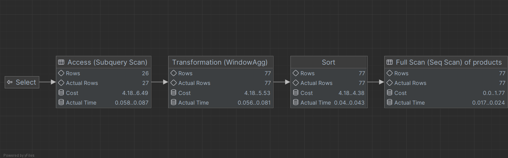

# SQL - Funkcje okna (Window functions) 

# Lab 1-2

---
**Imię i nazwisko:**

--- 


Celem ćwiczenia jest zapoznanie się z działaniem funkcji okna (window functions) w SQL, analiza wydajności zapytań i porównanie z rozwiązaniami przy wykorzystaniu "tradycyjnych" konstrukcji SQL

Swoje odpowiedzi wpisuj w miejsca oznaczone jako:

```sql
-- wyniki ...
```

Ważne/wymagane są komentarze.

Zamieść kod rozwiązania oraz zrzuty ekranu pokazujące wyniki, (dołącz kod rozwiązania w formie tekstowej/źródłowej)

Zwróć uwagę na formatowanie kodu

---

## Oprogramowanie - co jest potrzebne?

Do wykonania ćwiczenia potrzebne jest następujące oprogramowanie:
- MS SQL Server - wersja 2019, 2022
- PostgreSQL - wersja 15/16
- SQLite
- Narzędzia do komunikacji z bazą danych
	- SSMS - Microsoft SQL Managment Studio
	- DtataGrip lub DBeaver
-  Przykładowa baza Northwind
	- W wersji dla każdego z wymienionych serwerów

Oprogramowanie dostępne jest na przygotowanej maszynie wirtualnej

## Dokumentacja/Literatura

- Kathi Kellenberger,  Clayton Groom, Ed Pollack, Expert T-SQL Window Functions in SQL Server 2019, Apres 2019
- Itzik Ben-Gan, T-SQL Window Functions: For Data Analysis and Beyond, Microsoft 2020

- Kilka linków do materiałów które mogą być pomocne
	 - https://learn.microsoft.com/en-us/sql/t-sql/queries/select-over-clause-transact-sql?view=sql-server-ver16
	- https://www.sqlservertutorial.net/sql-server-window-functions/
	- https://www.sqlshack.com/use-window-functions-sql-server/
	- https://www.postgresql.org/docs/current/tutorial-window.html
	- https://www.postgresqltutorial.com/postgresql-window-function/
	-  https://www.sqlite.org/windowfunctions.html
	- https://www.sqlitetutorial.net/sqlite-window-functions/

- Ikonki używane w graficznej prezentacji planu zapytania w SSMS opisane są tutaj:
	- [https://docs.microsoft.com/en-us/sql/relational-databases/showplan-logical-and-physical-operators-reference](https://docs.microsoft.com/en-us/sql/relational-databases/showplan-logical-and-physical-operators-reference)

---
# Zadanie 1 - obserwacja

Wykonaj i porównaj wyniki następujących poleceń.

```sql
select avg(unitprice) avgprice
from products p;

select avg(unitprice) over () as avgprice
from products p;

select categoryid, avg(unitprice) avgprice
from products p
group by categoryid

select avg(unitprice) over (partition by categoryid) as avgprice
from products p;
```

Jaka jest są podobieństwa, jakie różnice pomiędzy grupowaniem danych a działaniem funkcji okna?

### Wyniki

Zapytania zrealizowane w bazie danych **Postgres**
#### Zapytanie 1
```sql
select avg(unitprice) avgprice
from products p;
```

 ![[Pasted image 20240304183527.png]]

To zapytanie policzyło średnią z **unitprice** z wszystkich wierszy w tabeli.
#### Zapytanie 2
```sql
select avg(unitprice) over () as avgprice
from products p;
```
![[Pasted image 20240304183602.png]]
Funkcja okna bez Partition policzyła średnią **unitPrice** z wszystkich wierszów, następnie zwróciła tą wartość dla każdego wiersza w tabeli.
#### Zapytanie 3
```sql
select categoryid, avg(unitprice) avgprice
from products p
group by categoryid
```

![[Pasted image 20240304183631.png]]
Powyższe zapytanie pogrupowało produkty po **categoryId** a następnie dla każdej grupy policzyła średnią z **unitPrice**. Jako wynik zwróciła tabele pogrupowaną po **categoryId**

#### Zapytanie 4
```sql
select avg(unitprice) over (partition by categoryid) as avgprice
from products p;
```

![[Pasted image 20240304183652.png]]
Funkcja okna z partition policzyła średnią dla każdej kategorii, następnie jako wynik zwróciła wszystkie wiersze z wartością odpowiadającej średniej dla kategorii do której dany wiersz należy

---
# Zadanie 2 - obserwacja

Wykonaj i porównaj wyniki następujących poleceń.

```sql
--1)

select p.productid, p.ProductName, p.unitprice,
       (select avg(unitprice) from products) as avgprice
from products p
where productid < 10

--2)
select p.productid, p.ProductName, p.unitprice,
       avg(unitprice) over () as avgprice
from products p
where productid < 10
```


Jaka jest różnica? Czego dotyczy warunek w każdym z przypadków? Napisz polecenie równoważne 
- 1) z wykorzystaniem funkcji okna. Napisz polecenie równoważne 
- 2) z wykorzystaniem podzapytania

### Wyniki

#### Zapytanie 1

```sql
select p.productid, p.ProductName, p.unitprice,
       (select avg(unitprice) from products) as avgprice
from products p
where productid < 10
```

![[Pasted image 20240304185604.png]]

To zapytanie najpierw liczy średnią dla wszystkich produktów, następnie ogranicza wynikową tabele do wierszy z **productId** < 10
#### Zapytanie 2

```sql
select p.productid, p.ProductName, p.unitprice,
       avg(unitprice) over () as avgprice
from products p
where productid < 10
```

![[Pasted image 20240304185721.png]]

Natomiast w tym zapytaniu średnia liczona jest z produktów gdzie **productId** < 10

#### Równoważne 1

(spróbować z with)

```sql
select distinct p.productid, p.ProductName, p.unitprice,  
    avg(sp.unitprice) over () as avgprice  
from products p, (select * from products) sp  
where p.productid < 10;
```

Ponieważ funkcja okna wykonuje się po klauzuli **WHERE**, to dodaliśmy do zapytania kolejną tabele, która nie jest ograniczona przez **WHERE**  i to na niej policzyliśmy średnią

![[Pasted image 20240304194655.png]]
#### Równoważne 2

```sql
select p.productid, p.ProductName, p.unitprice,  
    (select avg(unitprice) from (select * from products sp where sp.productid < 10 )) as avgprice  
from products p  
where productid < 10;
```

Sposobem na uniknięcie korzystania z funkcji okna jest policzenie średniej z tabeli już ograniczonej do **productId** < 10

![[Pasted image 20240304194034.png]]
# Zadanie 3

Baza: Northwind, tabela: products

Napisz polecenie, które zwraca: id produktu, nazwę produktu, cenę produktu, średnią cenę wszystkich produktów.

Napisz polecenie z wykorzystaniem z wykorzystaniem podzapytania, join'a oraz funkcji okna. Porównaj czasy oraz plany wykonania zapytań.

Przetestuj działanie w różnych SZBD (MS SQL Server, PostgreSql, SQLite)

W SSMS włącz dwie opcje: Include Actual Execution Plan oraz Include Live Query Statistics


W DataGrip użyj opcji Explain Plan/Explain Analyze


### Wyniki

```sql
subquery)
select p.ProductID, p.ProductName, p.UnitPrice, (select avg(unitprice) from products) as avgprice
from Products p

join)
select p.productid, p.productname, p.unitprice, avgprices.avgprice
from Products p
inner join (select avg(unitprice) as avgprice from Products) avprices on 1=1

window) 
select p.productid, p.productname, p.unitprice, avg(p.unitprice) over () as avgprice
from Products p
```
#### Query with join


#### Query with widnow function


#### Query with subquery


---

# Zadanie 4

Baza: Northwind, tabela products

Napisz polecenie, które zwraca: id produktu, nazwę produktu, cenę produktu, średnią cenę produktów w kategorii, do której należy dany produkt. Wyświetl tylko pozycje (produkty) których cena jest większa niż średnia cena.

Napisz polecenie z wykorzystaniem podzapytania, join'a oraz funkcji okna. Porównaj zapytania. Porównaj czasy oraz plany wykonania zapytań.

Przetestuj działanie w różnych SZBD (MS SQL Server, PostgreSql, SQLite)

```sql
-- subquery
select productid, productname, unitprice, (select AVG(unitprice) FROM products AS P2 where P2.categoryid = P1.categoryid) AS avg_price FROM products AS P1
where unitprice > (select AVG(unitprice) FROM products AS P2 where P2.categoryid = P1.categoryid);

-- join
SELECT
    P1.productid,
    P1.productname,
    P1.unitprice,
    AVG(P2.unitprice) AS avg_price
FROM
    products AS P1
        JOIN
    products AS P2 ON P1.categoryid = P2.categoryid
GROUP BY
    P1.productid, P1.productname, P1.unitprice
HAVING P1.unitprice > AVG(P2.unitprice);

-- window function
SELECT productid, productname, unitprice, avg
FROM
    (SELECT productid, productname, unitprice, AVG(unitprice) over (partition by categoryid) AS avg
     FROM products
    ) AS ss
WHERE unitprice > avg;
```
- **Zapytania**

    ***Subquery*** wykorzystuje podzapytanie do uzyskania średniej ceny dla danej kategorii, a następnie porównuje jednostkową cenę produktu z tą średnią.

    ***Join*** wykorzystuje operację JOIN oraz GROUP BY do uzyskania średniej ceny dla danej kategorii, a następnie porównuje jednostkową cenę produktu z tą średnią.

    ***Window Function*** wykorzystuje funkcję okna do uzyskania średniej ceny dla danej kategorii, a następnie porównuje jednostkową cenę produktu z tą średnią.

- **Czas**

    **PostgreSQL**
    | Zapytanie | subquery  | join  | window function |
    | ---       | ---       | ---   |---              |
    | Czas      | 80ms      | 71ms  | 65ms            |

    **SQL Server**
    | Zapytanie | subquery  | join  | window function |
    | ---       | ---       | ---   |---              |
    | Czas      | 0ms       | 0ms   | 0ms             |

    **SQLite**
    | Zapytanie | subquery  | join  | window function |
    | ---       | ---       | ---   |---              |
    | Czas      | 65ms      | 48ms  | 42ms            |

    Jak wynika z wyników, najszybszym rozwiązaniem okazał się SQL Server. Warto jednak zauważyć, że może to być wynikiem specyfiki pomiaru czasu w samym SQL Server Management Studio. W przypadku dwóch pozostałych systemów szybszym okazał się SQLite.

- **Plany wykonania**
    **PostgreSQL**
    
    
    

    Jak widać koszt oraz czas zapytań jest najlepszy w przypadku funkcji okna.

    **SQL Server**
    
    
    

    Tutaj również widać, że koszt zapytań jest najlepszy w przypadku funkcji okna.

    **SQLite**
    Dla tego serwera bazodanowego DataGrip nie pozwala zobaczyć analizy zapytań.

---
# Zadanie 5 - przygotowanie

Baza: Northwind

Tabela products zawiera tylko 77 wiersz. Warto zaobserwować działanie na większym zbiorze danych.

Wygeneruj tabelę zawierającą kilka milionów (kilkaset tys.) wierszy

Stwórz tabelę o następującej strukturze:

Skrypt dla SQL Srerver

```sql
create table product_history(
   id int identity(1,1) not null,
   productid int,
   productname varchar(40) not null,
   supplierid int null,
   categoryid int null,
   quantityperunit varchar(20) null,
   unitprice decimal(10,2) null,
   quantity int,
   value decimal(10,2),
   date date,
 constraint pk_product_history primary key clustered
    (id asc )
)
```

Wygeneruj przykładowe dane:

Dla 30000 iteracji, tabela będzie zawierała nieco ponad 2mln wierszy (dostostu ograniczenie do możliwości swojego komputera)

Skrypt dla SQL Srerver

```sql
declare @i int  
set @i = 1  
while @i <= 30000  
begin  
    insert product_history  
    select productid, ProductName, SupplierID, CategoryID,   
         QuantityPerUnit,round(RAND()*unitprice + 10,2),  
         cast(RAND() * productid + 10 as int), 0,  
         dateadd(day, @i, '1940-01-01')  
    from products  
    set @i = @i + 1;  
end;  
  
update product_history  
set value = unitprice * quantity  
where 1=1;
```


Skrypt dla Postgresql

```sql
create table product_history(
   id int generated always as identity not null  
       constraint pkproduct_history
            primary key,
   productid int,
   productname varchar(40) not null,
   supplierid int null,
   categoryid int null,
   quantityperunit varchar(20) null,
   unitprice decimal(10,2) null,
   quantity int,
   value decimal(10,2),
   date date
);
```

Wygeneruj przykładowe dane:

Skrypt dla Postgresql

```sql
do $$  
begin  
  for cnt in 1..30000 loop  
    insert into product_history(productid, productname, supplierid,   
           categoryid, quantityperunit,  
           unitprice, quantity, value, date)  
    select productid, productname, supplierid, categoryid,   
           quantityperunit,  
           round((random()*unitprice + 10)::numeric,2),  
           cast(random() * productid + 10 as int), 0,  
           cast('1940-01-01' as date) + cnt  
    from products;  
  end loop;  
end; $$;  
  
update product_history  
set value = unitprice * quantity  
where 1=1;
```

Skrypt dla SQLite

```sql
CREATE TABLE IF NOT EXISTS product_history (
    id INTEGER PRIMARY KEY AUTOINCREMENT,
    productid INTEGER,
    productname TEXT NOT NULL,
    supplierid INTEGER,
    categoryid INTEGER,
    quantityperunit TEXT,
    unitprice REAL,
    quantity INTEGER,
    value REAL,
    date DATE
);
```

Wygeneruj przykładowe dane:

Skrypt dla SQLite

```sql
WITH RECURSIVE cnt(i) AS (
    SELECT 1
    UNION ALL
    SELECT i+1 FROM cnt WHERE i < 30000
)
INSERT INTO product_history (productid, productname, supplierid, categoryid, quantityperunit, unitprice, quantity, value, date)
SELECT
    productid,
    productname,
    supplierid,
    categoryid,
    quantityperunit,
    ROUND(RANDOM() * unitprice + 10, 2),
    CAST(RANDOM() * productid + 10 AS INTEGER),
    0,
    date('1940-01-01', '+' || cnt.i || ' days')
FROM
    products,
    cnt;

UPDATE product_history
SET value = unitprice * quantity;
```

Wykonaj polecenia: `select count(*) from product_history`,  potwierdzające wykonanie zadania

```sql
select count(*) from product_history
```
**PostgreSQL**


**SQL Server**


**SQLite**


---
# Zadanie 6

Baza: Northwind, tabela product_history

To samo co w zadaniu 3, ale dla większego zbioru danych

Napisz polecenie, które zwraca: id pozycji, id produktu, nazwę produktu, cenę produktu, średnią cenę produktów w kategorii do której należy dany produkt. Wyświetl tylko pozycje (produkty) których cena jest większa niż średnia cena.

Napisz polecenie z wykorzystaniem podzapytania, join'a oraz funkcji okna. Porównaj zapytania. Porównaj czasy oraz plany wykonania zapytań.

Przetestuj działanie w różnych SZBD (MS SQL Server, PostgreSql, SQLite)


```sql
--- wyniki ...
```


---
# Zadanie 7

Baza: Northwind, tabela product_history

Lekka modyfikacja poprzedniego zadania

Napisz polecenie, które zwraca: id pozycji, id produktu, nazwę produktu, cenę produktu oraz
-  średnią cenę produktów w kategorii do której należy dany produkt.
-  łączną wartość sprzedaży produktów danej kategorii (suma dla pola value)
-  średnią cenę danego produktu w roku którego dotyczy dana pozycja
- łączną wartość sprzedaży produktów danej kategorii (suma dla pola value)

Napisz polecenie z wykorzystaniem podzapytania, join'a oraz funkcji okna. Porównaj zapytania. W przypadku funkcji okna spróbuj użyć klauzuli WINDOW.

Porównaj czasy oraz plany wykonania zapytań.

Przetestuj działanie w różnych SZBD (MS SQL Server, PostgreSql, SQLite)


```sql
--- wyniki ...
```

---
# Zadanie 8 - obserwacja

Funkcje rankingu, `row_number()`, `rank()`, `dense_rank()`

Wykonaj polecenie, zaobserwuj wynik. Porównaj funkcje row_number(), rank(), dense_rank()

```sql 
select productid, productname, unitprice, categoryid,  
    row_number() over(partition by categoryid order by unitprice desc) as rowno,  
    rank() over(partition by categoryid order by unitprice desc) as rankprice,  
    dense_rank() over(partition by categoryid order by unitprice desc) as denserankprice  
from products;
```

```sql
--- wyniki ...
```


Zadanie

Spróbuj uzyskać ten sam wynik bez użycia funkcji okna

```sql
--- wyniki ...
```


---
# Zadanie 9

Baza: Northwind, tabela product_history

Dla każdego produktu, podaj 4 najwyższe ceny tego produktu w danym roku. Zbiór wynikowy powinien zawierać:
- rok
- id produktu
- nazwę produktu
- cenę
- datę (datę uzyskania przez produkt takiej ceny)
- pozycję w rankingu

Uporządkuj wynik wg roku, nr produktu, pozycji w rankingu

```sql
--- wyniki ...
```


Spróbuj uzyskać ten sam wynik bez użycia funkcji okna, porównaj wyniki, czasy i plany zapytań. Przetestuj działanie w różnych SZBD (MS SQL Server, PostgreSql, SQLite)


```sql
--- wyniki ...
```

---
# Zadanie 10 - obserwacja

Funkcje `lag()`, `lead()`

Wykonaj polecenia, zaobserwuj wynik. Jak działają funkcje `lag()`, `lead()`

```sql
select productid, productname, categoryid, date, unitprice,  
       lag(unitprice) over (partition by productid order by date)   
as previousprodprice,  
       lead(unitprice) over (partition by productid order by date)   
as nextprodprice  
from product_history  
where productid = 1 and year(date) = 2022  
order by date;  
  
with t as (select productid, productname, categoryid, date, unitprice,  
                  lag(unitprice) over (partition by productid   
order by date) as previousprodprice,  
                  lead(unitprice) over (partition by productid   
order by date) as nextprodprice  
           from product_history  
           )  
select * from t  
where productid = 1 and year(date) = 2022  
order by date;
```

```sql
-- wyniki ...
```


Zadanie

Spróbuj uzyskać ten sam wynik bez użycia funkcji okna, porównaj wyniki, czasy i plany zapytań. Przetestuj działanie w różnych SZBD (MS SQL Server, PostgreSql, SQLite)

```sql
-- wyniki ...
```

---
# Zadanie 11

Baza: Northwind, tabele customers, orders, order details

Napisz polecenie które wyświetla inf. o zamówieniach

Zbiór wynikowy powinien zawierać:
- nazwę klienta, nr zamówienia,
- datę zamówienia,
- wartość zamówienia (wraz z opłatą za przesyłkę),
- nr poprzedniego zamówienia danego klienta,
- datę poprzedniego zamówienia danego klienta,
- wartość poprzedniego zamówienia danego klienta.

```sql
-- wyniki ...
```


---
# Zadanie 12 - obserwacja

Funkcje `first_value()`, `last_value()`

Wykonaj polecenia, zaobserwuj wynik. Jak działają funkcje `first_value()`, `last_value()`. Skomentuj uzyskane wyniki. Czy funkcja `first_value` pokazuje w tym przypadku najdroższy produkt w danej kategorii, czy funkcja `last_value()` pokazuje najtańszy produkt? Co jest przyczyną takiego działania funkcji `last_value`. Co trzeba zmienić żeby funkcja last_value pokazywała najtańszy produkt w danej kategorii

```sql
select productid, productname, unitprice, categoryid,  
    first_value(productname) over (partition by categoryid   
order by unitprice desc) first,  
    last_value(productname) over (partition by categoryid   
order by unitprice desc) last  
from products  
order by categoryid, unitprice desc;
```

```sql
-- wyniki ...
```

Zadanie

Spróbuj uzyskać ten sam wynik bez użycia funkcji okna, porównaj wyniki, czasy i plany zapytań. Przetestuj działanie w różnych SZBD (MS SQL Server, PostgreSql, SQLite)

```sql
-- wyniki ...
```

---
# Zadanie 13

Baza: Northwind, tabele orders, order details

Napisz polecenie które wyświetla inf. o zamówieniach

Zbiór wynikowy powinien zawierać:
- Id klienta,
- nr zamówienia,
- datę zamówienia,
- wartość zamówienia (wraz z opłatą za przesyłkę),
- dane zamówienia klienta o najniższej wartości w danym miesiącu
	- nr zamówienia o najniższej wartości w danym miesiącu
	- datę tego zamówienia
	- wartość tego zamówienia
- dane zamówienia klienta o najwyższej wartości w danym miesiącu
	- nr zamówienia o najniższej wartości w danym miesiącu
	- datę tego zamówienia
	- wartość tego zamówienia

```sql
--- wyniki ...
```

---
# Zadanie 14

Baza: Northwind, tabela product_history

Napisz polecenie które pokaże wartość sprzedaży każdego produktu narastająco od początku każdego miesiąca. Użyj funkcji okna

Zbiór wynikowy powinien zawierać:
- id pozycji
- id produktu
- datę
- wartość sprzedaży produktu w danym dniu
- wartość sprzedaży produktu narastające od początku miesiąca

```sql
-- wyniki ...
```

Spróbuj wykonać zadanie bez użycia funkcji okna. Spróbuj uzyskać ten sam wynik bez użycia funkcji okna, porównaj wyniki, czasy i plany zapytań. Przetestuj działanie w różnych SZBD (MS SQL Server, PostgreSql, SQLite)

```sql
-- wyniki ...
```

---
# Zadanie 15

Wykonaj kilka "własnych" przykładowych analiz. Czy są jeszcze jakieś ciekawe/przydatne funkcje okna (z których nie korzystałeś w ćwiczeniu)? Spróbuj ich użyć w zaprezentowanych przykładach.

```sql
-- wyniki ...
```


Punktacja

|         |     |
| ------- | --- |
| zadanie | pkt |
| 1       | 0,5 |
| 2       | 0,5 |
| 3       | 1   |
| 4       | 1   |
| 5       | 0,5 |
| 6       | 2   |
| 7       | 2   |
| 8       | 0,5 |
| 9       | 2   |
| 10      | 1   |
| 11      | 2   |
| 12      | 1   |
| 13      | 2   |
| 14      | 2   |
| 15      | 2   |
| razem   | 20  |
