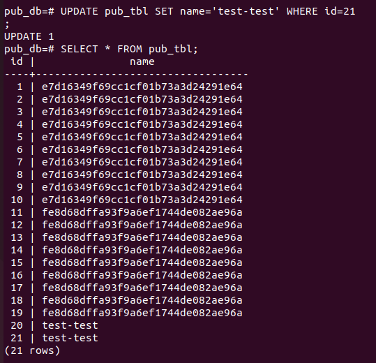

> initdb -D ./publisher_db

> initdb -D ./subscriber_db

W pliku postgresql.conf zmieniamy port i wal_level na logical

> pg_ctl start -D ./publisher_db

> pg_ctl start -D ./subscriber_db

Łączymy się z główną instancją

> psql -p 5433

Tworzymy baze danych

> CREATE DATABASE pub_db;

> \c pub_db

Tworzymy Tabele

> CREATE TABLE pub_tl (id int, name varchar(80))

> INSERT INTO pub_tbl
> SELECT * FROM generate_series(1, 10) AS id, md5(random()::text) AS name;

Przełączamy sie na sub i tworzymy tam baze sub_db

> psql -p 5434

> CREATE DATABASE sub_db;

Używamy polecenia pg_dump by wykonać dump bazy pub_db

> pg_dump -d pub_db -h localhost -p 5433 | /usr/lib/postgresql/15/bin/psql -p 5434 -d sub_db

Jak widać odrazu mamy skopiowane dane

Zatem dropnijmy dane dla potrzeb ćwiczenia:

Tworzymy teraz publikacje na głównej instancji

> psql -p 5433 -d pub_db

> CREATE PUBLICATION mypublication FOR TABLE pub_tbl;

Teraz stowrzmy subskrypcje:

> psql -p 5434 -d sub_db

> CREATE SUBSCRIPTION mysub CONNECTION 'host=localhost port=5433 dbname=pub_db' PUBLICATION mypublication;

Efekt w głównej instancji:

Sprawdzam czy dane zostały zreplikowane:

Dalsza weryfikacja działania:

### Insert

### Update

Przy próbie wykonania:

> UPDATE pub_tbl SET name='test-test' where id=21;

Dostaje error:

Korzystamy z hinta:

> ALTER TABLE pub_tbl REPLICA IDENTITY FULL;

Po tej komendzie możemy zupdtować rekord:

Sprawdźmy sub:

