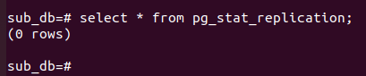
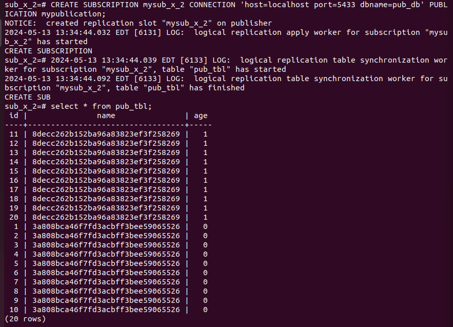
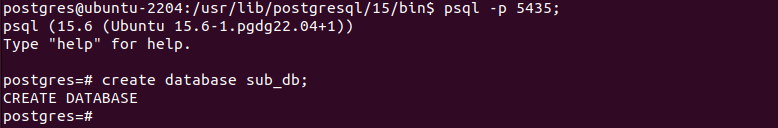
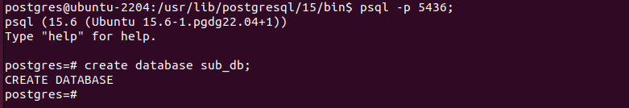
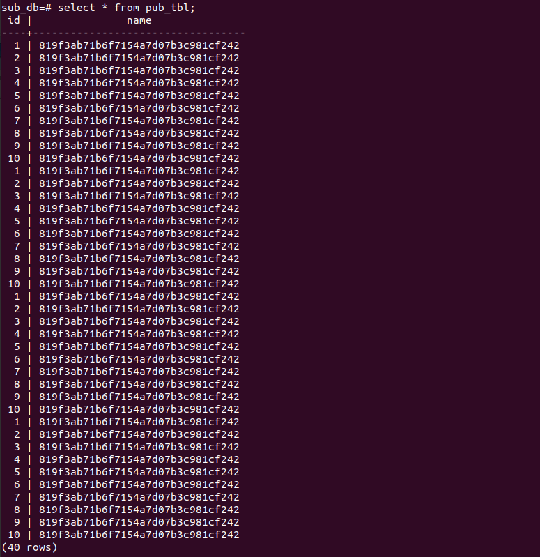

> initdb -D ./publisher_db

> initdb -D ./subscriber_db

W pliku postgresql.conf zmieniamy port i wal_level na logical

> pg_ctl start -D ./publisher_db

> pg_ctl start -D ./subscriber_db

Łączymy się z główną instancją

> psql -p 5433

Tworzymy baze danych

> CREATE DATABASE pub_db;

> \c pub_db

Tworzymy Tabele

> CREATE TABLE pub_tl (id int, name varchar(80))

> INSERT INTO pub_tbl
> SELECT * FROM generate_series(1, 10) AS id, md5(random()::text) AS name;

Przełączamy sie na sub i tworzymy tam baze sub_db

> psql -p 5434

> CREATE DATABASE sub_db;

Używamy polecenia pg_dump by wykonać dump bazy pub_db

> pg_dump -d pub_db -h localhost -p 5433 | /usr/lib/postgresql/15/bin/psql -p 5434 -d sub_db

Jak widać odrazu mamy skopiowane dane

Zatem dropnijmy dane dla potrzeb ćwiczenia:

Tworzymy teraz publikacje na głównej instancji

> psql -p 5433 -d pub_db

> CREATE PUBLICATION mypublication FOR TABLE pub_tbl;

Teraz stowrzmy subskrypcje:

> psql -p 5434 -d sub_db

> CREATE SUBSCRIPTION mysub CONNECTION 'host=localhost port=5433 dbname=pub_db' PUBLICATION mypublication;

Efekt w głównej instancji:

Sprawdzam czy dane zostały zreplikowane:

Dalsza weryfikacja działania:

### Insert

### Update

Przy próbie wykonania:

> UPDATE pub_tbl SET name='test-test' where id=21;

Dostaje error:

Korzystamy z hinta:

> ALTER TABLE pub_tbl REPLICA IDENTITY FULL;

Po tej komendzie możemy zupdtować rekord:

Sprawdźmy sub:

Jak widać jest pewne rozjechanie danych, wcześniej przez przypadek zupdatowałem rekord w sub, ta zmiana nie została oczywiście zreplikowana na pub, natomiast po zupdtowaniu tego samego rekordu w pub, zmiana ta nie została wykonana w sub. Dlatego w pub rekord o id 20 ma name=test-test a w sub name=test.

### Delete

Na pub:

> DELETE FROM pub_tbl WHERE id < 22 AND id > 10;

Sub:

Znowu możemy zaobserwować że rekord o id 20 nie został usunięty, jest jakby wyłączony z synchornizacji. Moglibśmy go ręcznie usunąc ale nie zrobimy tego by móc obserwować jak się będzie zachowywał przy następnych operacjach

### Truncate

Pub:

Sub:

Tej operacji nie przeżył rekord o id 20

### Add Column

Pub:

Sub:

Po dodaniu danych do pub, dostajemy takie errory odnośnie subskrypcji:

Wg dokumentacji postgresa (https://www.postgresql.org/docs/10/logical-replication-restrictions.html):

> The database schema and DDL commands are not replicated

Zatem ręcznie dodamy kolumne w sub:

i potej zmianie znowu mamy synchornizacje danych:

Następnie dodajemy nową kolumnę *city* na drugiej instancji:

Dodajmy kilka wierszy na pub:

Jak widać wiersze te zostały dodane na sub:

Jak widać różne schematy tabeli wcale nie muszą przeszkadzać w replikcaji danych. Tak zresztą możemy przeczytać w dokumentacji:

>Note, however, that there is no need for the schemas to be absolutely the same on both sides.

### PG_STAT

pub:

sub:

Dropujemy subskrypcje:

Pub:

## Rozserzenie Konfiguracji

## I

Powtarzamy kroki z poprzednich ćwiczeń by stworzyć 

Przy korzystaniu z komendy pg_dump użyjemy flagi -s która skopiuje sam schemat bazy danych. Przed dumpem trzeba także usunąc publikacje.

Po dumpie, mamy puste schematy na instancjach sub_x_1 i sub_x_2:

Następnie po wznowieniu publikacji i ustawieniu subskrybcji dane zostały automatycznie zsynchronizowane:

upewnijmy się czy synchronizacja działa przez wykonanie operacji truncate:

pub:

my_sub:

sub_x_1:

sub_x_2:

Sprawdźmy jeszcze widok pg_stat_replication:

pub:

Jak widać mamy 3 rekordy po jednym dla każdej subskrypcji

w przypadku subów widoki te są puste

## II - Cascade

Tworzymy i konfigurujemy 4 instancje

>./initdb -D /tmp/first_db

- port = 5433
- wal_level = logical

>./initdb -D /tmp/second_db

- port = 5434
- wal_level = logical

>./initdb -D /tmp/third_db

- port = 5435
- wal_level = logical

>./initdb -D /tmp/fourth_db

- port = 5436

Uruchamiamy instancje

> ./pg_ctl -D /tmp/first_db -l /tmp/first_db_log start

>./pg_ctl -D /tmp/second_db -l /tmp/second_db_log start

> ./pg_ctl -D /tmp/third_db -l /tmp/third_db_log start

> ./pg_ctl -D /tmp/fourth_db -l /tmp/fourth_db_log start

Tworzymy na pierwszej instancji bazę pub_db

Tworzymy na pierwszej instacji tabelę pub_tbl i wstawiamy do niej przykładowe dane

Tworzymy na drugiej, trzeciej i czwartej instancji bazę sub_db

Używamy polecenia pg_dump by wykonać dump bazy pub_db do pozostałych baz sub_db

Tworzymy publikacje na pierwszych trzech instancjach

Tworzymy subskrypcje na ostatnich trzech instancjach

Efekt na drugiej instancji:

Efekt na trzeciej instancji:

Efekt na czwartej instancji:

Widać, że dane zostały replikowane w kolejności first -> second -> third -> fourth

Dodajmy przykładowy rekord w pierwszej bazie:

Sprawdźmy, czy rekord się zreplikował na pozostałych instancjach.

Druga instancja:

Trzecia instancja:

Czwarta instancja:

Widać, że rekord zreplikował się na każdej instancji, więc replikacja działa poprawnie.

