# Raport

# Przetwarzanie i analiza danych przestrzennych
# Oracle spatial


---

**Imiona i nazwiska:**

---

Celem ćwiczenia jest zapoznanie się ze sposobem przechowywania, przetwarzania i analizy danych przestrzennych w bazach danych
(na przykładzie systemu Oracle spatial)

Swoje odpowiedzi wpisuj w miejsca oznaczone jako:

---
> Wyniki, zrzut ekranu, komentarz

```sql
--  ...
```

---

Do wykonania ćwiczenia (zadania 1 – 7) i wizualizacji danych wykorzystaj Oracle SQL Develper. Alternatywnie możesz wykonać analizy w środowisku Python/Jupyter Notebook

Do wykonania zadania 8 wykorzystaj środowisko Python/Jupyter Notebook

Raport należy przesłać w formacie pdf.

Należy też dołączyć raport zawierający kod w formacie źródłowym.

Np.
- plik tekstowy .sql z kodem poleceń
- plik .md zawierający kod wersji tekstowej
- notebook programu jupyter – plik .ipynb

Zamieść kod rozwiązania oraz zrzuty ekranu pokazujące wyniki, (dołącz kod rozwiązania w formie tekstowej/źródłowej)

Zwróć uwagę na formatowanie kodu

<div style="page-break-after: always;"></div>

# Zadanie 1

Zwizualizuj przykładowe dane

US_STATES


> Wyniki, zrzut ekranu, komentarz

```sql
SELECT * FROM US_STATES;
```

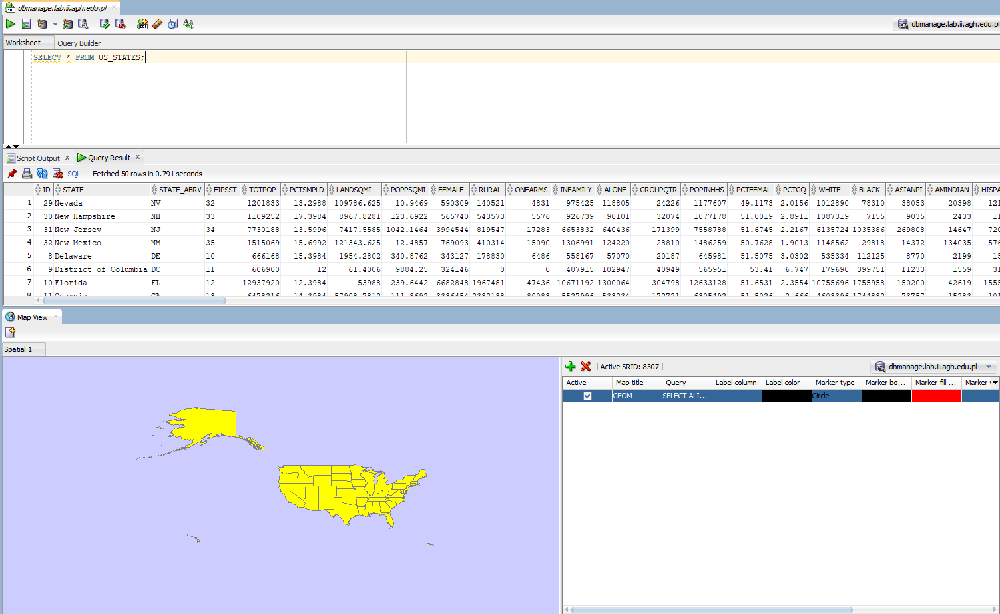

Tabela `US_STATES` zawiera informacje o stanach w USA. Każdy wiersz reprezentuje jeden stan, zawierając kolumny takie jak nazwa stanu, skrót (state_abrv), oraz dane geometryczne (geom).

US_INTERSTATES


> Wyniki, zrzut ekranu, komentarz

```sql
SELECT * FROM US_INTERSTATES;
```

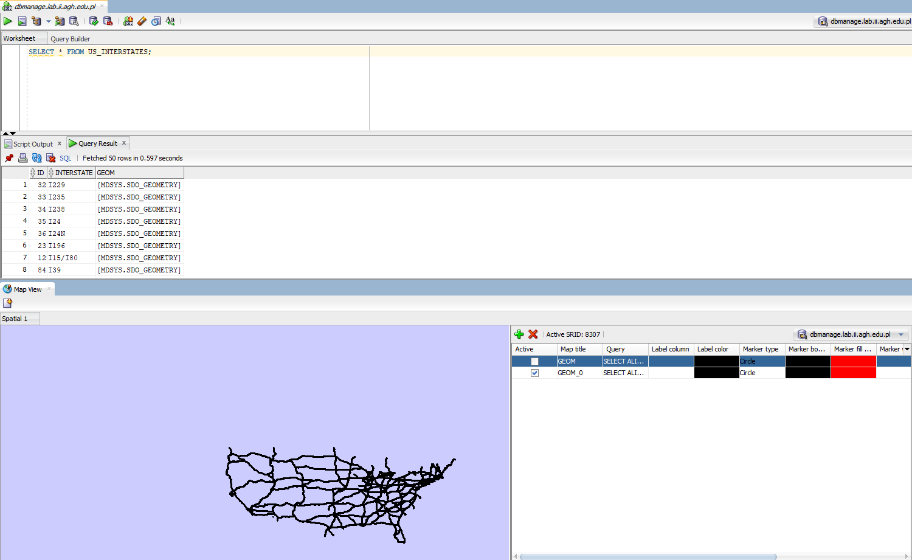

Tabela US_INTERSTATES zawiera informacje o międzystanowych autostradach. Każdy wiersz zawiera kolumny takie jak nazwa autostrady, identyfikator (id), oraz dane geometryczne (geom) określające trasę autostrady.

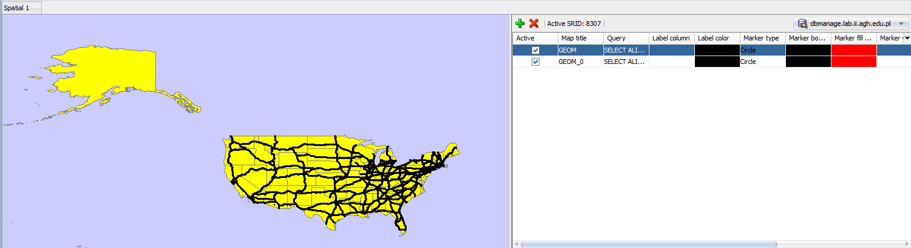

US_CITIES


> Wyniki, zrzut ekranu, komentarz

```sql
SELECT * FROM US_CITIES;
```

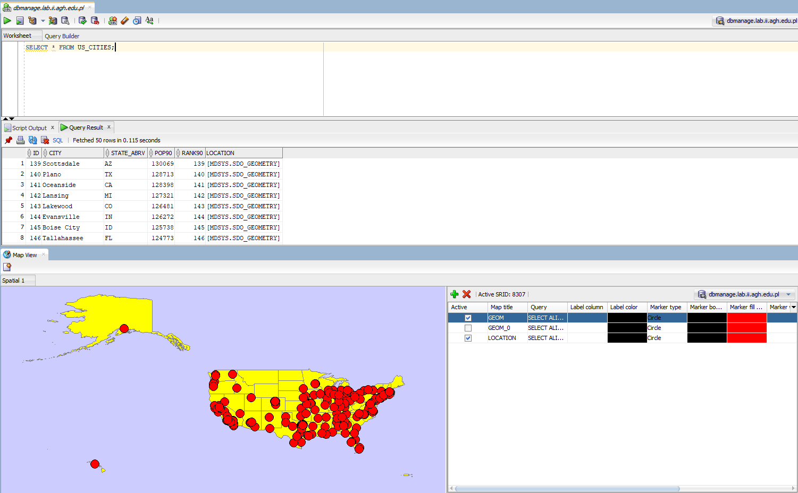

Tabela US_CITIES zawiera informacje o miastach w USA. Każdy wiersz zawiera kolumny takie jak nazwa miasta, skrót stanu (state_abrv), oraz dane geometryczne (geom).

```sql
SELECT * FROM US_CITIES
WHERE state_abrv = 'FL';
```

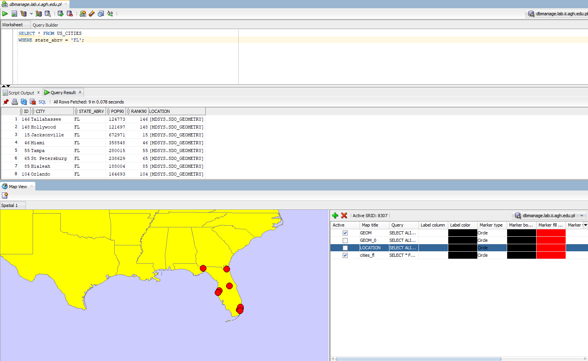

Drugie zapytanie ogranicza wynik do miast w stanie Floryda.

US_RIVERS


> Wyniki, zrzut ekranu, komentarz

```sql
SELECT * FROM US_RIVERS;
```

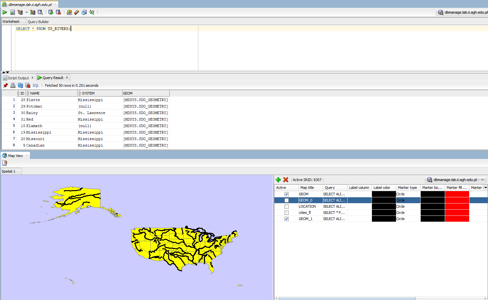

Tabela US_RIVERS zawiera informacje o rzekach w USA. Każdy wiersz zawiera kolumny takie jak nazwa rzeki, identyfikator (id), oraz dane geometryczne (geom) określające przebieg rzeki.

US_COUNTIES


> Wyniki, zrzut ekranu, komentarz

```sql
SELECT * FROM US_COUNTIES;
```

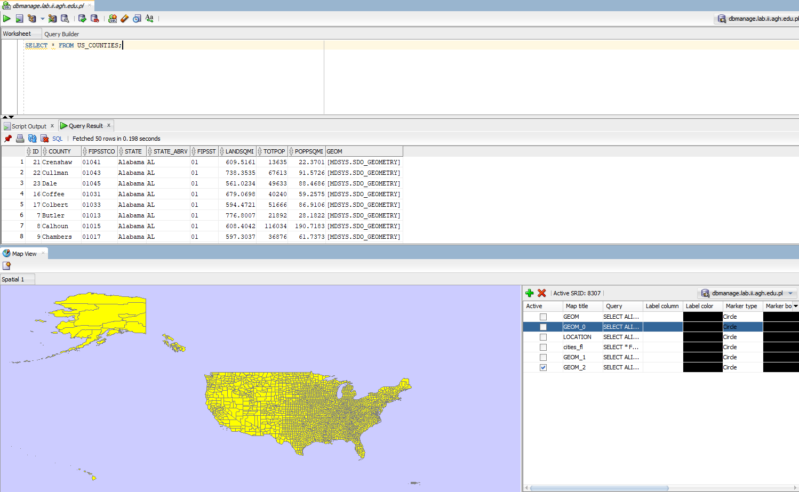

Tabela US_COUNTIES zawiera informacje o hrabstwach w USA. Każdy wiersz zawiera kolumny takie jak nazwa hrabstwa, skrót stanu (state_abrv), oraz dane geometryczne (geom).

```sql
SELECT * FROM US_COUNTIES
WHERE state_abrv = 'FL';
```

Drugie zapytanie ogranicza wynik do hrabstw w stanie Floryda.

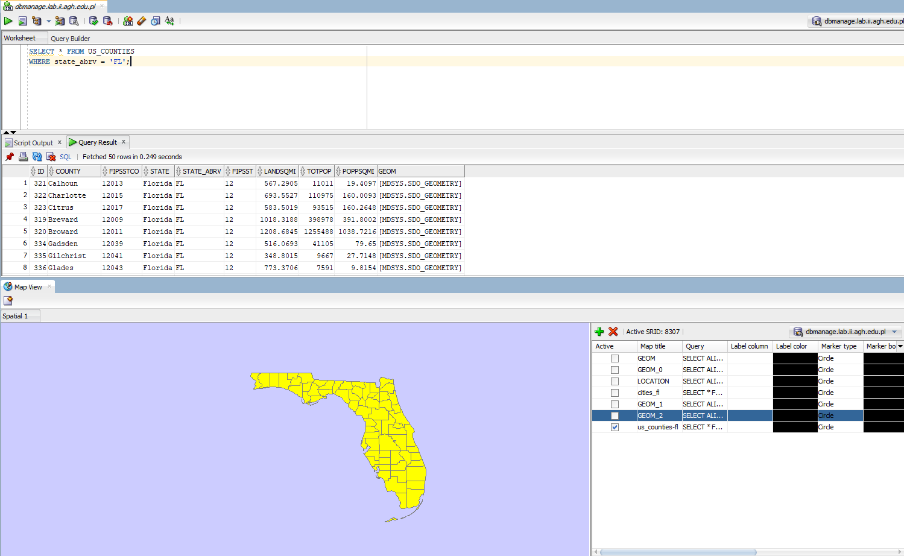

US_PARKS


> Wyniki, zrzut ekranu, komentarz

```sql
SELECT * FROM US_PARKS;
```

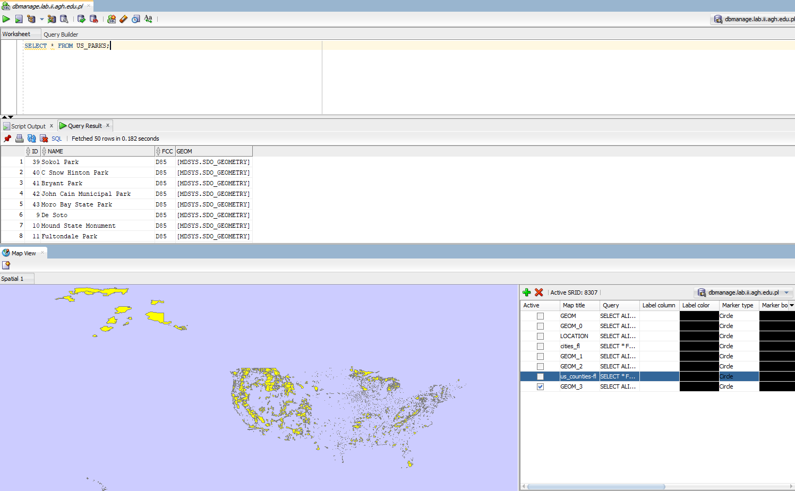

Tabela US_PARKS zawiera informacje o parkach w USA. Każdy wiersz zawiera kolumny takie jak nazwa parku, identyfikator (id), oraz dane geometryczne (geom)

```sql
SELECT * FROM US_PARKS;
WHERE id < 50;
```

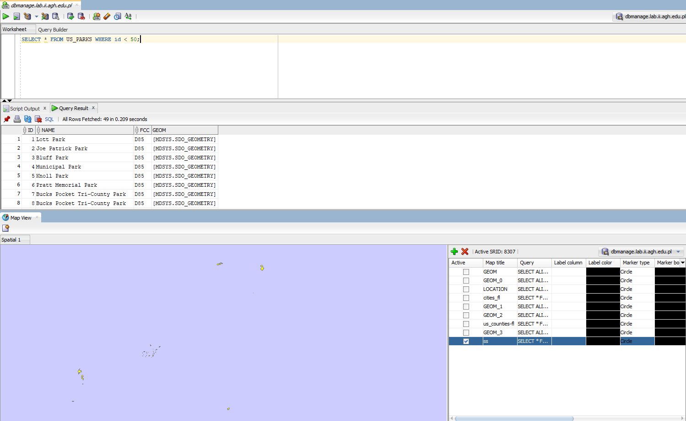

Drugie zapytanie ogranicza wynik do parków o identyfikatorze mniejszym niż 50.

# Zadanie 2

Znajdź wszystkie stany (us_states) których obszary mają część wspólną ze wskazaną geometrią (prostokątem)

Pokaż wynik na mapie.

prostokąt

```sql
SELECT  sdo_geometry (2003, 8307, null,
sdo_elem_info_array (1,1003,3),
sdo_ordinate_array ( -117.0, 40.0, -90., 44.0)) g
FROM dual

-- i dodatkowo
select * from us_states;
```

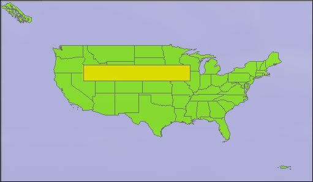

Jest to zwykły prostokąt na obszarze US.


Użyj funkcji SDO_FILTER

```sql
select *
from us_states
where sdo_filter(
	geom,
	sdo_geometry (
		2003,
		8307,
		null,
		sdo_elem_info_array (1,1003,3),
		sdo_ordinate_array ( -117.0, 40.0, -90., 44.0)
	)
) = 'TRUE';
```

Zwróć uwagę na liczbę zwróconych wierszy (16)


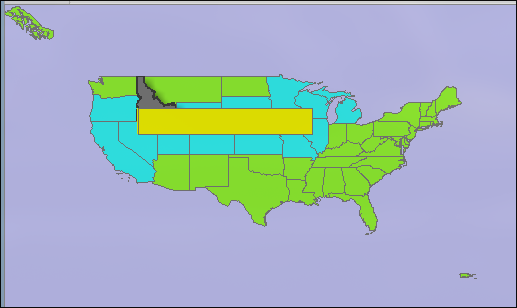

Zgodnie z oczekiwaniami, zwrócono 16 wierszy. 2 stany zostały błędnie zakwalifikowane jako pokrywające się z prostokątem.
Dokumentacja mówi, że funkcja `SDO_FILTER` w przeciwności do `SDO_ANYINTERACT` służy do szybkiego filtrowania danych, a nie do dokładnego sprawdzania pokrywania się geometrii.


Użyj funkcji `SDO_ANYINTERACT`

```sql
select *
from us_states
where sdo_anyinteract(
	geom,
	sdo_geometry (
		2003,
		8307,
		null,
		sdo_elem_info_array (1,1003,3),
		sdo_ordinate_array ( -117.0, 40.0, -90., 44.0)
	)
) = 'TRUE';
```

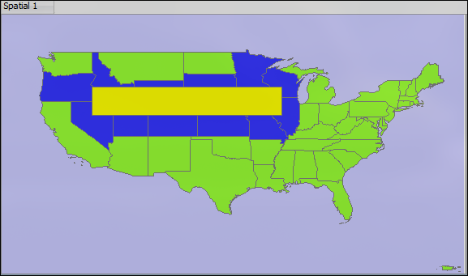

Tutaj wynik jest dokładny i składa się z 14 stanów.


Porównaj wyniki sdo_filter i sdo_anyinteract

Pokaż wynik na mapie


```sql
select *
from us_states
where sdo_anyinteract(
	geom,
	sdo_geometry (
		2003,
		8307,
		null,
		sdo_elem_info_array (1,1003,3),
		sdo_ordinate_array ( -117.0, 40.0, -90., 44.0)
	)
) != sdo_filter (
	geom,
	sdo_geometry (
		2003,
		8307,
		null,
		sdo_elem_info_array (1,1003,3),
		sdo_ordinate_array ( -117.0, 40.0, -90., 44.0)
	)
);
```

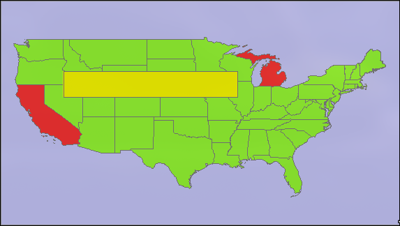

Czerwone opszary to stany dla których `SDO_ANYINTERACT` i `SDO_FILTER` zwróciły różne odpowiedzi.

Jak widać jedyna różnica w wyniku to 2 dodatkowe stany zwrócowe przez `SDO_FILTER` co wynika z wcześniej wymienionej różnicy w przeznaczeniu `CDO_FILTER` i `SDO_ANYINTERACT`.

# Zadanie 3

Znajdź wszystkie parki (us_parks) których obszary znajdują się wewnątrz stanu Wyoming

Użyj funkcji SDO_INSIDE

```sql
SELECT p.name, p.geom
FROM us_parks p, us_states s
WHERE s.state = 'Wyoming'
AND SDO_INSIDE (p.geom, s.geom ) = 'TRUE';
```

W przypadku wykorzystywania narzędzia SQL Developer, w celu wizualizacji na mapie użyj podzapytania

```sql
SELECT pp.name, pp.geom  FROM us_parks pp
WHERE id IN
(
    SELECT p.id
    FROM us_parks p, us_states s
    WHERE s.state = 'Wyoming'
    and SDO_INSIDE (p.geom, s.geom ) = 'TRUE'
)
```


> Wyniki, zrzut ekranu, komentarz

Wynik zapytania zwraca nam wszystkie parki, których obszary znajdują się całkowicie wewnątrz stanu Wyoming. Wizualizacja na mapie przedstawia te parki:

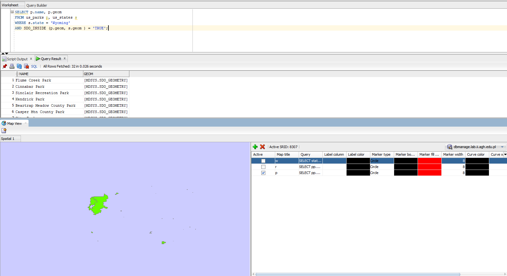

```sql
SELECT state, geom FROM us_states
WHERE state = 'Wyoming'
```

> Wyniki, zrzut ekranu, komentarz

Wynik zapytania zwraca cały obszar stanu Wyoming. Wizualizacja na mapie przedstawia ten obszar:

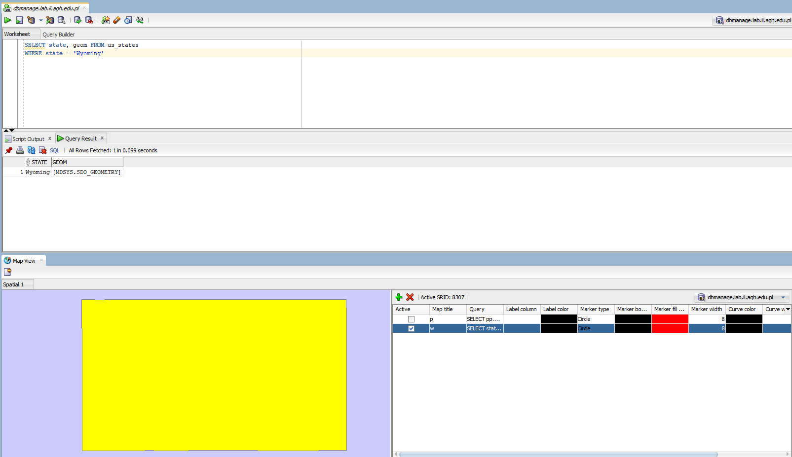


Gdy dodamy obie warstwy z dwóch poprzednich zapytań na mapie możemy zobaczyć nasze parki (zielony) na obszarze Wyoming (żółty):

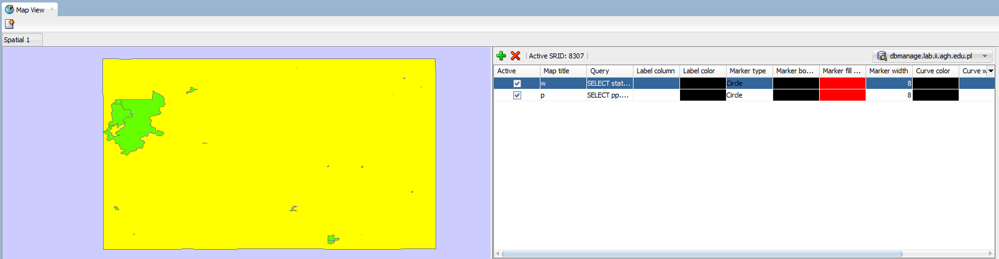

Porównaj wynik z:

```sql
SELECT p.name, p.geom
FROM us_parks p, us_states s
WHERE s.state = 'Wyoming'
AND SDO_ANYINTERACT (p.geom, s.geom ) = 'TRUE';
```

W celu wizualizacji użyj podzapytania

> Wyniki, zrzut ekranu, komentarz

Do wizualizacji wykorzystano poniższe podzapytanie:

```sql
SELECT pp.name, pp.geom  FROM us_parks pp
WHERE id IN
(
    SELECT p.id
    FROM us_parks p, us_states s
    WHERE s.state = 'Wyoming'
    AND SDO_ANYINTERACT (p.geom, s.geom ) = 'TRUE';
)
```

Wynik tego zapytania zwraca wszystkie parki, które mają jakąkolwiek interakcję z obszarem stanu Wyoming (czyli mogą być całkowicie wewnątrz, częściowo wewnątrz, lub przylegać do granicy stanu):

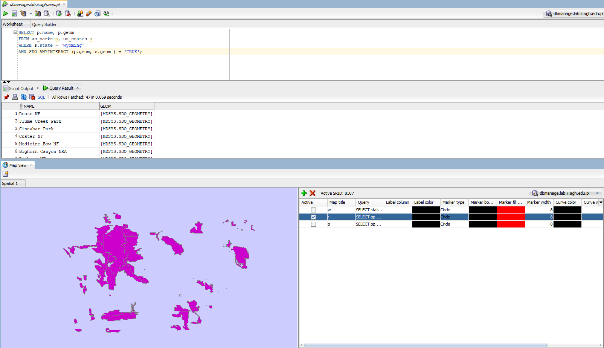

Gdy dodamy tę warstwę na wartstwę stanu Wyoming, to możemy lepiej zobaczyć te przecięcia:

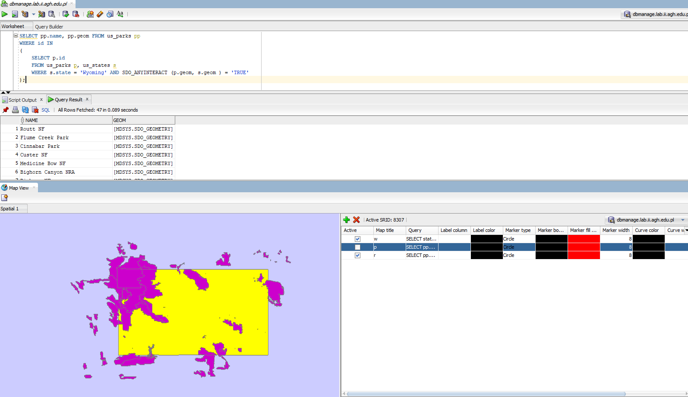

Prezentując wszystkie trzy warstwy na wspólnej mapie, widzimy na zielono część wspólną dwóch poprzednich zapytań (SDO_INSIDE i SDO_ANYINTERACT). Dzięki temu możemy lepiej zrozumieć, które parki są całkowicie wewnątrz stanu Wyoming, a które mają jakąkolwiek interakcję z granicami stanu:

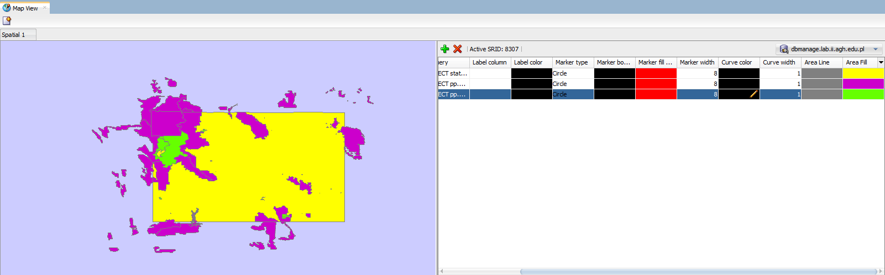

# Zadanie 4

Znajdź wszystkie jednostki administracyjne (us_counties) wewnątrz stanu New Hampshire

```sql
SELECT c.county, c.state_abrv, c.geom
FROM us_counties c, us_states s
WHERE s.state = 'New Hampshire'
AND SDO_RELATE ( c.geom,s.geom, 'mask=INSIDE+COVEREDBY') = 'TRUE';

SELECT c.county, c.state_abrv, c.geom
FROM us_counties c, us_states s
WHERE s.state = 'New Hampshire'
AND SDO_RELATE ( c.geom,s.geom, 'mask=INSIDE') = 'TRUE';

SELECT c.county, c.state_abrv, c.geom
FROM us_counties c, us_states s
WHERE s.state = 'New Hampshire'
AND SDO_RELATE ( c.geom,s.geom, 'mask=COVEREDBY') = 'TRUE';
```

W przypadku wykorzystywania narzędzia SQL Developer, w celu wizualizacji danych na mapie należy użyć podzapytania (podobnie jak w poprzednim zadaniu)

> Wyniki, zrzut ekranu, komentarz

##### Pierwsze zapytanie używa maski INSIDE+COVEREDBY

```sql
-- zapytanie
SELECT c.county, c.state_abrv, c.geom
FROM us_counties c, us_states s
WHERE s.state = 'New Hampshire'
AND SDO_RELATE(c.geom, s.geom, 'mask=INSIDE+COVEREDBY') = 'TRUE';

-- wizualizacja
SELECT cc.county, cc.state_abrv, cc.geom
FROM us_counties cc
WHERE cc.id IN
(
    SELECT c.id
    FROM us_counties c, us_states s
    WHERE s.state = 'New Hampshire'
    AND SDO_RELATE(c.geom, s.geom, 'mask=INSIDE+COVEREDBY') = 'TRUE'
);
```

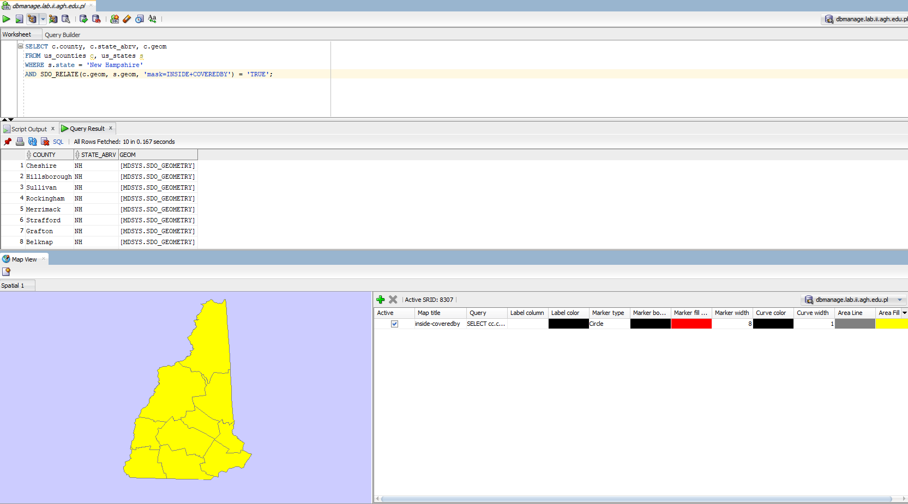

Maska `INSIDE+COVEREDBY` łączy logiki obu tych masek zwracając jednostki administracyjne, które są całkowicie wewnątrz stanu oraz jednostki administracyjne, które są częściowo lub całkowicie pokryte przez stan.

##### Drugie zapytanie używa maski INSIDE

```sql
-- zapytanie
SELECT c.county, c.state_abrv, c.geom
FROM us_counties c, us_states s
WHERE s.state = 'New Hampshire'
AND SDO_RELATE ( c.geom,s.geom, 'mask=INSIDE') = 'TRUE';

-- wizualizacja
SELECT cc.county, cc.state_abrv, cc.geom
FROM us_counties cc
WHERE cc.id IN
(
    SELECT c.id
    FROM us_counties c, us_states s
    WHERE s.state = 'New Hampshire'
    AND SDO_RELATE(c.geom, s.geom, 'mask=INSIDE') = 'TRUE'
);
```

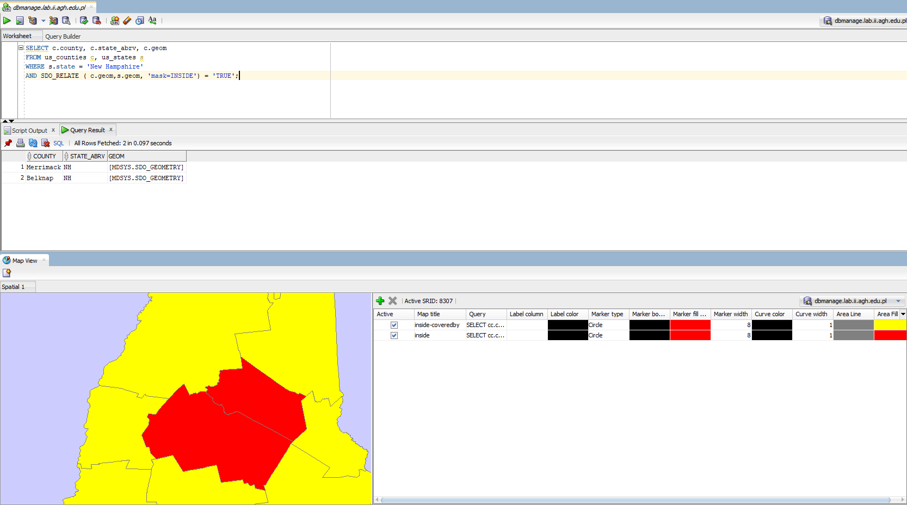

Maska `INSIDE` zwraca jednostki administracyjne, które są całkowicie wewnątrz stanu.

##### Trzecie zapytanie używa maski COVEREDBY

```sql
-- zapytanie
SELECT c.county, c.state_abrv, c.geom
FROM us_counties c, us_states s
WHERE s.state = 'New Hampshire'
AND SDO_RELATE ( c.geom,s.geom, 'mask=COVEREDBY') = 'TRUE';

-- wizualizacja
SELECT cc.county, cc.state_abrv, cc.geom
FROM us_counties cc
WHERE cc.id IN
(
    SELECT c.id
    FROM us_counties c, us_states s
    WHERE s.state = 'New Hampshire'
    AND SDO_RELATE(c.geom, s.geom, 'mask=COVEREDBY') = 'TRUE'
);
```

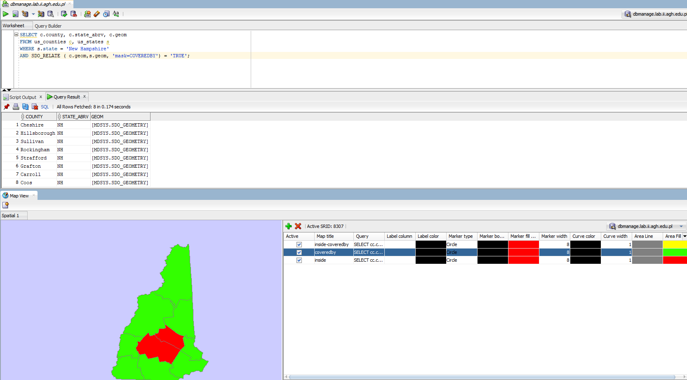

Maska `COVEREDBY` zwraca jednostki administracyjne, które są częściowo lub całkowicie pokryte przez stan.

W różnych wariantach zapytania używamy różnych masek (`INSIDE`, `COVEREDBY`), aby znaleźć jednostki administracyjne w różnych relacjach przestrzennych ze stanem New Hampshire.

Aby znaleźć wszystkie jednostki administracyjne (us_counties) wewnątrz stanu New Hampshire, najlepiej użyć maski `INSIDE`, ponieważ zwraca ona jednostki, które są całkowicie wewnątrz granic stanu.

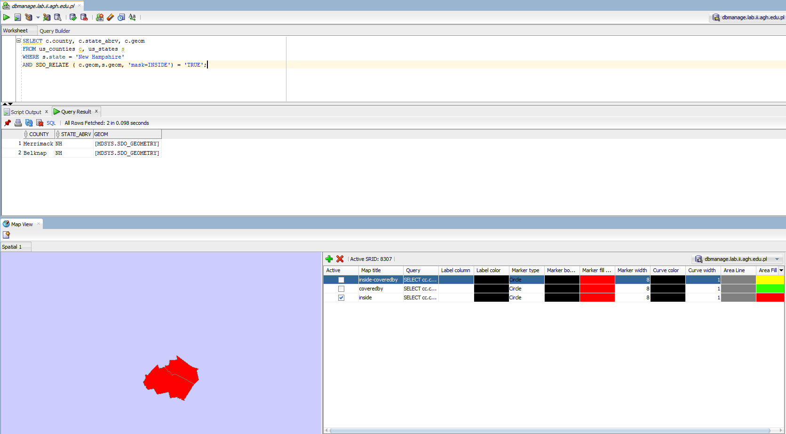

W tym przypadku wynik pokazuje, że dwie jednostki administracyjne (Merrimack oraz Belknap) spełniają ten warunek.

# Zadanie 5

Znajdź wszystkie miasta w odległości 50 mili od drogi (us_interstates) I4

Pokaż wyniki na mapie

```sql
SELECT * FROM us_interstates
WHERE interstate = 'I4'

SELECT * FROM us_states
WHERE state_abrv = 'FL'

SELECT c.city, c.state_abrv, c.location
FROM us_cities c
WHERE ROWID IN
(
SELECT c.rowid
FROM us_interstates i, us_cities c
WHERE i.interstate = 'I4'
AND sdo_within_distance (c.location, i.geom,'distance=50 unit=mile'
)
```

> Wyniki, zrzut ekranu, komentarz

```sql
-- Znalezienie miast w odległości 50 mil od drogi I4.
SELECT c.city, c.state_abrv, c.location
FROM us_cities c
WHERE ROWID IN (
    SELECT c.rowid
    FROM us_interstates i, us_cities c
    WHERE i.interstate = 'I4'
    AND SDO_WITHIN_DISTANCE(c.location, i.geom, 'distance=50 unit=mile') = 'TRUE'
);
```

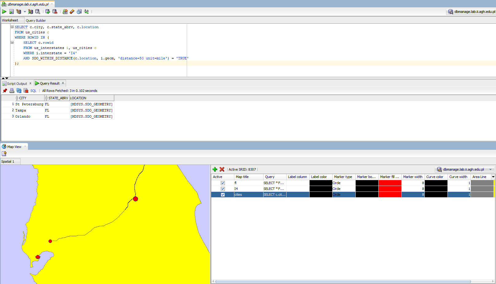

Miasta, które leżą w odległości 50 mil od drogi I4 to **St Petersburg**, **Tampa** oraz **Orlando**.

Dodatkowo:

a)     Znajdz wszystkie jednostki administracyjne przez które przechodzi droga I4

b)    Znajdz wszystkie jednostki administracyjne w pewnej odległości od I4

c)     Znajdz rzeki które przecina droga I4

d)    Znajdz wszystkie drogi które przecinają rzekę Mississippi

e)    Znajdz wszystkie miasta w odlegości od 15 do 30 mil od drogi 'I275'

f)      Itp. (własne przykłady)

> Wyniki, zrzut ekranu, komentarz
> (dla każdego z podpunktów)

a)     Znajdz wszystkie jednostki administracyjne przez które przechodzi droga I4

```sql
SELECT s.state
FROM us_states s, us_interstates i
WHERE i.interstate = 'I4'
AND SDO_RELATE(s.geom, i.geom, 'mask=ANYINTERACT') = 'TRUE';
```

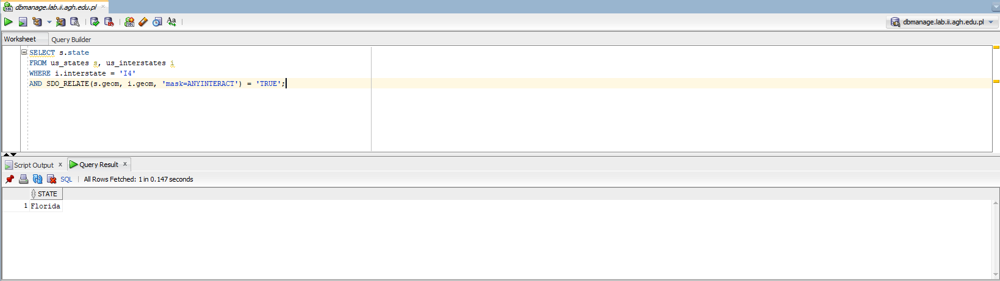

b)    Znajdz wszystkie jednostki administracyjne w pewnej odległości od I4

```sql
SELECT c.city, c.state_abrv, c.location
FROM us_cities c
WHERE ROWID IN (
    SELECT c.rowid
    FROM us_interstates i, us_cities c
    WHERE i.interstate = 'I4'
    AND SDO_WITHIN_DISTANCE(c.location, i.geom, 'distance=100 unit=mile') = 'TRUE'
);
```

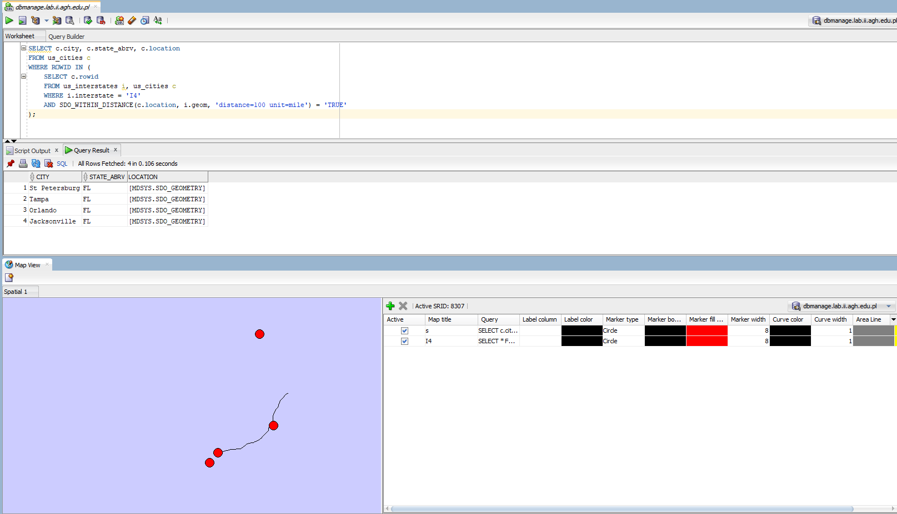

c)     Znajdz rzeki które przecina droga I4

```sql
SELECT r.name
FROM us_rivers r, us_interstates i
WHERE i.interstate = 'I4'
AND SDO_RELATE(r.geom, i.geom, 'mask=ANYINTERACT') = 'TRUE';
```

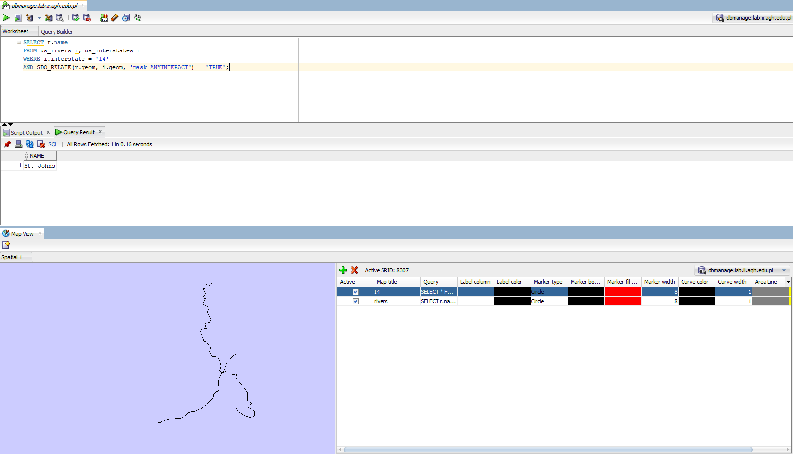

d)    Znajdz wszystkie drogi które przecinają rzekę Mississippi

```sql
SELECT i.interstate
FROM us_interstates i, us_rivers r
WHERE r.name = 'Mississippi'
AND SDO_RELATE(i.geom, r.geom, 'mask=ANYINTERACT') = 'TRUE';
```

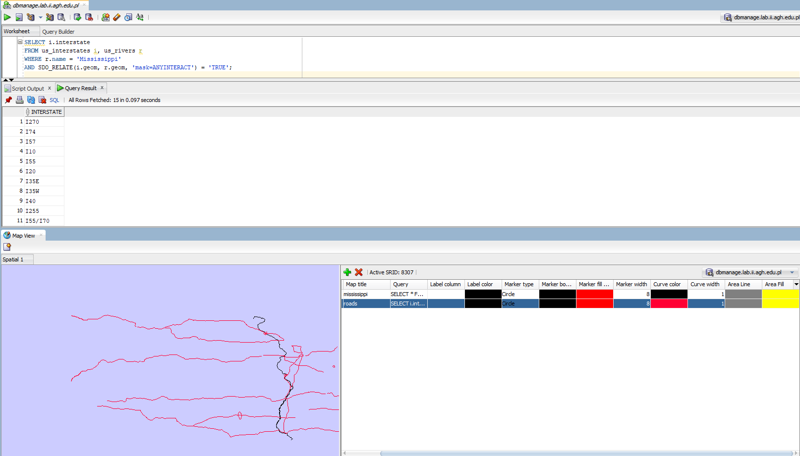

e)    Znajdz wszystkie miasta w odlegości od 15 do 30 mil od drogi 'I275'

```sql
SELECT c.city, c.state_abrv, c.location
FROM us_cities c
WHERE ROWID IN (
    SELECT c.rowid
    FROM us_interstates i, us_cities c
    WHERE i.interstate = 'I275'
    AND SDO_WITHIN_DISTANCE(c.location, i.geom, 'distance=30 unit=mile') = 'TRUE'
    AND SDO_WITHIN_DISTANCE(c.location, i.geom, 'distance=15 unit=mile') = 'TRUE'
);
```

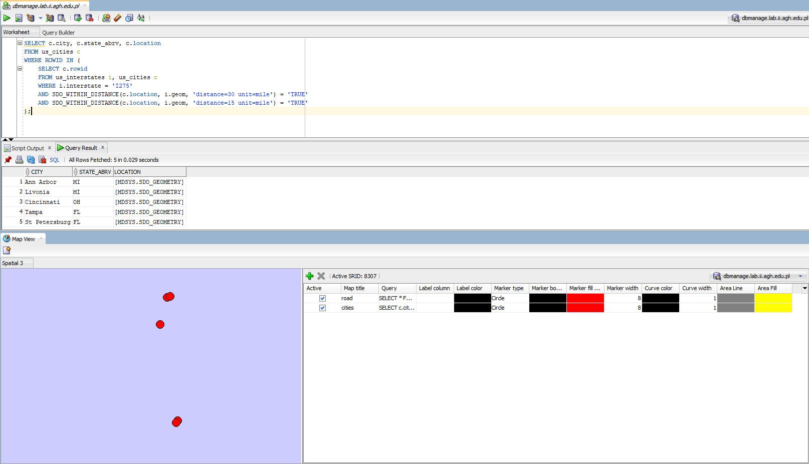

f) Znajdź wszystkie parki narodowe w odległości 50 mil od miasta Seattle.

```sql
SELECT p.name, p.geom
FROM us_parks p, us_cities c
WHERE c.city = 'Seattle'
AND SDO_WITHIN_DISTANCE(p.geom, c.location, 'distance=5 unit=mile') = 'TRUE';
```


g)  Znajdź wszystkie miasta w odległości od 25 do 40 mil od drogi 'I10'.

```sql
SELECT c.city, c.state_abrv, c.location
FROM us_cities c
WHERE ROWID IN (
    SELECT c.rowid
    FROM us_interstates i, us_cities c
    WHERE i.interstate = 'I10'
    AND SDO_WITHIN_DISTANCE(c.location, i.geom, 'distance=40 unit=mile') = 'TRUE'
    AND SDO_WITHIN_DISTANCE(c.location, i.geom, 'distance=25 unit=mile') = 'TRUE'
);
```

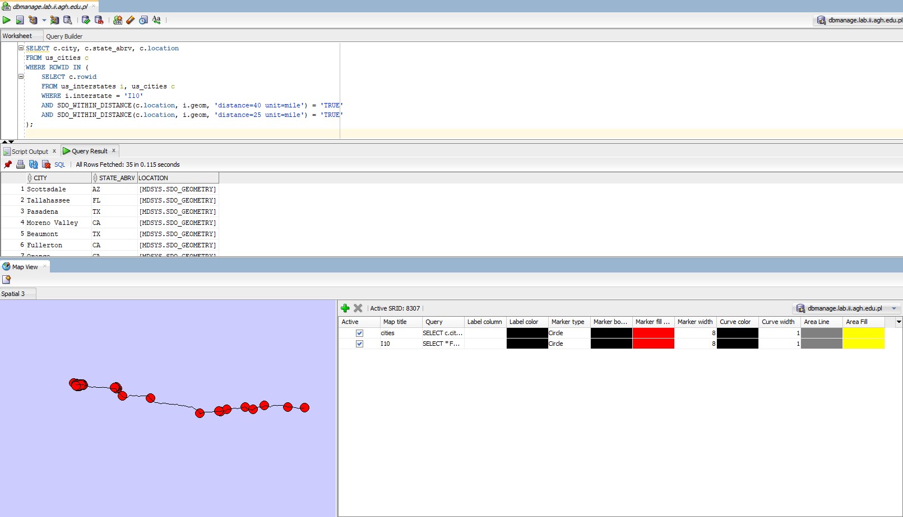

h) Znajdź wszystkie parki narodowe, które są przecięte przez autostradę 'I90'.

```sql
SELECT p.name, p.geom
FROM us_parks p, us_interstates i
WHERE i.interstate = 'I90'
AND SDO_RELATE(p.geom, i.geom, 'mask=ANYINTERACT') = 'TRUE';
```

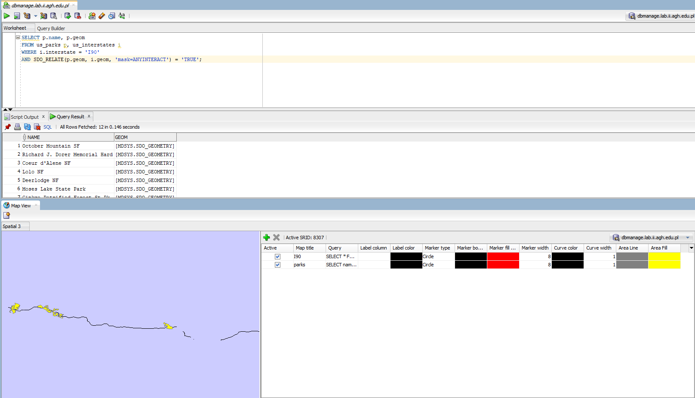

# Zadanie 6

Znajdz 5 miast najbliższych drogi I4

```sql
SELECT c.city, c.state_abrv, c.location
FROM us_interstates i, us_cities c
WHERE i.interstate = 'I4'
AND sdo_nn(c.location, i.geom, 'sdo_num_res=5') = 'TRUE';
```

>Wyniki, zrzut ekranu, komentarz

```sql
SELECT c.city, c.state_abrv, c.location
FROM us_cities c
WHERE ROWID IN
(
    SELECT c.rowid
    FROM us_interstates i, us_cities c
    WHERE i.interstate = 'I4'
    AND sdo_nn(c.location, i.geom, 'sdo_num_res=5') = 'TRUE'
)
```

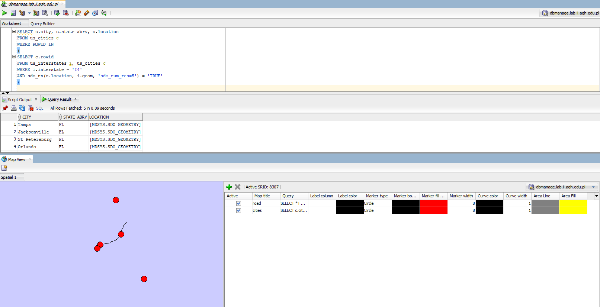

Dodatkowo:

a)     Znajdz kilka miast najbliższych rzece Mississippi

b)    Znajdz 3 miasta najbliżej Nowego Jorku

c)     Znajdz kilka jednostek administracyjnych (us_counties) z których jest najbliżej do Nowego Jorku

d)    Znajdz 5 najbliższych miast od drogi  'I170', podaj odległość do tych miast

e)    Znajdz 5 najbliższych dużych miast (o populacji powyżej 300 tys) od drogi  'I170'

f)      Itp. (własne przykłady)

> Wyniki, zrzut ekranu, komentarz
> (dla każdego z podpunktów)

a)     Znajdz kilka miast najbliższych rzece Mississippi

```sql
SELECT c.city, c.state_abrv, c.location
FROM us_cities c
WHERE ROWID IN
(
    SELECT c.rowid
    FROM us_rivers r, us_cities c
    WHERE r.Name = 'Mississippi'
    AND sdo_nn(c.location, r.geom, 'sdo_num_res=5') = 'TRUE'
)
```

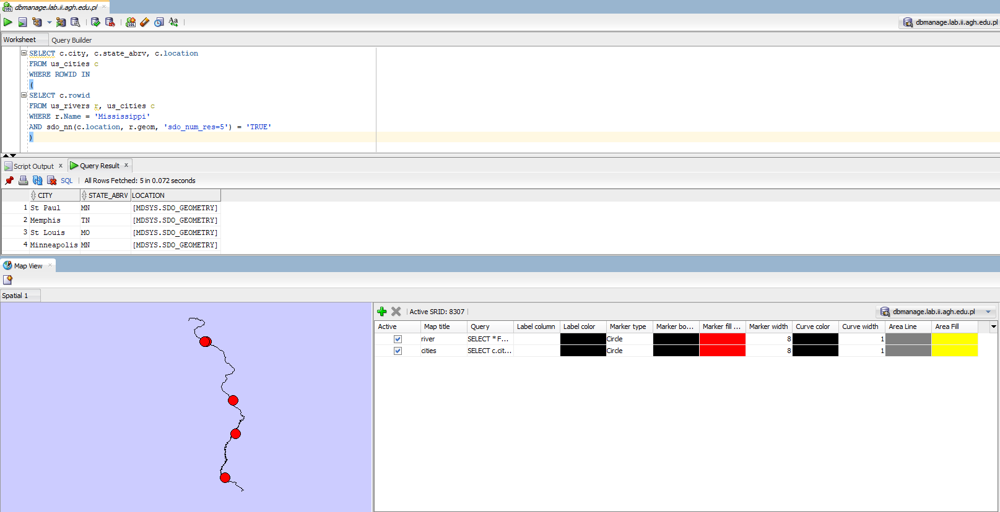

b)    Znajdz 3 miasta najbliżej Nowego Jorku

```sql
SELECT c.city, c.state_abrv, c.location
FROM us_cities c
WHERE ROWID IN
(
    SELECT c.rowid
    FROM us_cities c
    WHERE sdo_nn(c.location, (SELECT location FROM us_cities WHERE city = 'New York'), 'sdo_num_res=4') = 'TRUE'
    AND c.City != 'New York'
)
```

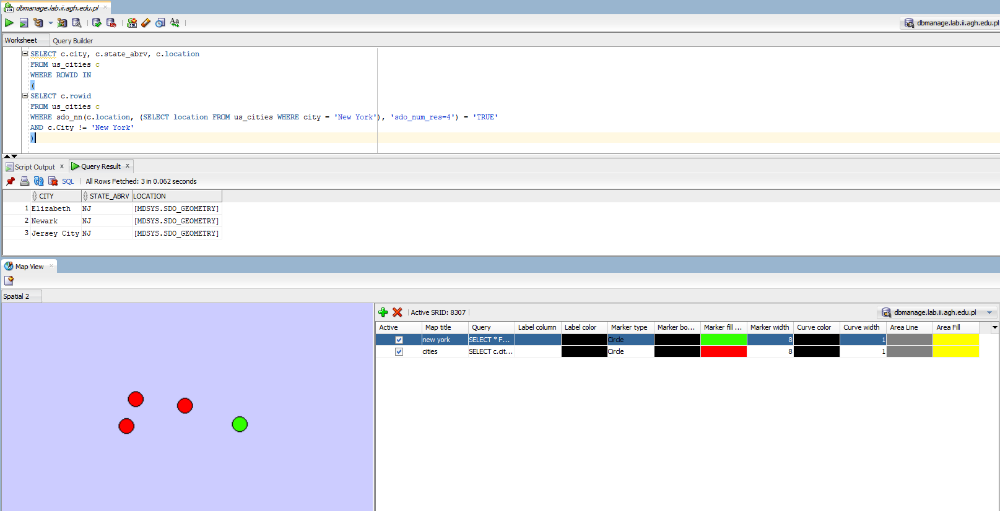

c)     Znajdz kilka jednostek administracyjnych (us_counties) z których jest najbliżej do Nowego Jorku

```sql
SELECT pp.county, pp.geom FROM us_counties pp
WHERE id IN
(
    SELECT co.id
    FROM us_counties co
    WHERE sdo_nn(co.geom, (SELECT location FROM us_cities WHERE city = 'New York'), 'sdo_num_res=10') = 'TRUE'
)
```

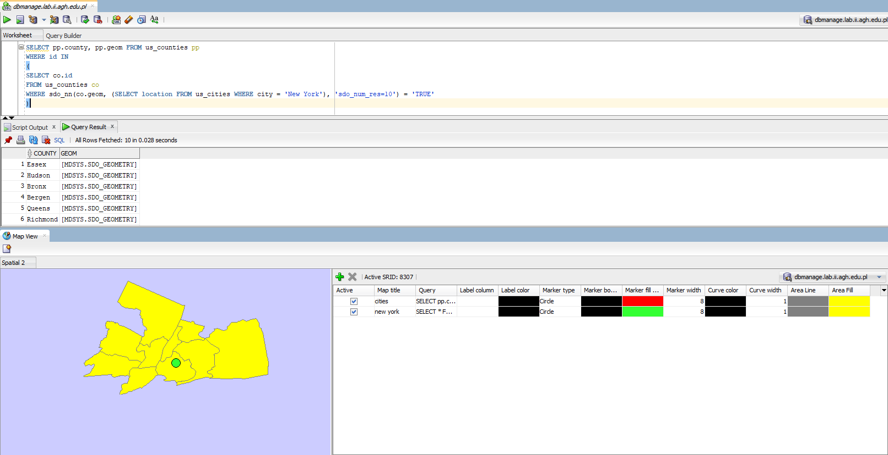

d)    Znajdz 5 najbliższych miast od drogi  'I170', podaj odległość do tych miast

```sql
SELECT
    pp.city,
    pp.location,
    SDO_GEOM.SDO_DISTANCE(pp.location, i.geom, 0.005, 'unit=mile') AS distance_to_road
FROM
    us_cities pp,
    us_interstates i
WHERE
    i.interstate = 'I170'
    AND SDO_NN(pp.location, i.geom, 'sdo_num_res=5') = 'TRUE';

-- wizualizacja
SELECT pp.city, pp.location FROM us_cities pp
WHERE rowid IN
(
SELECT c.rowid
FROM us_cities c, us_interstates i
WHERE
i.interstate = 'I170'
AND sdo_nn(c.location, i.geom, 'sdo_num_res=5') = 'TRUE'
)
```

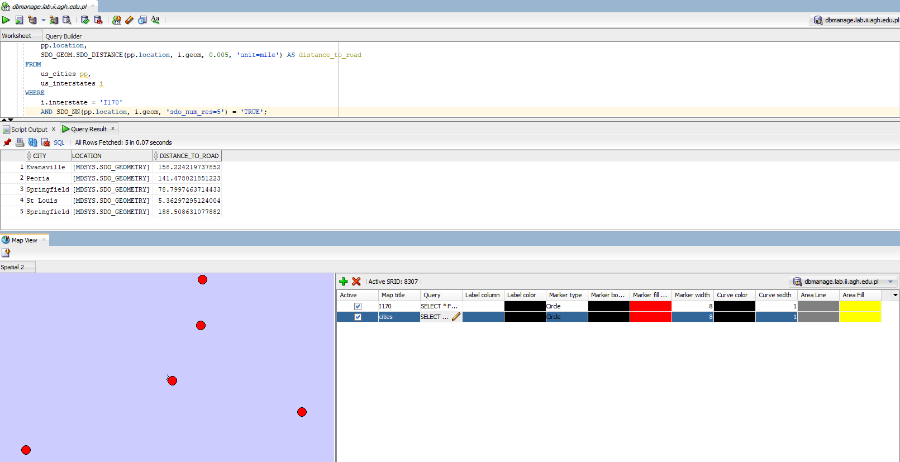

e)    Znajdz 5 najbliższych dużych miast (o populacji powyżej 300 tys) od drogi  'I170'

```sql
SELECT
    c.city,
    c.pop90,
    SDO_GEOM.SDO_DISTANCE(c.location, i.geom, 0.5, 'unit=kilometer') as distance
FROM
    us_cities c,
    us_interstates i
WHERE
    i.interstate = 'I170'
    AND c.pop90 > 300000
ORDER BY
    distance
FETCH FIRST 5 ROWS ONLY

-- wizualizacja
SELECT
    pp.city,
    pp.pop90,
    pp.location
FROM
    us_cities pp
WHERE
    pp.id IN (
            SELECT
                c.id
            FROM
                (SELECT * FROM us_cities WHERE pop90 > 300000) c,
                us_interstates i
            WHERE
                i.interstate = 'I170'
            ORDER BY
                SDO_GEOM.SDO_DISTANCE(c.location, i.geom, 0.5, 'unit=mile')
            FETCH FIRST 5 ROWS ONLY
    )
```

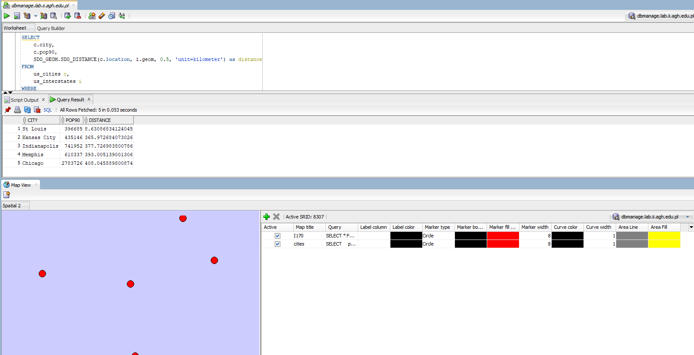

f)      Itp. (własne przykłady)

## TODO

# Zadanie 7

Oblicz długość drogi I4

```sql
SELECT SDO_GEOM.SDO_LENGTH (geom, 0.5,'unit=kilometer') length
FROM us_interstates
WHERE interstate = 'I4';
```

>Wyniki, zrzut ekranu, komentarz

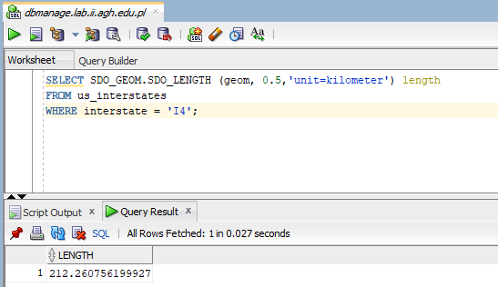

Długość drogi I4 to 212 km.

Dodatkowo:

a)     Oblicz długość rzeki Mississippi

b)    Która droga jest najdłuższa/najkrótsza

c)     Która rzeka jest najdłuższa/najkrótsza

d)    Które stany mają najdłuższą granicę

e)    Itp. (własne przykłady)

> Wyniki, zrzut ekranu, komentarz
> (dla każdego z podpunktów)

a)     Oblicz długość rzeki Mississippi

```sql
SELECT interstate, SDO_GEOM.SDO_LENGTH (geom, 0.5,'unit=kilometer') length
FROM us_interstates
ORDER BY length
FETCH FIRST ROW ONLY;
```

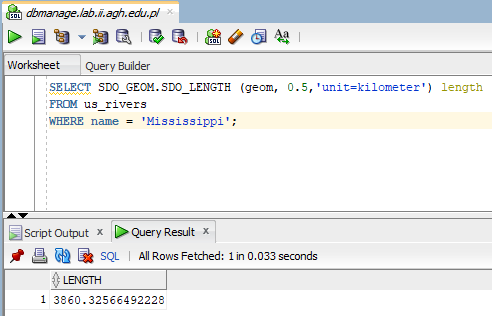

Długość rzeki Mississippi to 3860 kilometrów.

b)    Która droga jest najdłuższa/najkrótsza

Najkrótsza

```sql
SELECT interstate, SDO_GEOM.SDO_LENGTH (geom, 0.5,'unit=kilometer') length
FROM us_interstates
ORDER BY length
FETCH FIRST ROW ONLY;

-- Wizualizacja
SELECT i.interstate, i.geom
FROM us_interstates i
WHERE id IN
(
SELECT id
FROM us_interstates
ORDER BY SDO_GEOM.SDO_LENGTH (geom, 0.5,'unit=kilometer')
FETCH FIRST ROW ONLY
)
```

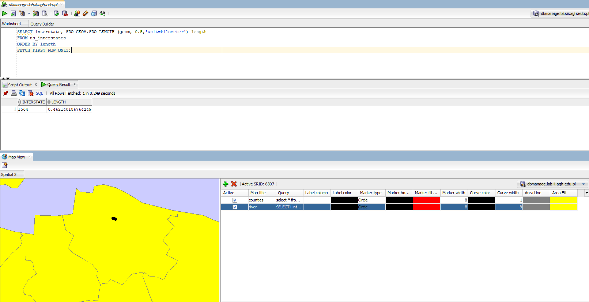

Najdłuższa

```sql
SELECT interstate, SDO_GEOM.SDO_LENGTH (geom, 0.5,'unit=kilometer') length
FROM us_interstates
ORDER BY length DESC
FETCH FIRST ROW ONLY;

-- wizualizacja
SELECT i.interstate, i.geom
FROM us_interstates i
WHERE id IN
(
SELECT id
FROM us_interstates
ORDER BY SDO_GEOM.SDO_LENGTH (geom, 0.5,'unit=kilometer') DESC
FETCH FIRST ROW ONLY
)
```

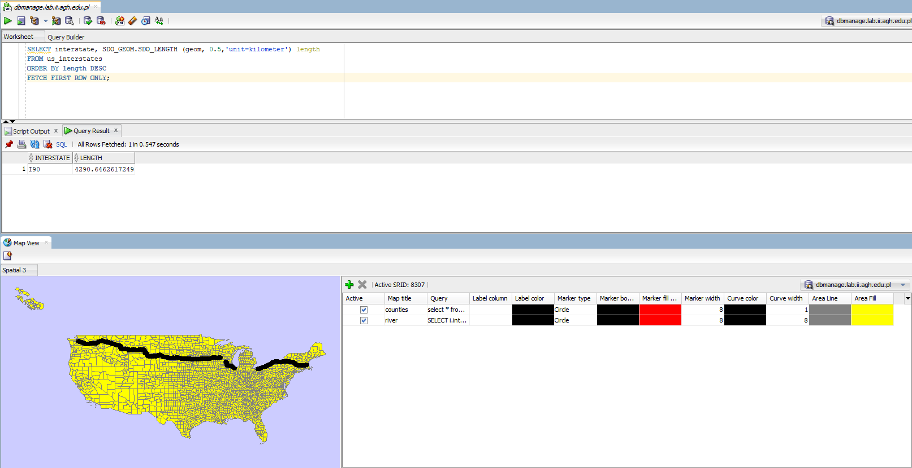

c)     Która rzeka jest najdłuższa/najkrótsza

Najkrótsza

```sql
SELECT name, SDO_GEOM.SDO_LENGTH (geom, 0.5,'unit=kilometer') length
FROM us_rivers
ORDER BY length
FETCH FIRST ROW ONLY;

-- wizualizacja
SELECT r.name, r.geom
FROM us_rivers r
WHERE id IN
(
SELECT id
FROM us_rivers
ORDER BY SDO_GEOM.SDO_LENGTH (geom, 0.5,'unit=kilometer')
FETCH FIRST ROW ONLY
)
```

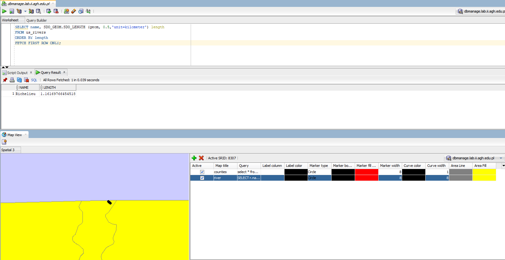

Najdłuższa

```sql
SELECT name, SDO_GEOM.SDO_LENGTH (geom, 0.5,'unit=kilometer') length
FROM us_rivers
ORDER BY length DESC
FETCH FIRST ROW ONLY;

-- wizualizacja
SELECT r.name, r.geom
FROM us_rivers r
WHERE id IN
(
SELECT id
FROM us_rivers
ORDER BY SDO_GEOM.SDO_LENGTH (geom, 0.5,'unit=kilometer') DESC
FETCH FIRST ROW ONLY
)
```

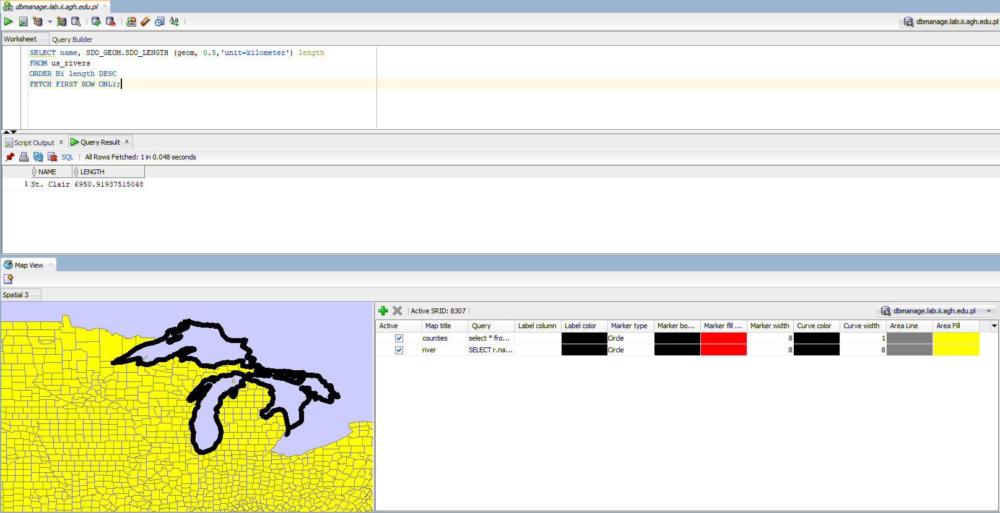

d)    Które stany mają najdłuższą granicę

```sql
SELECT
    state,
    SDO_GEOM.SDO_LENGTH(geom, 0.5, 'unit=kilometer') AS border_length
FROM
    us_states
ORDER BY
    border_length DESC
FETCH FIRST 5 ROWS ONLY

-- wizualizacja
SELECT state, geom FROM US_STATES
WHERE id IN
(
SELECT
    id
FROM
    us_states
ORDER BY
    SDO_GEOM.SDO_LENGTH(geom, 0.5, 'unit=kilometer') DESC
FETCH FIRST 5 ROWS ONLY
)
```

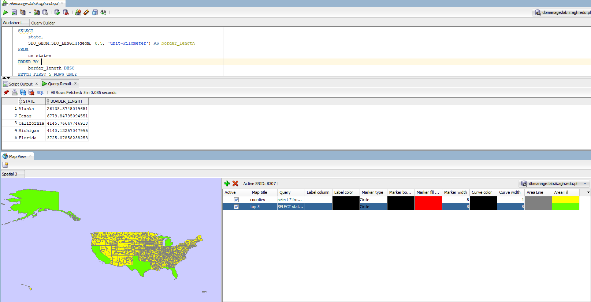

e)    Itp. (własne przykłady)

## TODO

Oblicz odległość między miastami Buffalo i Syracuse

```sql
SELECT SDO_GEOM.SDO_DISTANCE ( c1.location, c2.location, 0.5) distance
FROM us_cities c1, us_cities c2
WHERE c1.city = 'Buffalo' and c2.city = 'Syracuse';
```

>Wyniki, zrzut ekranu, komentarz

```sql
SELECT SDO_GEOM.SDO_DISTANCE ( c1.location, c2.location, 0.5, 'unit=kilometer') distance
FROM us_cities c1, us_cities c2
WHERE c1.city = 'Buffalo' and c2.city = 'Syracuse';

-- wizualizacja
SELECT city, location
FROM US_CITIES
WHERE city = 'Buffalo' or city = 'Syracuse'
```

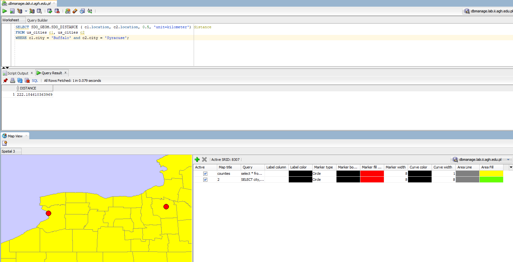

Dodatkowo:

a)     Oblicz odległość między miastem Tampa a drogą I4

b)    Jaka jest odległość z między stanem Nowy Jork a  Florydą

c)     Jaka jest odległość z między miastem Nowy Jork a  Florydą

d)    Podaj 3 parki narodowe do których jest najbliżej z Nowego Jorku, oblicz odległości do tych parków

e)    Przetestuj działanie funkcji

a.     sdo_intersection, sdo_union, sdo_difference

b.     sdo_buffer

c.     sdo_centroid, sdo_mbr, sdo_convexhull, sdo_simplify

f)      Itp. (własne przykłady)

> Wyniki, zrzut ekranu, komentarz
> (dla każdego z podpunktów)

a)     Oblicz odległość między miastem Tampa a drogą I4

```sql
SELECT SDO_GEOM.SDO_DISTANCE ( c1.location, i.geom, 0.5, 'unit=kilometer') distance
FROM us_cities c1, us_interstates i
WHERE c1.city = 'Tampa' and i.interstate = 'I4';
```

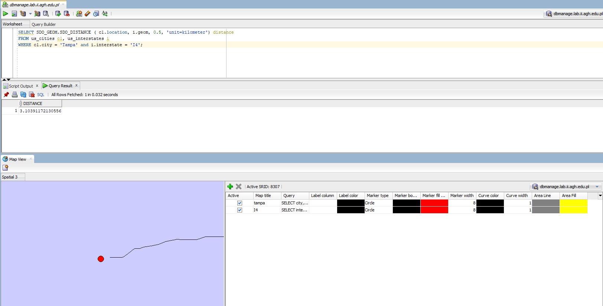

Odległość wynosi 3 km.

b)    Jaka jest odległość z między stanem Nowy Jork a  Florydą

```sql
SELECT SDO_GEOM.SDO_DISTANCE (s1.geom, s2.geom, 0.5, 'unit=kilometer') distance
FROM us_states s1, us_states s2
WHERE s1.state = 'New York' and s2.state = 'Florida';
```

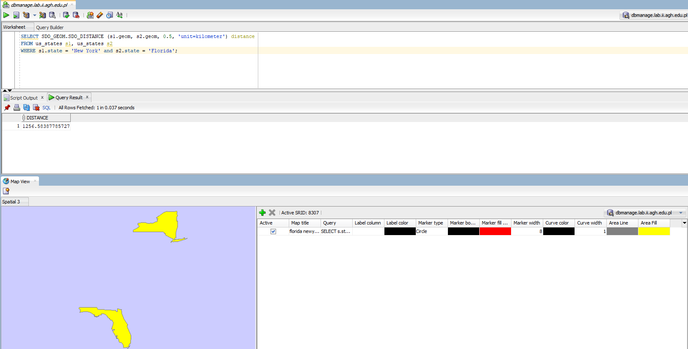

Odległość wynosi 1256 km.

c)     Jaka jest odległość z między miastem Nowy Jork a  Florydą

```sql
SELECT SDO_GEOM.SDO_DISTANCE (c1.location, s2.geom, 0.5, 'unit=kilometer') distance
FROM us_cities c1, us_states s2
WHERE c1.city = 'New York' and s2.state = 'Florida';
```

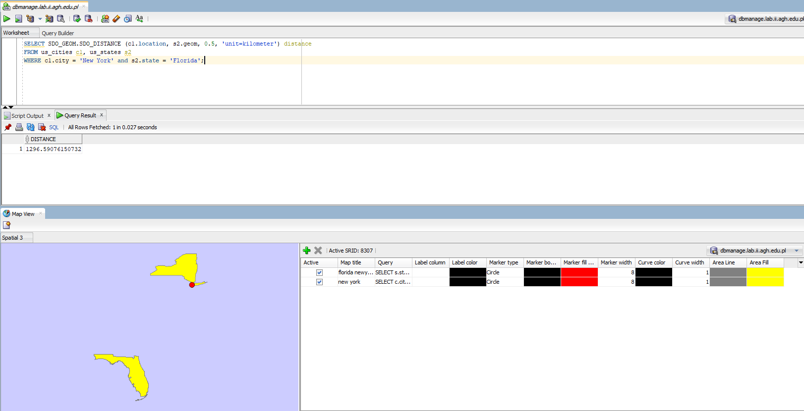

Odległość wynsoi 1296 km.

d)    Podaj 3 parki narodowe do których jest najbliżej z Nowego Jorku, oblicz odległości do tych parków

```sql
SELECT
    p.name,
    SDO_GEOM.SDO_DISTANCE(c.location, p.geom, 0.5, 'unit=mile') AS distance
FROM
    us_parks p,
    us_cities c
WHERE
    c.city = 'New York'
AND
    SDO_NN(p.geom, c.location, 'sdo_num_res=3') = 'TRUE'
ORDER BY
    distance
```

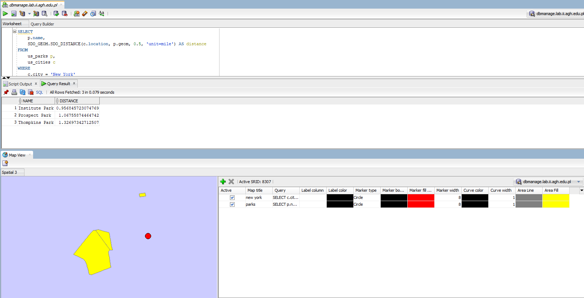

Trzy najbliższe parki to Institute Park, Prospect Park oraz Thompkins Park.

e)    Przetestuj działanie funkcji


Na takich 2 kształtach będziemy testować funkcje 

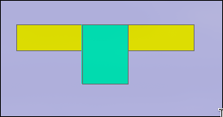


a.     sdo_intersection, sdo_union, sdo_difference


```sql
select sdo_geom.sdo_intersection(
	sdo_geometry (2003, 8307, null,
		sdo_elem_info_array (1,1003,3),
		sdo_ordinate_array ( -117.0, 40.0, -90., 44.0)
	),
	sdo_geometry (2003, 8307, null,
		sdo_elem_info_array (1,1003,3),
		sdo_ordinate_array ( -107.0, 35.0, -100., 44.0)
	)
)
```

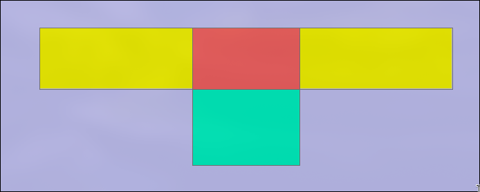

```sql
select sdo_geom.sdo_union(
	sdo_geometry (2003, 8307, null,
		sdo_elem_info_array (1,1003,3),
		sdo_ordinate_array ( -117.0, 40.0, -90., 44.0)
	),
	sdo_geometry (2003, 8307, null,
		sdo_elem_info_array (1,1003,3),
		sdo_ordinate_array ( -107.0, 35.0, -100., 44.0)
	)
)
```

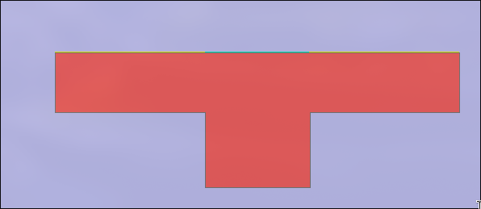

```sql
select sdo_geom.sdo_difference(
	sdo_geometry (2003, 8307, null,
		sdo_elem_info_array (1,1003,3),
		sdo_ordinate_array ( -117.0, 40.0, -90., 44.0)
	),
	sdo_geometry (2003, 8307, null,
		sdo_elem_info_array (1,1003,3),
		sdo_ordinate_array ( -107.0, 35.0, -100., 44.0)
	)
)
```

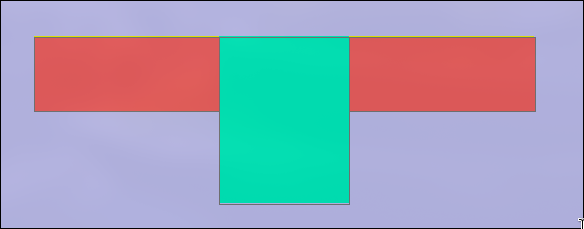


b.     sdo_buffer

```sql
select sdo_geom.sdo_buffer(	
	sdo_geometry (2003, 8307, null,
		sdo_elem_info_array (1,1003,3),
		sdo_ordinate_array ( -117.0, 40.0, -90., 44.0)
	),
	50
) from dual
```

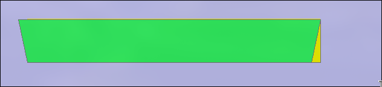

## TODO

c.     sdo_centroid, sdo_mbr, sdo_convexhull, sdo_simplify

```sql
select sdo_geom.sdo_centroid(sdo_geom.sdo_union(
	sdo_geometry (2003, 8307, null,
		sdo_elem_info_array (1,1003,3),
		sdo_ordinate_array ( -120.0, 40.0, -90., 44.0)
	),
	sdo_geometry (2003, 8307, null,
		sdo_elem_info_array (1,1003,3),
		sdo_ordinate_array ( -107.0, 35.0, -100., 44.0)
	)
)) from dual
```

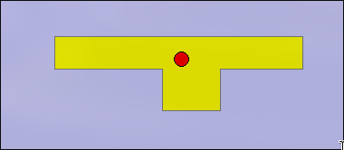


```sql
select sdo_geom.sdo_mbr(sdo_geom.sdo_union(
	sdo_geometry (2003, 8307, null,
		sdo_elem_info_array (1,1003,3),
		sdo_ordinate_array ( -120.0, 40.0, -90., 44.0)
	),
	sdo_geometry (2003, 8307, null,
		sdo_elem_info_array (1,1003,3),
		sdo_ordinate_array ( -107.0, 35.0, -100., 44.0)
	)
)) from dual
```

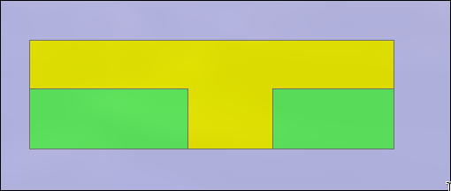


```sql
select sdo_geom.sdo_convexhull(sdo_geom.sdo_union(
	sdo_geometry (2003, 8307, null,
		sdo_elem_info_array (1,1003,3),
		sdo_ordinate_array ( -120.0, 40.0, -90., 44.0)
	),
	sdo_geometry (2003, 8307, null,
		sdo_elem_info_array (1,1003,3),
		sdo_ordinate_array ( -107.0, 35.0, -100., 44.0)
	)
)) from dual
```

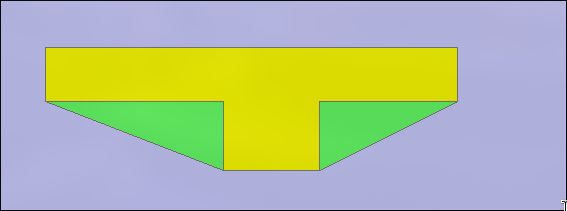


```sql
select sdo_util.simplify(sdo_geom.sdo_union(
	sdo_geometry (2003, 8307, null,
		sdo_elem_info_array (1,1003,3),
		sdo_ordinate_array ( -120.0, 40.0, -90., 44.0)
	),
	sdo_geometry (2003, 8307, null,
		sdo_elem_info_array (1,1003,3),
		sdo_ordinate_array ( -107.0, 35.0, -100., 44.0)
	)
), 6, 0.5) from dual
```

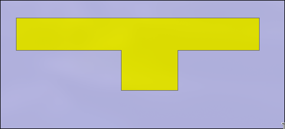

## TODO

f)      Itp. (własne przykłady)

## TODO

# Zadanie 8

Wykonaj kilka własnych przykładów/analiz


>Wyniki, zrzut ekranu, komentarz

```sql
--  ...
```

Punktacja

|   |   |
|---|---|
|zad|pkt|
|1|0,5|
|2|1|
|3|1|
|4|1|
|5|3|
|6|3|
|7|6|
|8|4|
|razem|20|
