# Indeksy,  optymalizator <br>Lab 4

<!-- <style scoped>
 p,li {
    font-size: 12pt;
  }
</style>  -->

<!-- <style scoped>
 pre {
    font-size: 8pt;
  }
</style>  -->


---

**Imię i nazwisko:**

--- 

Celem ćwiczenia jest zapoznanie się z planami wykonania zapytań (execution plans), oraz z budową i możliwością wykorzystaniem indeksów.

Swoje odpowiedzi wpisuj w miejsca oznaczone jako:

---
> Wyniki: 

```sql
--  ...
```

---

Ważne/wymagane są komentarze.

Zamieść kod rozwiązania oraz zrzuty ekranu pokazujące wyniki, (dołącz kod rozwiązania w formie tekstowej/źródłowej)

Zwróć uwagę na formatowanie kodu

## Oprogramowanie - co jest potrzebne?

Do wykonania ćwiczenia potrzebne jest następujące oprogramowanie
- MS SQL Server,
- SSMS - SQL Server Management Studio    
- przykładowa baza danych AdventureWorks2017.
    
Oprogramowanie dostępne jest na przygotowanej maszynie wirtualnej


## Przygotowanie  

Uruchom Microsoft SQL Managment Studio.
    
Stwórz swoją bazę danych o nazwie XYZ. 

```sql
create database xyz  
go  
  
use xyz  
go
```

Wykonaj poniższy skrypt, aby przygotować dane:

```sql
select * into [salesorderheader]  
from [adventureworks2017].sales.[salesorderheader]  
go  
  
select * into [salesorderdetail]  
from [adventureworks2017].sales.[salesorderdetail]  
go
```

## Dokumentacja/Literatura

Celem tej części ćwiczenia jest zapoznanie się z planami wykonania zapytań (execution plans) oraz narzędziem do automatycznego generowania indeksów.

Przydatne materiały/dokumentacja. Proszę zapoznać się z dokumentacją:
- [https://docs.microsoft.com/en-us/sql/tools/dta/tutorial-database-engine-tuning-advisor](https://docs.microsoft.com/en-us/sql/tools/dta/tutorial-database-engine-tuning-advisor)
- [https://docs.microsoft.com/en-us/sql/relational-databases/performance/start-and-use-the-database-engine-tuning-advisor](https://docs.microsoft.com/en-us/sql/relational-databases/performance/start-and-use-the-database-engine-tuning-advisor)
- [https://www.simple-talk.com/sql/performance/index-selection-and-the-query-optimizer](https://www.simple-talk.com/sql/performance/index-selection-and-the-query-optimizer)

Ikonki używane w graficznej prezentacji planu zapytania opisane są tutaj:
- [https://docs.microsoft.com/en-us/sql/relational-databases/showplan-logical-and-physical-operators-reference](https://docs.microsoft.com/en-us/sql/relational-databases/showplan-logical-and-physical-operators-reference)


<div style="page-break-after: always;"></div>

# Zadanie 1 - Obserwacja

Wpisz do MSSQL Managment Studio (na razie nie wykonuj tych zapytań):

```sql
-- zapytanie 1  
select *  
from salesorderheader sh  
inner join salesorderdetail sd on sh.salesorderid = sd.salesorderid  
where orderdate = '2008-06-01 00:00:00.000'  
go  
  
-- zapytanie 2  
select orderdate, productid, sum(orderqty) as orderqty, 
       sum(unitpricediscount) as unitpricediscount, sum(linetotal)  
from salesorderheader sh  
inner join salesorderdetail sd on sh.salesorderid = sd.salesorderid  
group by orderdate, productid  
having sum(orderqty) >= 100  
go  
  
-- zapytanie 3  
select salesordernumber, purchaseordernumber, duedate, shipdate  
from salesorderheader sh  
inner join salesorderdetail sd on sh.salesorderid = sd.salesorderid  
where orderdate in ('2008-06-01','2008-06-02', '2008-06-03', '2008-06-04', '2008-06-05')  
go  
  
-- zapytanie 4  
select sh.salesorderid, salesordernumber, purchaseordernumber, duedate, shipdate  
from salesorderheader sh  
inner join salesorderdetail sd on sh.salesorderid = sd.salesorderid  
where carriertrackingnumber in ('ef67-4713-bd', '6c08-4c4c-b8')  
order by sh.salesorderid  
go
```


Włącz dwie opcje: **Include Actual Execution Plan** oraz **Include Live Query Statistics**:


<!-- ![[_img/index1-1.png | 500]] -->


Teraz wykonaj poszczególne zapytania (najlepiej każde analizuj oddzielnie). Co można o nich powiedzieć? Co sprawdzają? Jak można je zoptymalizować?  
(Hint: aby wykonać tylko fragment kodu SQL znajdującego się w edytorze, zaznacz go i naciśnij F5)

---
## Zapytanie 1

#### Opis

Zapytanie pobiera wszystkie kolumny z tabeli `salesorderheader` oraz `salesorderdetail`, łącząc je na podstawie kolumny `salesorderid`. Następnie filtruje wyniki, zwracając tylko te rekordy, gdzie wartość kolumny `orderdate` wynosi '2008-06-01 00:00:00.000'.

#### Wynik

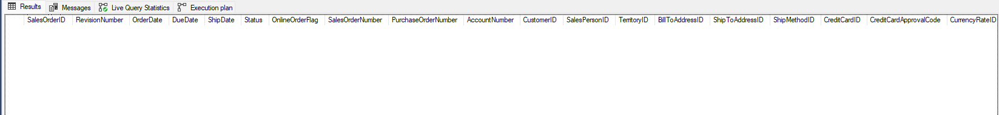

Execution Plan:

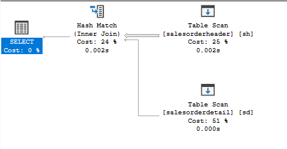

Zapytanie zwraca pusty zbiór wyników, jednakże proces jego wykonania generuje znaczący koszt związany z przeszukiwaniem całej drugiej tabeli, pomimo braku wyników w pierwszej.

#### Optymalizacja

Można zoptymalizować to zapytanie poprzez stworzenie indeksu na kolumnie `orderdate` w tabeli `salesorderheader`. Pozwoli to na szybsze określenie, że zbiór wynikowy jest pusty bez konieczności przeszukiwania całej drugiej tabeli.

Możemy utworzyć indeks na kolumnę `orderdate` w tabeli `salesorderheader` poniższą komendą:
```sql
CREATE NONCLUSTERED INDEX [orderdate] ON [dbo].[salesorderheader] ([OrderDate])
```

Po utworzeniu indeksu koszt i czas zapytania spadają do zera.
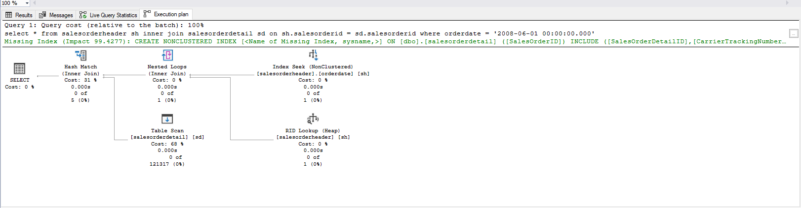

## Zapytanie 2

#### Opis

Zapytanie pobiera `orderdate`, `productid` oraz sumy `orderqty`, `unitpricediscount` i `linetotal`. Łączy tabele `salesorderheader` i `salesorderdetail` na podstawie kolumny `salesorderid`, grupując wyniki według `orderdate` i `productid`, a następnie filtrując grupy, gdzie suma `orderqty` jest większa lub równa 100.

#### Wynik

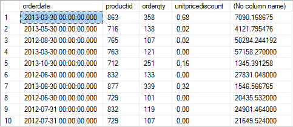

Execution Plan:

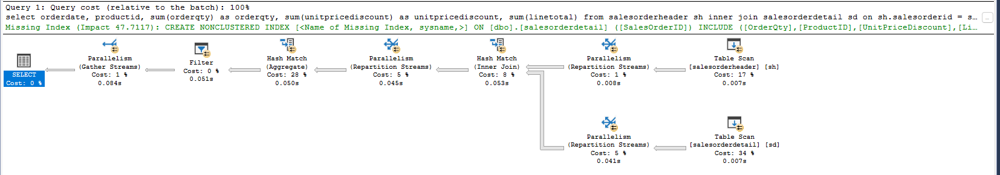

Zapytanie zwraca poprawny zbiór wyników, jednak proces sumowania kolumn może być zoptymalizowany.

#### Optymalizacja

Aby zoptymalizować to zapytanie, można utworzyć indeksy na kolumnach `orderdate` w tabeli `salesorderheader` i `productid` w tabeli `salesorderdetail`. Dodatkowo, można skorzystać z indeksu z opcją `include`, aby szybciej uzyskać dostęp do kolumn sumowanych podczas agregacji.

Potrzebny indeks można utworzyć poniższą komendą:
```sql
CREATE NONCLUSTERED INDEX [orderid_include] ON [dbo].[salesorderdetail] ([SalesOrderID]) INCLUDE ([OrderQty], [ProductID], [UnitPriceDiscount], [LineTotal])
```

Po utworzeniu indeksu koszt i czas zapytania znacznie się zmniejszają.

Przed:
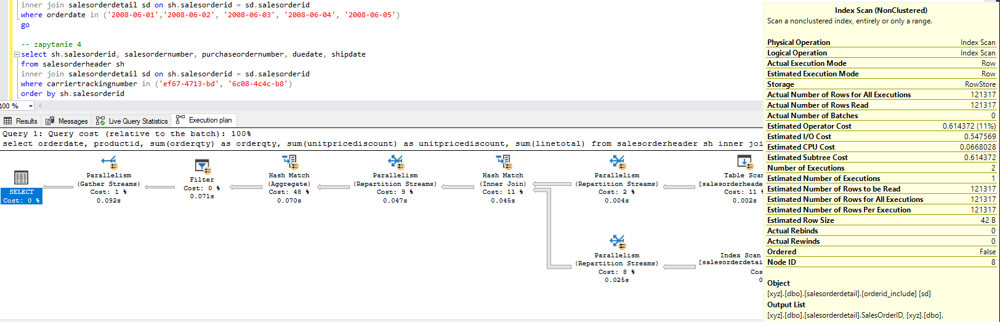

Po:


## Zapytanie 3

#### Opis

Zapytanie pobiera kolumny `salesordernumber`, `purchaseordernumber`, `duedate`, `shipdate`, łącząc tabele `salesorderheader` i `salesorderdetail` na podstawie kolumny `salesorderid`. Następnie filtruje wyniki, zwracając tylko te rekordy, gdzie `orderdate` należy do określonych dat.

#### Wynik:

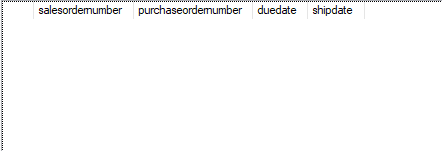

Execution Plan:

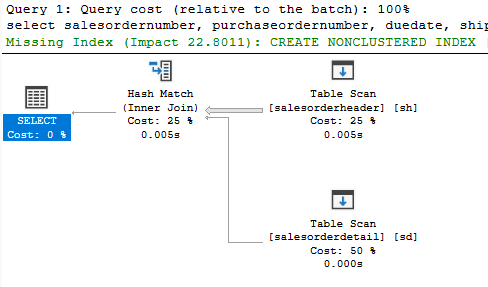

Sytuacja bardzo podobna do tej z zapytania 1. Zbiór wynikowy jest pusty, ale odkrycie tego było kosztowne.

#### Optymalizacja

Stworzenie indeksu na kolumnie `orderdate` w tabeli `salesorderheader` przyspieszy zapytanie, eliminując zbędne obliczenia.

Potrzebny indeks można utworzyć poniższa komendą:
```sql
CREATE NONCLUSTERED INDEX [orderdate] ON [dbo].[salesorderheader] ([OrderDate])
```

Po wykonaniu zapytania po utworzeniu indeksu, koszt i czas zapytania spadają do zera.
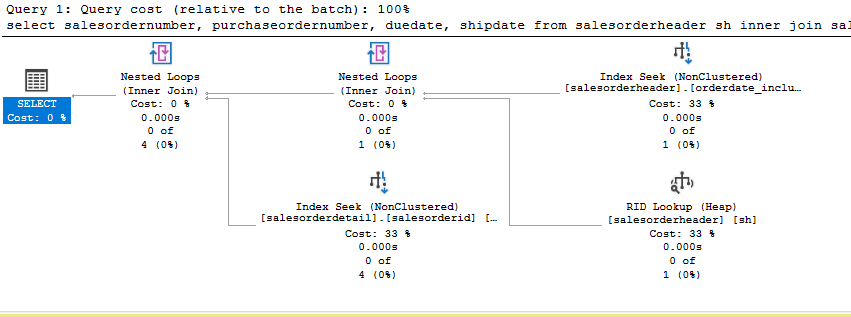

## Zapytanie 4

#### Opis

Zapytanie pobiera kolumny `sh.salesorderid`, `salesordernumber`, `purchaseordernumber`, `duedate`, `shipdate`, łącząc tabele `salesorderheader` i `salesorderdetail` na podstawie kolumny `salesorderid`. Następnie filtruje wyniki, zwracając tylko te rekordy, gdzie `carriertrackingnumber` należy do określonych wartości.

#### Wynik

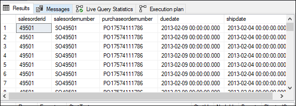

Execution Plan:

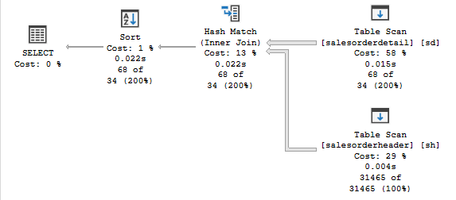

Widzimy, że znaczną część kosztu zapytania powoduje zapytanie pochodzące z tabeli `salesorderdetail`, a to w niej wyszukiwany jest `carriertrackingnumber` z warunku `WHERE`. 

#### Optymalizacja

Pierwszym krokiem do optymalizacji tego zapytania jest utworzenie indeksu na kolumnie `carriertrackingnumber` w tabeli `salesorderdetail`. Indeks ten przyspieszy wyszukiwanie rekordów na podstawie wartości w tej kolumnie, co znacznie zwiększy wydajność zapytania. Można także skorzystać z `include`, aby szybciej uzyskać wartość kolumny `salesorderid`, co również pozwoli nam przyśpieszyć to zapytanie.

Potrzebny indeks można utworzyć poniższą komendą:
```sql
CREATE NONCLUSTERED INDEX [carriertrackingnumber] ON [dbo].[salesorderdetail] ([carriertrackingnumber]) INCLUDE ([salesorderid])
```

Po wykonaniu zapytania po utworzeniu indeksu, czas i koszt każdego z etapów oraz całego zapytania znacznie spadają.
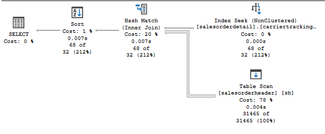

---

<div style="page-break-after: always;"></div>

# Zadanie 2 - Optymalizacja

Zaznacz wszystkie zapytania, i uruchom je w **Database Engine Tuning Advisor**:

<!-- ![[_img/index1-12.png | 500]] -->

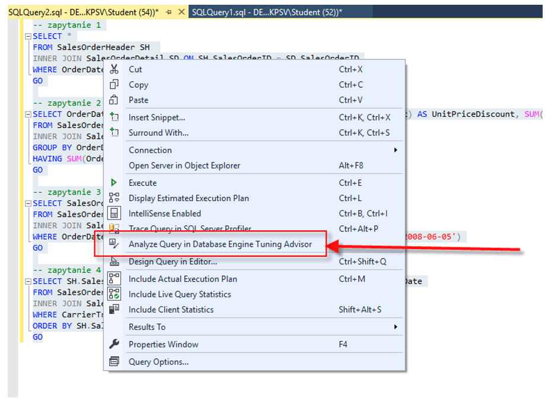


Sprawdź zakładkę **Tuning Options**, co tam można skonfigurować?

---

### Wyniki

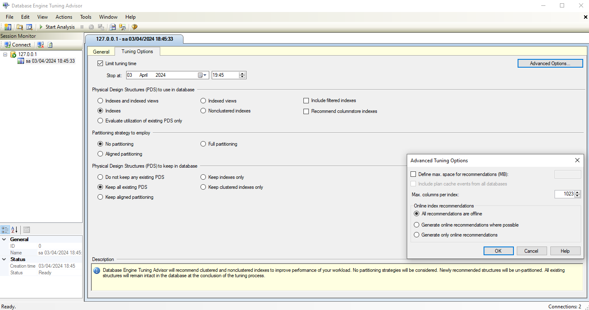

Mamy możliwość konfiguracji następujących parametrów:

- **Ograniczenie czasu tuningu**: Określ, ile czasu narzędzie ma przeznaczyć na analizę i generowanie rekomendacji. Możesz wybrać konkretny czas zakończenia procesu.

- **Fizyczne struktury przechowujące dane do użycia w bazie danych**: Wybierz struktury, takie jak indeksy lub indeksowane widoki, które mają być brane pod uwagę w rekomendacjach. Możesz również zdecydować, czy uwzględnić indeksy filtrowane i indeksy kolumnowe.

- **Strategia partycjonowania**: Wybierz preferowaną strategię partycjonowania, taką jak partycjonowanie pełne czy równomierne.

- **Zachowanie fizycznych struktur przechowywania danych**: Określ, które struktury zachować w bazie danych, np. wszystkie, żadne, tylko indeksy itp.

Oprócz tych podstawowych opcji, istnieją także zaawansowane ustawienia, takie jak:

- **Maksymalna przestrzeń rekomendacji**: Określ maksymalną ilość miejsca, jaką narzędzie może zarezerwować na rekomendacje (wyrażoną w megabajtach).

- **Uwzględnienie zdarzeń z bufora planów**: Decyduj, czy uwzględnić zdarzenia z bufora planów z wszystkich baz danych w analizie.

- **Maksymalna liczba kolumn na indeks**: Określ maksymalną liczbę kolumn, które mogą być zawarte w pojedynczym indeksie.

- **Praca bazy danych podczas tuningu**: Wybierz, czy dopuszczasz przerywanie pracy bazy danych podczas procesu tuningu.

---


Użyj **Start Analysis**:

<!-- ![[_img/index1-3.png | 500]] -->

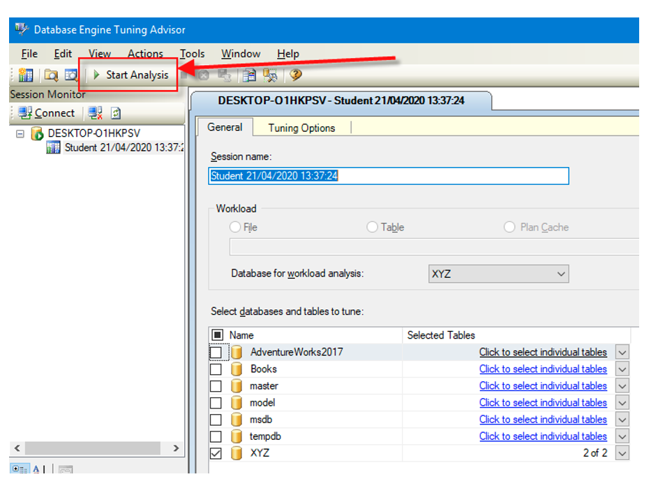


Zaobserwuj wyniki w **Recommendations**.

Przejdź do zakładki **Reports**. Sprawdź poszczególne raporty. Główną uwagę zwróć na koszty i ich poprawę:


<!-- ![[_img/index4-1.png | 500]] -->

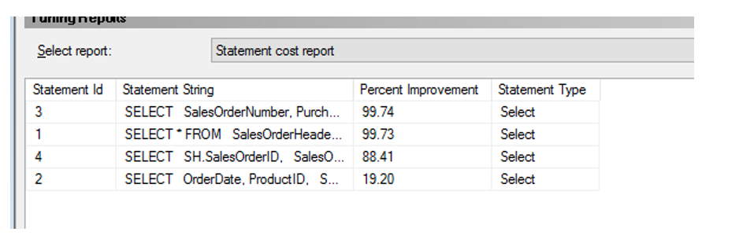


Zapisz poszczególne rekomendacje:

Uruchom zapisany skrypt w Management Studio.

Opisz, dlaczego dane indeksy zostały zaproponowane do zapytań:

---
> Wyniki: 

```sql
--  ...
```

---


Sprawdź jak zmieniły się Execution Plany. Opisz zmiany:

---
> Wyniki: 

```sql
--  ...
```

---


<div style="page-break-after: always;"></div>

# Zadanie 3 - Kontrola "zdrowia" indeksu

## Dokumentacja/Literatura

Celem kolejnego zadania jest zapoznanie się z możliwością administracji i kontroli indeksów.

Na temat wewnętrznej struktury indeksów można przeczytać tutaj:
- [https://technet.microsoft.com/en-us/library/2007.03.sqlindex.aspx](https://technet.microsoft.com/en-us/library/2007.03.sqlindex.aspx)
- [https://docs.microsoft.com/en-us/sql/relational-databases/system-dynamic-management-views/sys-dm-db-index-physical-stats-transact-sql](https://docs.microsoft.com/en-us/sql/relational-databases/system-dynamic-management-views/sys-dm-db-index-physical-stats-transact-sql)
- [https://docs.microsoft.com/en-us/sql/relational-databases/system-dynamic-management-views/sys-dm-db-index-physical-stats-transact-sql](https://docs.microsoft.com/en-us/sql/relational-databases/system-dynamic-management-views/sys-dm-db-index-physical-stats-transact-sql)
- [https://docs.microsoft.com/en-us/sql/relational-databases/system-catalog-views/sys-indexes-transact-sql](https://docs.microsoft.com/en-us/sql/relational-databases/system-catalog-views/sys-indexes-transact-sql)

Sprawdź jakie informacje można wyczytać ze statystyk indeksu:

```sql
select *  
from sys.dm_db_index_physical_stats (db_id('adventureworks2017')  
,object_id('humanresources.employee')  
,null -- null to view all indexes; otherwise, input index number  
,null -- null to view all partitions of an index  
,'detailed') -- we want all information
```

Jakie są według Ciebie najważniejsze pola?

---
#### Wyniki


Do najważniejszych pól należą:
- index_id / index_type-desc - to pole mówi nam z jakim typem indexu (lub stertą) mamy do czynienia
- alloc_unity_type_desc - czy mamy doczynienia z *IN_ROW_DATA* lub *LOB_DATA*, ewentualnie *OVERFLOW_ROW_DATA*. W większości przypadków mamy do czynienia z *IN_ROW_DATA*, jeśli dany wiersz przekracza ustaloną wartość (zwykle 8060 bajtów) to część pól jest kopiowana do *OVERFLOW_ROW_DATA*, z ostatnim typem mamy do czynienia jeśli pole jest zdefiniowane jako LOB.
- index_depth - głębokość indexu, w przypadku sterty = 1
- index_level - aktualny poziom w indexie (wiersze w tej komendzie odpowiadają pojedynczemu poziomowi w B-drzewie)
- avg_fragmentation_in_percent - logiczna defragmnetacja w przypadku indexów oraz fragmentacja extentów w przypadku sterty
- page_count - liczba stron używanych przez indeks

---

Sprawdź, które indeksy w bazie danych wymagają reorganizacji:

```sql
use adventureworks2017  
  
select object_name([object_id]) as 'table name',  
index_id as 'index id'  
from sys.dm_db_index_physical_stats (db_id('adventureworks2017')  
,null -- null to view all tables  
,null -- null to view all indexes; otherwise, input index number  
,null -- null to view all partitions of an index  
,'detailed') --we want all information  
where ((avg_fragmentation_in_percent > 10  
and avg_fragmentation_in_percent < 15) -- logical fragmentation  
or (avg_page_space_used_in_percent < 75  
and avg_page_space_used_in_percent > 60)) --page density  
and page_count > 8 -- we do not want indexes less than 1 extent in size  
and index_id not in (0) --only clustered and nonclustered indexes
```

---
#### Wyniki

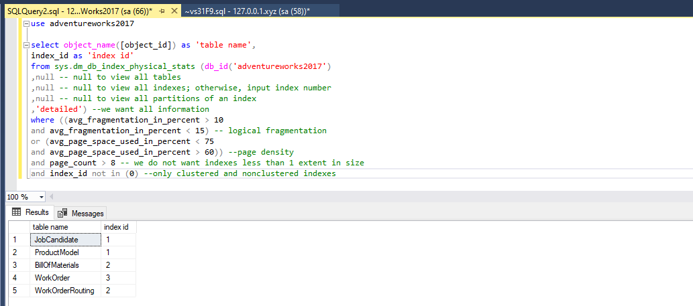

W bazie Adventure Works mamy 5 tabel z umiarkowaną fragmentacją lub z nieoptymalną gęstością strony. W sytuacji gdy mamy małą gęstość strony, to zwiększamy ilość operacji I/O ale mamy nie musimy się martwić tym że wiersz przestanie się mieścić na stronie. W przypadku wysokiej gęstości, operacje I/O są bardzo optymalne, ale w przypadku gdy wiersz przestanie się mieścić na stronie, musimy taki wiersz splitować na dwie strony co jest nieoptymalne w przypadku dużej ilości operacji insert/update.

---

Sprawdź, które indeksy w bazie danych wymagają przebudowy:

```sql
use adventureworks2017  
  
select object_name([object_id]) as 'table name',  
index_id as 'index id'  
from sys.dm_db_index_physical_stats (db_id('adventureworks2017')  
,null -- null to view all tables  
,null -- null to view all indexes; otherwise, input index number  
,null -- null to view all partitions of an index  
,'detailed') --we want all information  
where ((avg_fragmentation_in_percent > 15) -- logical fragmentation  
or (avg_page_space_used_in_percent < 60)) --page density  
and page_count > 8 -- we do not want indexes less than 1 extent in size  
and index_id not in (0) --only clustered and nonclustered indexes
```

---
### Wyniki

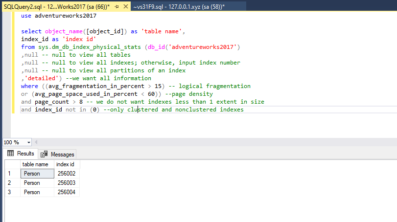

Wyniki wskazują, że trzy indeksy na tabeli Person wymagają przebudowy.
Może to być spowodowane częstymi modyfikacjami rekordów w tabeli Person, szczególnie z uwagi na obecność kolumny `ModifiedDate`.
Dodatkowo, rozmiar tej tabeli jest relatywnie duży, co również może przyczynić się do częstych modyfikacji i potencjalnej fragmentacji indeksów.

---

Czym się różni przebudowa indeksu od reorganizacji?

(Podpowiedź: [http://blog.plik.pl/2014/12/defragmentacja-indeksow-ms-sql.html](http://blog.plik.pl/2014/12/defragmentacja-indeksow-ms-sql.html))

---
### Wyniki

Obie operacje - reorganizacja i przebudowa indeksów - mają na celu zmniejszenie poziomu fragmentacji indeksu, jednak różnią się sposobem działania oraz skutkami.

Przebudowa polega na całkowitym zrzuceniu i ponownym zbudowaniu indeksu. Jest to bardziej radykalne podejście, które eliminuje całkowicie fragmentację, jednak jest znacznie bardziej czasochłonne i wymaga większej ilości zasobów. Może być wykonywany online lub offline, z opcją ONLINE pozwalającą na wykonywanie tej operacji w trakcie działania bazy danych, jednakże zaleca się, aby operacja przebudowy odbywała się offline, gdy baza danych nie jest wykorzystywana.

Reorganizacja operuje na poziomie liści B-drzewa. Polega na uporządkowaniu fizycznej kolejności stron, co redukuje fragmentację zewnętrzną, oraz na modyfikacji stron w celu dopasowania gęstości do określonych parametrów fill dla danego indeksu. Jest to operacja wykonywana online, zużywająca mniej zasobów niż przebudowa, jednak może być mniej skuteczna w przypadku silnie zfragmentowanych indeksów.

Źródło:
https://learn.microsoft.com/en-us/sql/relational-databases/indexes/reorganize-and-rebuild-indexes?view=sql-server-ver16&redirectedfrom=MSDN#rebuild-an-index

---

Sprawdź co przechowuje tabela sys.dm_db_index_usage_stats:

---
### Wyniki

```sql
select * from  sys.dm_db_index_usage_stats;
```

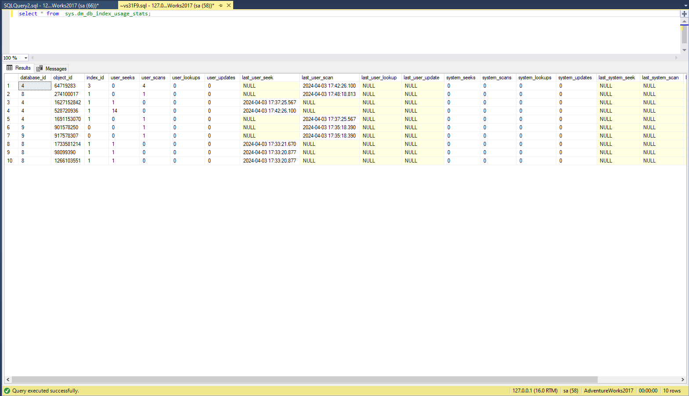

Tabela przechowuje informacje o użyciu indeksów bazy danych. Zawiera statystyki dotyczące operacji odczytu i zapisu dla indeksów w bazie danych. Dane tej tabeli mogą być przydatne do analizy i optymalizacji wydajności bazy danych poprzez identyfikację rzadko używanych indeksów lub takich, które wymagają aktualizacji statystyk.

---

Napraw wykryte błędy z indeksami ze wcześniejszych zapytań. Możesz użyć do tego przykładowego skryptu:

```sql
use adventureworks2017  
  
--table to hold results  
declare @tablevar table(lngid int identity(1,1), objectid int,  
index_id int)  
  
insert into @tablevar (objectid, index_id)  
select [object_id],index_id  
from sys.dm_db_index_physical_stats (db_id('adventureworks2017')  
,null -- null to view all tables  
,null -- null to view all indexes; otherwise, input index number  
,null -- null to view all partitions of an index  
,'detailed') --we want all information  
where ((avg_fragmentation_in_percent > 15) -- logical fragmentation  
or (avg_page_space_used_in_percent < 60)) --page density  
and page_count > 8 -- we do not want indexes less than 1 extent in size  
and index_id not in (0) --only clustered and nonclustered indexes  
  
select 'alter index ' + ind.[name] + ' on ' + sc.[name] + '.'  
+ object_name(objectid) + ' rebuild'  
from @tablevar tv  
inner join sys.indexes ind  
on tv.objectid = ind.[object_id]  
and tv.index_id = ind.index_id  
inner join sys.objects ob  
on tv.objectid = ob.[object_id]  
inner join sys.schemas sc  
on sc.schema_id = ob.schema_id
```

Napisz przygotowane komendy SQL do naprawy indeksów:

---
### Wyniki

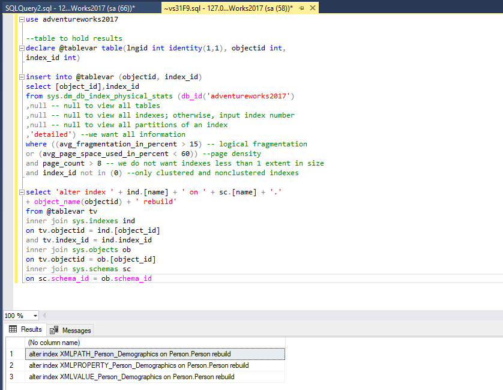

```sql
ALTER INDEX XMLPATH_Person_Demographics ON Person.Person REBUILD WITH (MAXDOP = 1);
ALTER INDEX XMLPROPERTY_Person_Demographics ON Person.Person REBUILD WITH (MAXDOP = 1);
ALTER INDEX XMLVALUE_Person_Demographics ON Person.Person REBUILD WITH (MAXDOP = 1);
```

Parametr MAXDOP = 1 jest konieczny, gdyż zapewnia, że tylko jeden proces będzie wykonywał operację przebudowywania indeksu jednocześnie. Wszystkie te operacje będą wykonywane seryjnie. Chociaż to wydłuża czas przebudowywania, to zwiększa wydajność indeksu oraz zmniejsza fragmentację. Bez tego parametru indeksy nadal mogą pozostać kandydatami do przebudowywania, co wpływa na wydajność i stabilność systemu.

---

<div style="page-break-after: always;"></div>

# Zadanie 4 - Budowa strony indeksu

## Dokumentacja

Celem kolejnego zadania jest zapoznanie się z fizyczną budową strony indeksu 
- [https://www.mssqltips.com/sqlservertip/1578/using-dbcc-page-to-examine-sql-server-table-and-index-data/](https://www.mssqltips.com/sqlservertip/1578/using-dbcc-page-to-examine-sql-server-table-and-index-data/)
- [https://www.mssqltips.com/sqlservertip/2082/understanding-and-examining-the-uniquifier-in-sql-server/](https://www.mssqltips.com/sqlservertip/2082/understanding-and-examining-the-uniquifier-in-sql-server/)
- [http://www.sqlskills.com/blogs/paul/inside-the-storage-engine-using-dbcc-page-and-dbcc-ind-to-find-out-if-page-splits-ever-roll-back/](http://www.sqlskills.com/blogs/paul/inside-the-storage-engine-using-dbcc-page-and-dbcc-ind-to-find-out-if-page-splits-ever-roll-back/)

Wypisz wszystkie strony które są zaalokowane dla indeksu w tabeli. Użyj do tego komendy np.:

```sql
dbcc ind ('adventureworks2017', 'person.address', 1)  
-- '1' oznacza nr indeksu
```

Zapisz sobie kilka różnych typów stron, dla różnych indeksów:

---
### Wyniki

Indeks 1
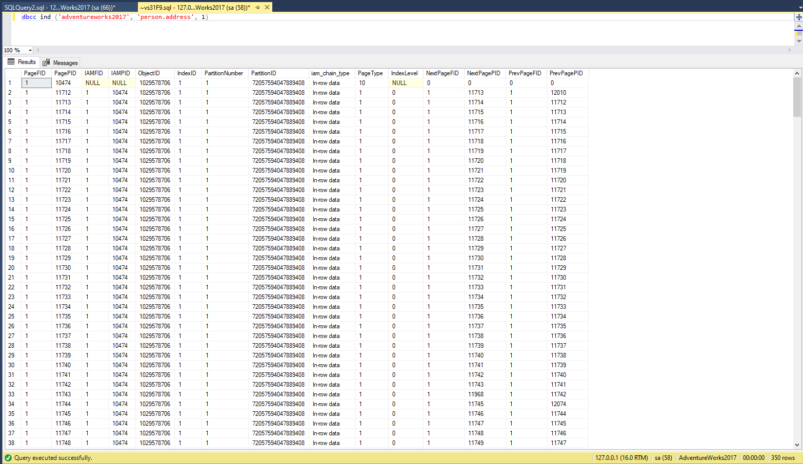

Indeks 2
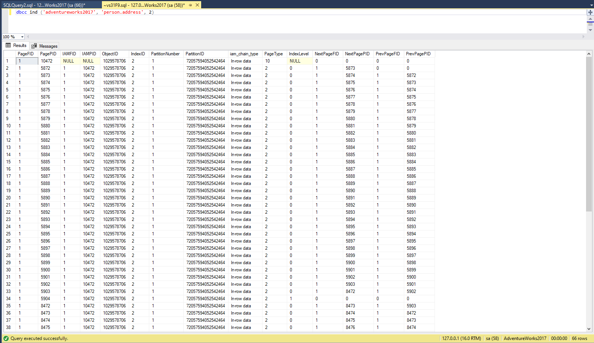

Indeks 3
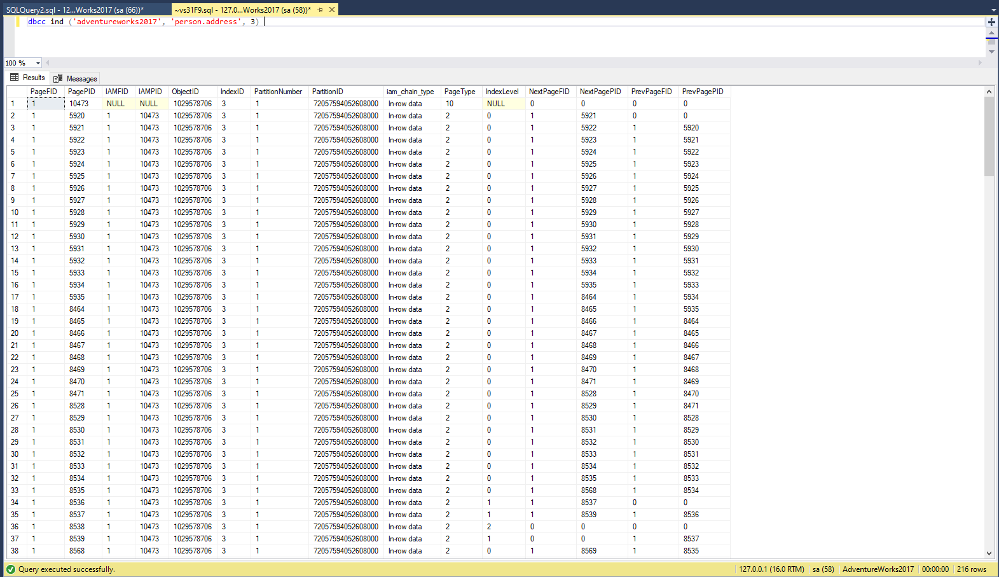

Uzyskano strony o typach: 1, 2, 3 i 10.

**Strona danych (Data Page - PageType 1)**

Przechowuje rzeczywiste dane tabeli, takie jak wiersze.
Wysokość strony wynosi zazwyczaj 8 KB.
Te strony są również znane jako strony danych wierszy.

**Strona indeksu (Index Page - PageType 2)**

Przechowuje dane indeksu dla danej tabeli.
Każdy indeks posiada swoje własne strony indeksu.
Strony indeksów zawierają odwołania do rzeczywistych danych lub do innych stron indeksu.

**Strona zaalokowana dla indeksu (Index Allocation Map (IAM) Page - PageType 3)**

Przechowuje informacje na temat innych stron, które są zaalokowane dla danego indeksu.
Umożliwia systemowi zarządzania bazą danych śledzenie używanych i dostępnych stron w indeksie.

**Strona danych lub indeksu (Data or Index Page - PageType 10)**

Jest to specjalny typ strony, który może być zarówno stroną danych, jak i stroną indeksu.
Zwykle używany w przypadku, gdy strona może zawierać zarówno dane, jak i indeksy, co jest częstym przypadkiem w przypadku strony liścia klastra.

---

Włącz flagę 3604 zanim zaczniesz przeglądać strony:

```sql
dbcc traceon (3604);
```

Sprawdź poszczególne strony komendą DBCC PAGE. np.:

```sql
dbcc page('adventureworks2017', 1, 13720, 3);
```

Zapisz obserwacje ze stron. Co ciekawego udało się zaobserwować?

---
### Wyniki

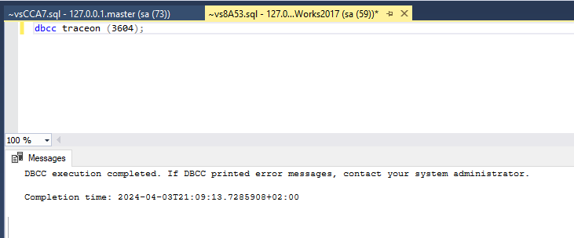

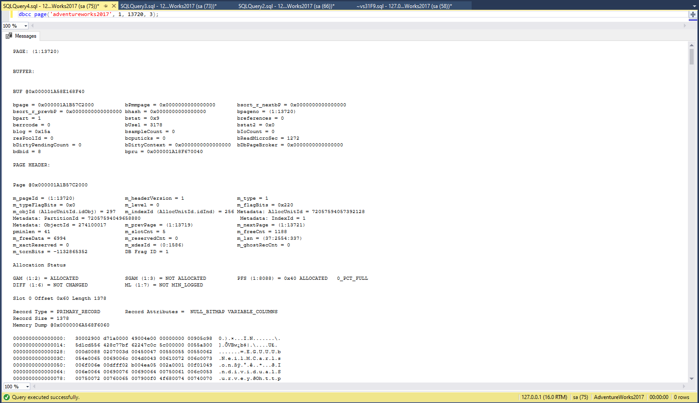

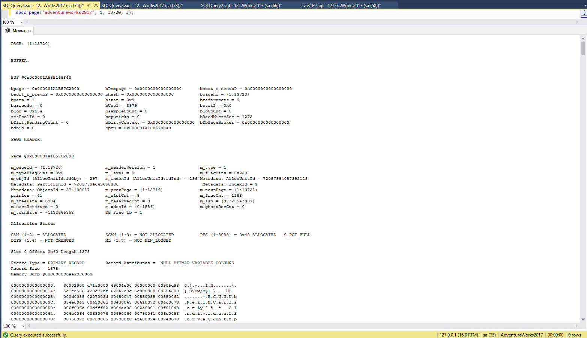

Podczas analizy zauważyliśmy cztery ciekawe obserwacje:

**Informacje o stronie**: Na początku raportu uzyskaliśmy ogólne informacje o stronie, takie jak jej identyfikator (PAGE: (1:13720)) oraz dane bufora (BUFFER). Informacje o buforze zawierają szczegóły dotyczące sposobu przechowywania strony w pamięci podręcznej, takie jak adresy, statystyki odczytu/zapisu oraz stan błędu.

**Nagłówek strony:** Zawiera metadane dotyczące strony, takie jak identyfikator strony, wersja nagłówka, typ strony, poziom w hierarchii, flagi, informacje o obiekcie, indeksie, poprzedniej i następnej stronie, ilość slotów, ilość danych wolnych oraz zarezerwowane dane.

**Status alokacji**: W sekcji "Allocation Status" znajdują się informacje o alokacji miejsca w różnych strukturach bazy danych, takich jak GAM (Global Allocation Map), SGAM (Shared Global Allocation Map), PFS (Page Free Space), DIFF (Differential Changed Map) oraz ML (Minimum Log Map). Te informacje są przydatne do zarządzania przestrzenią w plikach bazy danych.

**Dane**: Widzimy, że na stronie przechowywane są rzeczywiste dane (coś w rodzaju zrzutu pamięci). Te dane mają format szesnastkowy.

---

Punktacja:

|   |   |
|---|---|
|zadanie|pkt|
|1|3|
|2|3|
|3|3|
|4|1|
|razem|10|
