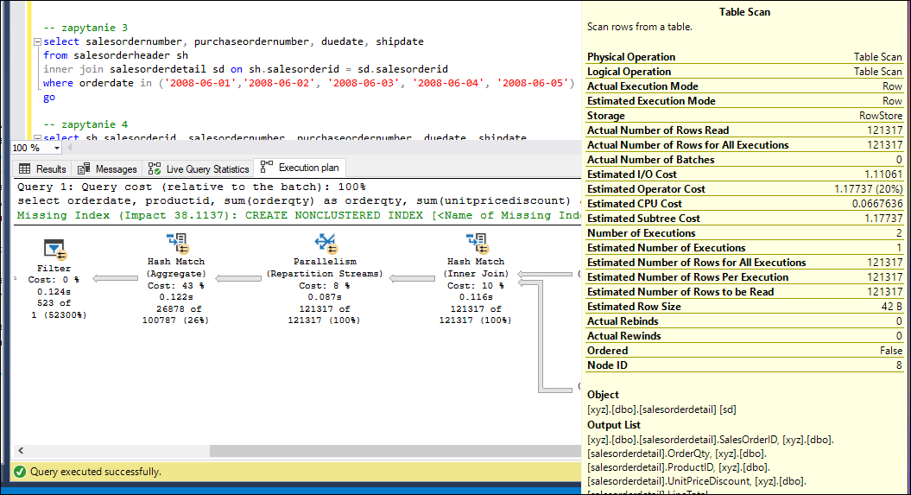
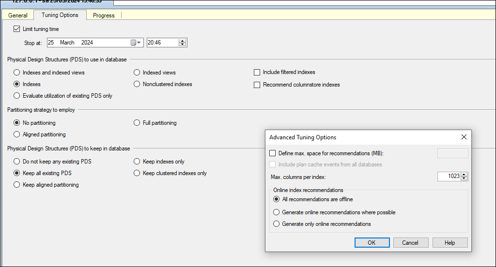

# Indeksy,  optymalizator <br>Lab 4

<!-- <style scoped>
 p,li {
    font-size: 12pt;
  }
</style>  -->

<!-- <style scoped>
 pre {
    font-size: 8pt;
  }
</style>  -->


---

**Imię i nazwisko:**

--- 

Celem ćwiczenia jest zapoznanie się z planami wykonania zapytań (execution plans), oraz z budową i możliwością wykorzystaniem indeksów.

Swoje odpowiedzi wpisuj w miejsca oznaczone jako:

---
> Wyniki: 

```sql
--  ...
```

---

Ważne/wymagane są komentarze.

Zamieść kod rozwiązania oraz zrzuty ekranu pokazujące wyniki, (dołącz kod rozwiązania w formie tekstowej/źródłowej)

Zwróć uwagę na formatowanie kodu

## Oprogramowanie - co jest potrzebne?

Do wykonania ćwiczenia potrzebne jest następujące oprogramowanie
- MS SQL Server,
- SSMS - SQL Server Management Studio    
- przykładowa baza danych AdventureWorks2017.
    
Oprogramowanie dostępne jest na przygotowanej maszynie wirtualnej


## Przygotowanie  

Uruchom Microsoft SQL Managment Studio.
    
Stwórz swoją bazę danych o nazwie XYZ. 

```sql
create database xyz  
go  
  
use xyz  
go
```

Wykonaj poniższy skrypt, aby przygotować dane:

```sql
select * into [salesorderheader]  
from [adventureworks2017].sales.[salesorderheader]  
go  
  
select * into [salesorderdetail]  
from [adventureworks2017].sales.[salesorderdetail]  
go
```

## Dokumentacja/Literatura

Celem tej części ćwiczenia jest zapoznanie się z planami wykonania zapytań (execution plans) oraz narzędziem do automatycznego generowania indeksów.

Przydatne materiały/dokumentacja. Proszę zapoznać się z dokumentacją:
- [https://docs.microsoft.com/en-us/sql/tools/dta/tutorial-database-engine-tuning-advisor](https://docs.microsoft.com/en-us/sql/tools/dta/tutorial-database-engine-tuning-advisor)
- [https://docs.microsoft.com/en-us/sql/relational-databases/performance/start-and-use-the-database-engine-tuning-advisor](https://docs.microsoft.com/en-us/sql/relational-databases/performance/start-and-use-the-database-engine-tuning-advisor)
- [https://www.simple-talk.com/sql/performance/index-selection-and-the-query-optimizer](https://www.simple-talk.com/sql/performance/index-selection-and-the-query-optimizer)

Ikonki używane w graficznej prezentacji planu zapytania opisane są tutaj:
- [https://docs.microsoft.com/en-us/sql/relational-databases/showplan-logical-and-physical-operators-reference](https://docs.microsoft.com/en-us/sql/relational-databases/showplan-logical-and-physical-operators-reference)


<div style="page-break-after: always;"></div>

# Zadanie 1 - Obserwacja

Wpisz do MSSQL Managment Studio (na razie nie wykonuj tych zapytań):

```sql
-- zapytanie 1  
select *  
from salesorderheader sh  
inner join salesorderdetail sd on sh.salesorderid = sd.salesorderid  
where orderdate = '2008-06-01 00:00:00.000'  
go  
  
-- zapytanie 2  
select orderdate, productid, sum(orderqty) as orderqty, 
       sum(unitpricediscount) as unitpricediscount, sum(linetotal)  
from salesorderheader sh  
inner join salesorderdetail sd on sh.salesorderid = sd.salesorderid  
group by orderdate, productid  
having sum(orderqty) >= 100  
go  
  
-- zapytanie 3  
select salesordernumber, purchaseordernumber, duedate, shipdate  
from salesorderheader sh  
inner join salesorderdetail sd on sh.salesorderid = sd.salesorderid  
where orderdate in ('2008-06-01','2008-06-02', '2008-06-03', '2008-06-04', '2008-06-05')  
go  
  
-- zapytanie 4  
select sh.salesorderid, salesordernumber, purchaseordernumber, duedate, shipdate  
from salesorderheader sh  
inner join salesorderdetail sd on sh.salesorderid = sd.salesorderid  
where carriertrackingnumber in ('ef67-4713-bd', '6c08-4c4c-b8')  
order by sh.salesorderid  
go
```


Włącz dwie opcje: **Include Actual Execution Plan** oraz **Include Live Query Statistics**:


<!-- ![[_img/index1-1.png | 500]] -->


Teraz wykonaj poszczególne zapytania (najlepiej każde analizuj oddzielnie). Co można o nich powiedzieć? Co sprawdzają? Jak można je zoptymalizować?  
(Hint: aby wykonać tylko fragment kodu SQL znajdującego się w edytorze, zaznacz go i naciśnij F5)

---
## Zapytanie 1

#### Opis

Zapytanie pobiera wszystkie kolumny z tabeli `salesorderheader` oraz `salesorderdetail`, łącząc je na podstawie kolumny `salesorderid`. Następnie filtruje wyniki, zwracając tylko te rekordy, gdzie wartość kolumny `orderdate` wynosi '2008-06-01 00:00:00.000'.

#### Wynik


Execution Plan:


Zapytanie zwraca pusty zbiór wyników, jednakże proces jego wykonania generuje znaczący koszt związany z przeszukiwaniem całej drugiej tabeli, pomimo braku wyników w pierwszej.

#### Optymalizacja

Można zoptymalizować to zapytanie poprzez stworzenie indeksu na kolumnie `orderdate` w tabeli `salesorderheader`. Pozwoli to na szybsze określenie, że zbiór wynikowy jest pusty bez konieczności przeszukiwania całej drugiej tabeli.

Możemy utworzyć indeks na kolumnę `orderdate` w tabeli `salesorderheader` poniższą komendą:
```sql
CREATE NONCLUSTERED INDEX [orderdate] ON [dbo].[salesorderheader] ([OrderDate])
```

Po utworzeniu indeksu koszt i czas zapytania spadają do zera.


## Zapytanie 2

#### Opis

Zapytanie pobiera `orderdate`, `productid` oraz sumy `orderqty`, `unitpricediscount` i `linetotal`. Łączy tabele `salesorderheader` i `salesorderdetail` na podstawie kolumny `salesorderid`, grupując wyniki według `orderdate` i `productid`, a następnie filtrując grupy, gdzie suma `orderqty` jest większa lub równa 100.

#### Wynik


Execution Plan:


Zapytanie zwraca poprawny zbiór wyników, jednak proces sumowania kolumn może być zoptymalizowany.

#### Optymalizacja

Aby zoptymalizować to zapytanie, można utworzyć indeksy na kolumnach `orderdate` w tabeli `salesorderheader` i `productid` w tabeli `salesorderdetail`. Dodatkowo, można skorzystać z indeksu z opcją `include`, aby szybciej uzyskać dostęp do kolumn sumowanych podczas agregacji.

Potrzebny indeks można utworzyć poniższą komendą:
```sql
CREATE NONCLUSTERED INDEX [orderid_include] ON [dbo].[salesorderdetail] ([SalesOrderID]) INCLUDE ([OrderQty], [ProductID], [UnitPriceDiscount], [LineTotal])
```

Po utworzeniu indeksu koszt i czas zapytania znacznie się zmniejszają.

Przed:


Po:


## Zapytanie 3

#### Opis

Zapytanie pobiera kolumny `salesordernumber`, `purchaseordernumber`, `duedate`, `shipdate`, łącząc tabele `salesorderheader` i `salesorderdetail` na podstawie kolumny `salesorderid`. Następnie filtruje wyniki, zwracając tylko te rekordy, gdzie `orderdate` należy do określonych dat.

#### Wynik:


Execution Plan:


Sytuacja bardzo podobna do tej z zapytania 1. Zbiór wynikowy jest pusty, ale odkrycie tego było kosztowne.

#### Optymalizacja

Stworzenie indeksu na kolumnie `orderdate` w tabeli `salesorderheader` przyspieszy zapytanie, eliminując zbędne obliczenia.

Potrzebny indeks można utworzyć poniższa komendą:
```sql
CREATE NONCLUSTERED INDEX [orderdate] ON [dbo].[salesorderheader] ([OrderDate])
```

Po wykonaniu zapytania po utworzeniu indeksu, koszt i czas zapytania spadają do zera.


## Zapytanie 4

#### Opis

Zapytanie pobiera kolumny `sh.salesorderid`, `salesordernumber`, `purchaseordernumber`, `duedate`, `shipdate`, łącząc tabele `salesorderheader` i `salesorderdetail` na podstawie kolumny `salesorderid`. Następnie filtruje wyniki, zwracając tylko te rekordy, gdzie `carriertrackingnumber` należy do określonych wartości.

#### Wynik


Execution Plan:


Widzimy, że znaczną część kosztu zapytania powoduje zapytanie pochodzące z tabeli `salesorderdetail`, a to w niej wyszukiwany jest `carriertrackingnumber` z warunku `WHERE`. 

#### Optymalizacja

Pierwszym krokiem do optymalizacji tego zapytania jest utworzenie indeksu na kolumnie `carriertrackingnumber` w tabeli `salesorderdetail`. Indeks ten przyspieszy wyszukiwanie rekordów na podstawie wartości w tej kolumnie, co znacznie zwiększy wydajność zapytania. Można także skorzystać z `include`, aby szybciej uzyskać wartość kolumny `salesorderid`, co również pozwoli nam przyśpieszyć to zapytanie.

Potrzebny indeks można utworzyć poniższą komendą:
```sql
CREATE NONCLUSTERED INDEX [carriertrackingnumber] ON [dbo].[salesorderdetail] ([carriertrackingnumber]) INCLUDE ([salesorderid])
```

Po wykonaniu zapytania po utworzeniu indeksu, czas i koszt każdego z etapów oraz całego zapytania znacznie spadają.


---

<div style="page-break-after: always;"></div>

# Zadanie 2 - Optymalizacja

Zaznacz wszystkie zapytania, i uruchom je w **Database Engine Tuning Advisor**:

<!-- ![[_img/index1-12.png | 500]] -->


Sprawdź zakładkę **Tuning Options**, co tam można skonfigurować?

---
> Wyniki: 



Można skonfiguraować takie parametry jak:
- jak szeroką analizę w kwesti fizycznych struktur danych przeprowacdzić
- czy zaproponować partycjonowanie tabeli
- które typy struktur danych zachować, a które można usunąć
- strategę optymalizacji (online/offline)

---


Użyj **Start Analysis**:

<!-- ![[_img/index1-3.png | 500]] -->


Zaobserwuj wyniki w **Recommendations**.

Przejdź do zakładki **Reports**. Sprawdź poszczególne raporty. Główną uwagę zwróć na koszty i ich poprawę:


<!-- ![[_img/index4-1.png | 500]] -->


Zapisz poszczególne rekomendacje:

Uruchom zapisany skrypt w Management Studio.

Opisz, dlaczego dane indeksy zostały zaproponowane do zapytań:

---
> Wyniki: 

```sql
--  ...
```

---


Sprawdź jak zmieniły się Execution Plany. Opisz zmiany:

---
> Wyniki: 

```sql
--  ...
```

---


<div style="page-break-after: always;"></div>

# Zadanie 3 - Kontrola "zdrowia" indeksu

## Dokumentacja/Literatura

Celem kolejnego zadania jest zapoznanie się z możliwością administracji i kontroli indeksów.

Na temat wewnętrznej struktury indeksów można przeczytać tutaj:
- [https://technet.microsoft.com/en-us/library/2007.03.sqlindex.aspx](https://technet.microsoft.com/en-us/library/2007.03.sqlindex.aspx)
- [https://docs.microsoft.com/en-us/sql/relational-databases/system-dynamic-management-views/sys-dm-db-index-physical-stats-transact-sql](https://docs.microsoft.com/en-us/sql/relational-databases/system-dynamic-management-views/sys-dm-db-index-physical-stats-transact-sql)
- [https://docs.microsoft.com/en-us/sql/relational-databases/system-dynamic-management-views/sys-dm-db-index-physical-stats-transact-sql](https://docs.microsoft.com/en-us/sql/relational-databases/system-dynamic-management-views/sys-dm-db-index-physical-stats-transact-sql)
- [https://docs.microsoft.com/en-us/sql/relational-databases/system-catalog-views/sys-indexes-transact-sql](https://docs.microsoft.com/en-us/sql/relational-databases/system-catalog-views/sys-indexes-transact-sql)

Sprawdź jakie informacje można wyczytać ze statystyk indeksu:

```sql
select *  
from sys.dm_db_index_physical_stats (db_id('adventureworks2017')  
,object_id('humanresources.employee')  
,null -- null to view all indexes; otherwise, input index number  
,null -- null to view all partitions of an index  
,'detailed') -- we want all information
```

Jakie są według Ciebie najważniejsze pola?

---
> Wyniki: 

Do najważniejszych pól należą:
- index_id / index_type-desc - to pole mówi nam z jakim typem indexu (lub stertą) mamy do czynienia
- alloc_unity_type_desc - czy mamy doczynienia z *IN_ROW_DATA* lub *LOB_DATA*, ewentualnie *OVERFLOW_ROW_DATA*. W większości przypadków mamy do czynienia z *IN_ROW_DATA*, jeśli dany wiersz przekracza ustaloną wartość (zwykle 8060 bajtów) to część pól jest kopiowana do *OVERFLOW_ROW_DATA*, z ostatnim typem mamy do czynienia jeśli pole jest zdefiniowane jako LOB.
- index_depth - głębokość indexu, w przypadku sterty = 1
- index_level - aktualny poziom w indexie (wiersze w tej komendzie odpowiadają pojedynczemu poziomowi w B-drzewie)
- avg_fragmentation_in_percent - logiczna defragmnetacja w przypadku indexów oraz fragmentacja extentów w przypadku sterty
- page_count - liczba stron używanych przez indeks

---


Sprawdź, które indeksy w bazie danych wymagają reorganizacji:

```sql
use adventureworks2017  
  
select object_name([object_id]) as 'table name',  
index_id as 'index id'  
from sys.dm_db_index_physical_stats (db_id('adventureworks2017')  
,null -- null to view all tables  
,null -- null to view all indexes; otherwise, input index number  
,null -- null to view all partitions of an index  
,'detailed') --we want all information  
where ((avg_fragmentation_in_percent > 10  
and avg_fragmentation_in_percent < 15) -- logical fragmentation  
or (avg_page_space_used_in_percent < 75  
and avg_page_space_used_in_percent > 60)) --page density  
and page_count > 8 -- we do not want indexes less than 1 extent in size  
and index_id not in (0) --only clustered and nonclustered indexes
```


---
> Wyniki: 
> zrzut ekranu/komentarz:


W bazie Adventure Works mamy 5 tabel z umiarkowaną fragmentacją lub z nieoptymalną gęstością strony. W sytuacji gdy mamy małą gęstość strony, to zwiększamy ilość operacji I/O ale mamy nie musimy się martwić tym że wiersz przestanie się mieścić na stronie. W przypadku wysokiej gęstości, operacje I/O są bardzo optymalne, ale w przypadku gdy wiersz przestanie się mieścić na stronie, musimy taki wiersz splitować na dwie strony co jest nieoptymalne w przypadku dużej ilości operacji insert/update.

---


Sprawdź, które indeksy w bazie danych wymagają przebudowy:

```sql
use adventureworks2017  
  
select object_name([object_id]) as 'table name',  
index_id as 'index id'  
from sys.dm_db_index_physical_stats (db_id('adventureworks2017')  
,null -- null to view all tables  
,null -- null to view all indexes; otherwise, input index number  
,null -- null to view all partitions of an index  
,'detailed') --we want all information  
where ((avg_fragmentation_in_percent > 15) -- logical fragmentation  
or (avg_page_space_used_in_percent < 60)) --page density  
and page_count > 8 -- we do not want indexes less than 1 extent in size  
and index_id not in (0) --only clustered and nonclustered indexes
```

---
> Wyniki: 
> zrzut ekranu/komentarz:


---

Czym się różni przebudowa indeksu od reorganizacji?

(Podpowiedź: [http://blog.plik.pl/2014/12/defragmentacja-indeksow-ms-sql.html](http://blog.plik.pl/2014/12/defragmentacja-indeksow-ms-sql.html))

---
> Wyniki: 

### Czym się różni przebudowa od reorganizacji

Obie operacje służą do zmniejszenia poziomu defragmentacji indeksu. Różni się sposobem działania. Reorganizacja operuje na poziomie liści B-drzewa i polega na przeorganizowaniu stron tak by odpowiadała ona fizycznej kolejnośći stron. Reorganizacja także modyfikuje strony tak by gęstość stron odpowiadała parametrowi fill dla danego indeksu. Przebudowa polega na całkowitym zdropowaniu indesku oraz zbudowaniu go na nowo, w ten sposob pozbywamy się całkowicie defragmentacji, natomiast jest to operacja dużo bardziej czasochłonna i wymaga ona więcej zasobów. Zaleca się także by operacja przebudowy odbywała się offline.

Źródło:
https://learn.microsoft.com/en-us/sql/relational-databases/indexes/reorganize-and-rebuild-indexes?view=sql-server-ver16&redirectedfrom=MSDN#rebuild-an-index

---

Sprawdź co przechowuje tabela sys.dm_db_index_usage_stats:

---
> Wyniki: 

```sql
select * from  sys.dm_db_index_usage_stats;
```


Ta tabela zaweiera statystyki na temat użycia indeksów w zapytaniach. W ten sposób możemy zobaczyć czy stworzony przez nas indeks jest używany.

---


Napraw wykryte błędy z indeksami ze wcześniejszych zapytań. Możesz użyć do tego przykładowego skryptu:

```sql
use adventureworks2017  
  
--table to hold results  
declare @tablevar table(lngid int identity(1,1), objectid int,  
index_id int)  
  
insert into @tablevar (objectid, index_id)  
select [object_id],index_id  
from sys.dm_db_index_physical_stats (db_id('adventureworks2017')  
,null -- null to view all tables  
,null -- null to view all indexes; otherwise, input index number  
,null -- null to view all partitions of an index  
,'detailed') --we want all information  
where ((avg_fragmentation_in_percent > 15) -- logical fragmentation  
or (avg_page_space_used_in_percent < 60)) --page density  
and page_count > 8 -- we do not want indexes less than 1 extent in size  
and index_id not in (0) --only clustered and nonclustered indexes  
  
select 'alter index ' + ind.[name] + ' on ' + sc.[name] + '.'  
+ object_name(objectid) + ' rebuild'  
from @tablevar tv  
inner join sys.indexes ind  
on tv.objectid = ind.[object_id]  
and tv.index_id = ind.index_id  
inner join sys.objects ob  
on tv.objectid = ob.[object_id]  
inner join sys.schemas sc  
on sc.schema_id = ob.schema_id
```


Napisz przygotowane komendy SQL do naprawy indeksów:

---
> Wyniki: 

```sql
```

---

<div style="page-break-after: always;"></div>

# Zadanie 4 - Budowa strony indeksu

## Dokumentacja

Celem kolejnego zadania jest zapoznanie się z fizyczną budową strony indeksu 
- [https://www.mssqltips.com/sqlservertip/1578/using-dbcc-page-to-examine-sql-server-table-and-index-data/](https://www.mssqltips.com/sqlservertip/1578/using-dbcc-page-to-examine-sql-server-table-and-index-data/)
- [https://www.mssqltips.com/sqlservertip/2082/understanding-and-examining-the-uniquifier-in-sql-server/](https://www.mssqltips.com/sqlservertip/2082/understanding-and-examining-the-uniquifier-in-sql-server/)
- [http://www.sqlskills.com/blogs/paul/inside-the-storage-engine-using-dbcc-page-and-dbcc-ind-to-find-out-if-page-splits-ever-roll-back/](http://www.sqlskills.com/blogs/paul/inside-the-storage-engine-using-dbcc-page-and-dbcc-ind-to-find-out-if-page-splits-ever-roll-back/)

Wypisz wszystkie strony które są zaalokowane dla indeksu w tabeli. Użyj do tego komendy np.:

```sql
dbcc ind ('adventureworks2017', 'person.address', 1)  
-- '1' oznacza nr indeksu
```

Zapisz sobie kilka różnych typów stron, dla różnych indeksów:

---
> Wyniki: 

```sql
--  ...
```

---

Włącz flagę 3604 zanim zaczniesz przeglądać strony:

```sql
dbcc traceon (3604);
```

Sprawdź poszczególne strony komendą DBCC PAGE. np.:

```sql
dbcc page('adventureworks2017', 1, 13720, 3);
```


Zapisz obserwacje ze stron. Co ciekawego udało się zaobserwować?

---
> Wyniki: 

```sql
--  ...
```

---

Punktacja:

|   |   |
|---|---|
|zadanie|pkt|
|1|3|
|2|3|
|3|3|
|4|1|
|razem|10|
