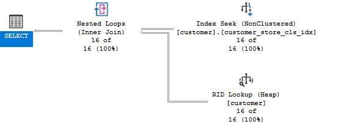

# Indeksy,  optymalizator <br>Lab 5

<!-- <style scoped>
 p,li {
    font-size: 12pt;
  }
</style>  -->

<!-- <style scoped>
 pre {
    font-size: 8pt;
  }
</style>  -->


---

**Imię i nazwisko:**

--- 

Celem ćwiczenia jest zapoznanie się z planami wykonania zapytań (execution plans), oraz z budową i możliwością wykorzystaniem indeksów (cz. 2.)

Swoje odpowiedzi wpisuj w miejsca oznaczone jako:

---
> Wyniki: 

```sql
--  ...
```

---

Ważne/wymagane są komentarze.

Zamieść kod rozwiązania oraz zrzuty ekranu pokazujące wyniki, (dołącz kod rozwiązania w formie tekstowej/źródłowej)

Zwróć uwagę na formatowanie kodu

## Oprogramowanie - co jest potrzebne?

Do wykonania ćwiczenia potrzebne jest następujące oprogramowanie
- MS SQL Server,
- SSMS - SQL Server Management Studio    
- przykładowa baza danych AdventureWorks2017.
    
Oprogramowanie dostępne jest na przygotowanej maszynie wirtualnej


## Przygotowanie  

Uruchom Microsoft SQL Managment Studio.
    
Stwórz swoją bazę danych o nazwie XYZ. 

```sql
create database lab5  
go  
  
use lab5  
go
```


## Dokumentacja/Literatura

Obowiązkowo:

- [https://docs.microsoft.com/en-us/sql/relational-databases/indexes/indexes](https://docs.microsoft.com/en-us/sql/relational-databases/indexes/indexes)
- [https://docs.microsoft.com/en-us/sql/relational-databases/sql-server-index-design-guide](https://docs.microsoft.com/en-us/sql/relational-databases/sql-server-index-design-guide)
- [https://www.simple-talk.com/sql/performance/14-sql-server-indexing-questions-you-were-too-shy-to-ask/](https://www.simple-talk.com/sql/performance/14-sql-server-indexing-questions-you-were-too-shy-to-ask/)

Materiały rozszerzające:
- [https://www.sqlshack.com/sql-server-query-execution-plans-examples-select-statement/](https://www.sqlshack.com/sql-server-query-execution-plans-examples-select-statement/)

<div style="page-break-after: always;"></div>

# Zadanie 1 - Indeksy klastrowane I nieklastrowane

Skopiuj tabelę `Customer` do swojej bazy danych:

```sql
select * into customer from adventureworks2017.sales.customer
```

Wykonaj analizy zapytań:

```sql
select * from customer where storeid = 594  
  
select * from customer where storeid between 594 and 610
```

Zanotuj czas zapytania oraz jego koszt koszt:

---
> Wyniki: 

Zapytanie nr1:
czas: 1/100 sekundy
koszt: ~0.14

Zapytanie nr2:
czas: 1/100 sekundy
koszt: ~0.14

W każdym z zapytań wykonanu full table scan


Dodaj indeks:

```sql
create  index customer_store_cls_idx on customer(storeid)
```

Jak zmienił się plan i czas? Czy jest możliwość optymalizacji?

Po dodaniu indeksu:

Zapytanie nr1:
czas: 1/100 sekundy
koszt: ~0.0065


Zapytanie nr2:
czas: 1/100 sekundy
cost: ~0.05



Jak widać zamiast full table scan, mamy index scan a następnie RID lookup

O ile czas wykonania znacząco się nie różni, to możemy zauważyć znaczące mniejszenie kosztu wykonania.


Dodaj indeks klastrowany:

```sql
create clustered index clustered_customer_store_cls_idx on customer(storeid)
```

Czy zmienił się plan i czas? Skomentuj dwa podejścia w wyszukiwaniu krotek.

Zapytanie nr1:
czas: 1/100 sekundy
kosz: ~0.003


Zapytanie nr2:
czas: 1/100 sekundy
koszt: ~0.003


W planie mamy tylko clustered index seek. W przypadku zapytania nr1 nie widzimy dużej korzyści z zastosowania clustered index. Rożnice widać za to w przypadku wybieraniu zakresu. Ponieważ clustered index fizycznie sortuje dane na dysku, kolejne wiersze z zakresu są umieszczone blisko siebie.

# Zadanie 2 – Indeksy zawierające dodatkowe atrybuty (dane z kolumn)

Celem zadania jest poznanie indeksów z przechowujących dodatkowe atrybuty (dane z kolumn)

Skopiuj tabelę `Person` do swojej bazy danych:

```sql
select businessentityid  
      ,persontype  
      ,namestyle  
      ,title  
      ,firstname  
      ,middlename  
      ,lastname  
      ,suffix  
      ,emailpromotion  
      ,rowguid  
      ,modifieddate  
into person  
from adventureworks2017.person.person
```
---

Wykonaj analizę planu dla trzech zapytań:

```sql
select * from [person] where lastname = 'Agbonile'  
  
select * from [person] where lastname = 'Agbonile' and firstname = 'Osarumwense'  
  
select * from [person] where firstname = 'Osarumwense'
```

Co można o nich powiedzieć?


---
> Wyniki: 


W każdym z przypadków system bazy danych jest zmuszony do przeskanowania całej tabeli w celu znalezienia wierszy spełniających kryterium.


Przygotuj indeks obejmujący te zapytania:

```sql
create index person_first_last_name_idx  
on person(lastname, firstname)
```

Sprawdź plan zapytania. Co się zmieniło?


---
> Wyniki: 


Jak widać teraz najpierw używany jest indeks a następnie RID lookup.
RID lookup jest wykonywany w celu uzyskania dodatkowych informacji o wierszu, które nie są przechowywane w indeksie.


Przeprowadź ponownie analizę zapytań tym razem dla parametrów: `FirstName = ‘Angela’` `LastName = ‘Price’`. (Trzy zapytania, różna kombinacja parametrów). 

Czym różni się ten plan od zapytania o `'Osarumwense Agbonile'` . Dlaczego tak jest?


---
> Wyniki: 

```sql
--  ...
```


# Zadanie 3

Skopiuj tabelę `PurchaseOrderDetail` do swojej bazy danych:

```sql
select * into purchaseorderdetail from  adventureworks2017.purchasing.purchaseorderdetail
```

Wykonaj analizę zapytania:

```sql
select rejectedqty, ((rejectedqty/orderqty)*100) as rejectionrate, productid, duedate  
from purchaseorderdetail  
order by rejectedqty desc, productid asc
```

Która część zapytania ma największy koszt?

---
> Wyniki: 


Największy koszt ma część zapytania obejmująca sortowanie. Stanowi ona 85% kosztu całości zapytania.

Jaki indeks można zastosować aby zoptymalizować koszt zapytania? Przygotuj polecenie tworzące index.


---
> Wyniki: 

Można dodać indeks na kolumny `rejectedqty` oraz `productid` z sekcją `include`, w której uwzględnimu kolumny, których dodatkowo potrzebujemy, czyli `orderqty` oraz `duedate`, aby nie trzeba było realizować dodatkowych odczytów dla każdego wiersza.

```sql
create index person_firspurchaseorderdetail_rejectedqty_productid_orderqty_duedate
on purchaseorderdetail (rejectedqty, productid) include (orderqty, duedate)
```

Ponownie wykonaj analizę zapytania:

---
> Wyniki: 


Koszt części zapytania obejmującej sortowanie wielokrotnie zmalał. Nadal jest to jednak najbardziej kosztowny element.

# Zadanie 4

Celem zadania jest porównanie indeksów zawierających wszystkie kolumny oraz indeksów przechowujących dodatkowe dane (dane z kolumn).

Skopiuj tabelę `Address` do swojej bazy danych:

```sql
select * into address from  adventureworks2017.person.address
```

W tej części będziemy analizować następujące zapytanie:

```sql
select addressline1, addressline2, city, stateprovinceid, postalcode  
from address  
where postalcode between n'98000' and n'99999'
```

```sql
create index address_postalcode_1  
on address (postalcode)  
include (addressline1, addressline2, city, stateprovinceid);  
go  
  
create index address_postalcode_2  
on address (postalcode, addressline1, addressline2, city, stateprovinceid);  
go
```


Czy jest widoczna różnica w zapytaniach? Jeśli tak to jaka? Aby wymusić użycie indeksu użyj `WITH(INDEX(Address_PostalCode_1))` po `FROM`:

> Wyniki: 

```sql
--  ...
```


Sprawdź rozmiar Indeksów:

```sql
select i.name as indexname, sum(s.used_page_count) * 8 as indexsizekb  
from sys.dm_db_partition_stats as s  
inner join sys.indexes as i on s.object_id = i.object_id and s.index_id = i.index_id  
where i.name = 'address_postalcode_1' or i.name = 'address_postalcode_2'  
group by i.name  
go
```


Który jest większy? Jak można skomentować te dwa podejścia do indeksowania? Które kolumny na to wpływają?


> Wyniki: 

```sql
--  ...
```


# Zadanie 5 – Indeksy z filtrami

Celem zadania jest poznanie indeksów z filtrami.

Skopiuj tabelę `BillOfMaterials` do swojej bazy danych:

```sql
select * into billofmaterials  
from adventureworks2017.production.billofmaterials
```


W tej części analizujemy zapytanie:

```sql
select productassemblyid, componentid, startdate  
from billofmaterials  
where enddate is not null  
    and componentid = 327  
    and startdate >= '2010-08-05'
```

Zastosuj indeks:

```sql
create nonclustered index billofmaterials_cond_idx  
    on billofmaterials (componentid, startdate)  
    where enddate is not null
```

Sprawdź czy działa. 

Przeanalizuj plan dla poniższego zapytania:

Czy indeks został użyty? Dlaczego?

> Wyniki: 

```sql
--  ...
```

Spróbuj wymusić indeks. Co się stało, dlaczego takie zachowanie?

> Wyniki: 

```sql
--  ...
```


---

Punktacja:

|         |     |
| ------- | --- |
| zadanie | pkt |
| 1       | 2   |
| 2       | 2   |
| 3       | 2   |
| 4       | 2   |
| 5       | 2   |
| razem   | 10  |
