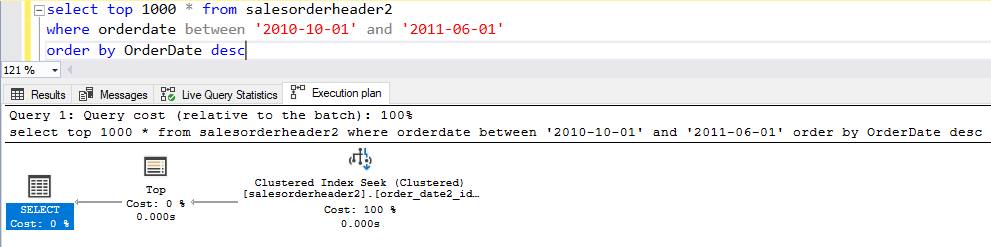
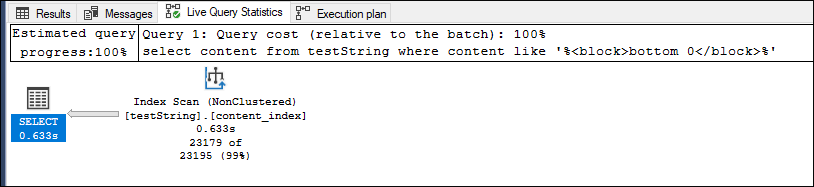

# Indeksy, optymalizator <br>Lab 6-7

<!-- <style scoped>
 p,li {
    font-size: 12pt;
  }
</style>  -->

<!-- <style scoped>
 pre {
    font-size: 8pt;
  }
</style>  -->

---

**Imię i nazwisko:**

Mateusz Skowron, Bartłomiej Wiśniewski, Karol Wrona

---

Celem ćwiczenia jest zapoznanie się z planami wykonania zapytań (execution plans), oraz z budową i możliwością wykorzystaniem indeksów (cz. 2.)

Swoje odpowiedzi wpisuj w miejsca oznaczone jako:

---

> Wyniki:

```sql
--  ...
```

---

Ważne/wymagane są komentarze.

Zamieść kod rozwiązania oraz zrzuty ekranu pokazujące wyniki, (dołącz kod rozwiązania w formie tekstowej/źródłowej)

Zwróć uwagę na formatowanie kodu

## Oprogramowanie - co jest potrzebne?

Do wykonania ćwiczenia potrzebne jest następujące oprogramowanie

- MS SQL Server,
- SSMS - SQL Server Management Studio
- przykładowa baza danych AdventureWorks2017.

Oprogramowanie dostępne jest na przygotowanej maszynie wirtualnej

## Przygotowanie

Stwórz swoją bazę danych o nazwie lab6.

```sql
create database lab5
go

use lab5
go
```

## Dokumentacja

Obowiązkowo:

- [https://docs.microsoft.com/en-us/sql/relational-databases/indexes/indexes](https://docs.microsoft.com/en-us/sql/relational-databases/indexes/indexes)
- [https://docs.microsoft.com/en-us/sql/relational-databases/indexes/create-filtered-indexes](https://docs.microsoft.com/en-us/sql/relational-databases/indexes/create-filtered-indexes)

# Zadanie 1

Skopiuj tabelę Product do swojej bazy danych:

```sql
select * into product from adventureworks2017.production.product
```

Stwórz indeks z warunkiem przedziałowym:

```sql
create nonclustered index product_range_idx
    on product (productsubcategoryid, listprice) include (name)
where productsubcategoryid >= 27 and productsubcategoryid <= 36
```

Sprawdź, czy indeks jest użyty w zapytaniu:

```sql
select name, productsubcategoryid, listprice
from product
where productsubcategoryid >= 27 and productsubcategoryid <= 36
```

Sprawdź, czy indeks jest użyty w zapytaniu, który jest dopełnieniem zbioru:

```sql
select name, productsubcategoryid, listprice
from product
where productsubcategoryid < 27 or productsubcategoryid > 36
```

Skomentuj oba zapytania. Czy indeks został użyty w którymś zapytaniu, dlaczego? Czy indeks nie został użyty w którymś zapytaniu, dlaczego? Jak działają indeksy z warunkiem?

---

> Wyniki:

Execution Plan dla zapytania 1:


Execution Plan dla zapytania 2:


Tylko pierwsze zapytanie wykorzystuje indeks. W drugim zapytaniu warunek jest przeciwieństwem warunku indeksu, dlatego indeks nie jest używany. Indeks z warunkiem działa tylko wtedy, gdy warunek jest spełniony. W przeciwnym przypadku indeks nie jest używany.

# Zadanie 2 – indeksy klastrujące

Celem zadania jest poznanie indeksów klastrujących

Skopiuj ponownie tabelę SalesOrderHeader do swojej bazy danych:

```sql
select * into salesorderheader2 from adventureworks2017.sales.salesorderheader
```


Wypisz sto pierwszych zamówień:

```sql
select top 100 * from salesorderheader2
order by orderdate
```


Stwórz indeks klastrujący według OrderDate:

```sql
create clustered index order_date2_idx on salesorderheader2(orderdate)
```


Wypisz ponownie sto pierwszych zamówień. Co się zmieniło?


---

> Wyniki:

W wynikach nie zmieniło się nic.

W analizie zapytań, możemy zauważyć, że w pierwszym przypadku, gdzie nie mamy indeksu jest realizowana operacja sortowania, która jest bardzo kosztowa i stanowi większą część kosztu zapytania. W drugim przypadku, dzięki zastosowaniu indeksu klastrującego na kolumnę, po której sortujemy w naszym zapytaniu pozbywamy się konieczności sortowania, czyli najbardziej kosztownej operacji, a więc koszt zapytania się zmniejsza.

Sprawdź zapytanie:

```sql
select top 1000 * from salesorderheader2
where orderdate between '2010-10-01' and '2011-06-01'
```

Dodaj sortowanie według OrderDate ASC i DESC. Czy indeks działa w obu przypadkach. Czy wykonywane jest dodatkowo sortowanie?

---

> Wyniki:

```sql
select top 1000 * from salesorderheader2
where orderdate between '2010-10-01' and '2011-06-01'
order by OrderDate asc
```


Widzimy, że indeks został wykorzystany, na co wskazuje operacja `Clustered Index Seek`. Nie jest wykonywane dodatkowe sortowanie.

```sql
select top 1000 * from salesorderheader2
where orderdate between '2010-10-01' and '2011-06-01'
order by OrderDate desc
```




Widzimy, że indeks został wykorzystany, na co wskazuje operacja `Clustered Index Seek`. Nie jest wykonywane dodatkowe sortowanie.

Indeks działa w obu przypadkach dzięki czemu w obu przypadkach unikamy konieczności sortowania.

# Zadanie 3 – indeksy column store

Celem zadania jest poznanie indeksów typu column store

Utwórz tabelę testową:

```sql
create table dbo.saleshistory(
 salesorderid int not null,
 salesorderdetailid int not null,
 carriertrackingnumber nvarchar(25) null,
 orderqty smallint not null,
 productid int not null,
 specialofferid int not null,
 unitprice money not null,
 unitpricediscount money not null,
 linetotal numeric(38, 6) not null,
 rowguid uniqueidentifier not null,
 modifieddate datetime not null
 )
```

Załóż indeks:

```sql
create clustered index saleshistory_idx
on saleshistory(salesorderdetailid)
```

Wypełnij tablicę danymi:

(UWAGA `GO 100` oznacza 100 krotne wykonanie polecenia. Jeżeli podejrzewasz, że Twój serwer może to zbyt przeciążyć, zacznij od GO 10, GO 20, GO 50 (w sumie już będzie 80))

```sql
insert into saleshistory
 select sh.*
 from adventureworks2017.sales.salesorderdetail sh
go 100
```

Sprawdź jak zachowa się zapytanie, które używa obecny indeks:

```sql
select productid, sum(unitprice), avg(unitprice), sum(orderqty), avg(orderqty)
from saleshistory
group by productid
order by productid
```

Załóż indeks typu ColumnStore:

```sql
create nonclustered columnstore index saleshistory_columnstore
 on saleshistory(unitprice, orderqty, productid)
```

Sprawdź różnicę pomiędzy przetwarzaniem w zależności od indeksów. Porównaj plany i opisz różnicę.

---

> Wyniki:

Zapytania zostały wykonane na tabeli z 52 mln wierszy

### Clustered index


Czas wykonania około: 8s

### Columnstore index

Zakładnie column store indexa trwało około: 41 sek

Czas wykonania: 0s


### Porównanie

Jak widać columnstore mimo dość długiego procesu zakładania indeksu, drastycznie zwiększa prędkość odczytu. Estimated Subtree Cost zwykłego indeksu to 360, columnstora to 6.

# Zadanie 4 – własne eksperymenty

Należy zaprojektować tabelę w bazie danych, lub wybrać dowolny schemat danych (poza używanymi na zajęciach), a następnie wypełnić ją danymi w taki sposób, aby zrealizować poszczególne punkty w analizie indeksów. Warto wygenerować sobie tabele o większym rozmiarze.

Do analizy, proszę uwzględnić następujące rodzaje indeksów:

- Klastrowane (np.  dla atrybutu nie będącego kluczem głównym)
- Nieklastrowane
- Indeksy wykorzystujące kilka atrybutów, indeksy include
- Filtered Index (Indeks warunkowy)
- Kolumnowe

## Analiza

Proszę przygotować zestaw zapytań do danych, które:

- wykorzystują poszczególne indeksy
- przy wymuszeniu indeksu działają gorzej, niż bez niego (lub pomimo założonego indeksu, tabela jest w pełni skanowana)

Odpowiedź powinna zawierać:

- Schemat tabeli
- Opis danych (ich rozmiar, zawartość, statystyki)
- Trzy indeksy
- Opis indeksu
- Przygotowane zapytania, wraz z wynikami z planów (zrzuty ekranow)
- Komentarze do zapytań, ich wyników
- Sprawdzenie, co proponuje Database Engine Tuning Advisor (porównanie czy udało się Państwu znaleźć odpowiednie indeksy do zapytania)

> Wyniki:

### Eksperyment 1 - Indeks warunkowy (Filtered Index)

Rozpoczynamy od stworzenia tabeli `Products`, która będzie przechowywać informacje o produktach, w tym nazwę, kategorię, cenę i ilość w magazynie. Następnie wypełniamy tę tabelę 20,000 rekordami.

```sql
CREATE TABLE Products (
    ProductID INT IDENTITY(1,1),
    ProductName NVARCHAR(255),
    Category NVARCHAR(50),
    Price DECIMAL(10,2),
    StockQuantity INT
);

DECLARE @i INT = 1;
WHILE @i <= 20000
BEGIN
    INSERT INTO Products (ProductName, Category, Price, StockQuantity)
    VALUES (
        CONCAT('Product', @i),
        CASE
            WHEN @i % 3 = 0 THEN 'Electronics'
            WHEN @i % 3 = 1 THEN 'Clothing'
            ELSE 'Books'
        END,
        RAND() * 1000,
        RAND() * 100
    );
    SET @i = @i + 1;
END;
```


Chcemy wybrać produkty z kategorii "Electronics".

```sql
SELECT ProductName, Price, StockQuantity FROM Products WHERE Category = 'Electronics'
```

Tworzymy indeks warunkowy na kolumnie Category dla kategorii "Electronics" i dodajemy pozostałe kolumny jako INCLUDE.

```sql
CREATE NONCLUSTERED INDEX IX_Filtered_Category_Electronics
ON Products (Category)
INCLUDE(ProductName, Price, StockQuantity)
WHERE Category = 'Electronics';
```

> Wyniki

**Bez indeksu**


Zapytanie wykonuje pełne skanowanie tabeli, aby znaleźć odpowiednie rekordy.

**Z indeksem w jego zasięgu**


Dzięki indeksowi, koszt zapytania jest znacznie niższy, a liczba operacji wejścia/wyjścia jest mniejsza.

**Z indeksem poza jego zasięgiem**


W tym przypadku, gdy warunek filtru nie jest spełniony, wykonuje się pełne skanowanie tabeli.

**Rekomendacja Database Engine Tuning Advisor**

Narzędzie sugeruje utworzenie identycznego indeksu z dodatkową rekomendacją uporządkowania kategorii rosnąco.


**Wnioski**

Indeks warunkowy jest skuteczny w przypadku, gdy zapytanie pokrywa się z jego warunkami. Jednakże, gdy warunki nie są spełnione, może dojść do pełnego skanowania tabeli, co jest kosztowne. Stosowanie tego rodzaju indeksów ma sens, gdy często wyszukujemy dane z konkretnie określonej kategorii.

### Eksperyment 2 - Indeks kolumnowy (Column Index)

Tworzymy tabelę `Orders`, która będzie przechowywać informacje o zamówieniach, w tym identyfikator klienta, produktu, datę zamówienia, ilość i łączną cenę. Następnie wypełniamy tę tabelę 50,000 rekordami.

```sql
CREATE TABLE Orders (
    OrderID INT IDENTITY(1,1),
    CustomerID INT,
    ProductID INT,
    OrderDate DATE,
    Quantity INT,
    TotalPrice DECIMAL(10,2)
);

DECLARE @i INT = 1;
WHILE @i <= 50000
BEGIN
    INSERT INTO Orders (CustomerID, ProductID, OrderDate, Quantity, TotalPrice)
    VALUES (
        FLOOR(RAND()*(100-1+1))+1,
        FLOOR(RAND()*(1000-1+1))+1,
        DATEADD(DAY, -RAND()*(365*10), GETDATE()),
        FLOOR(RAND()*(10-1+1))+1,
        RAND() * 1000
    );
    SET @i = @i + 1;
END;
```


Chcemy zsumować wartość zamówień dla określonego produktu w określonym przedziale czasowym.

```sql
SELECT ProductID, SUM(TotalPrice) AS TotalSales
FROM Orders
WHERE OrderDate BETWEEN '2022-01-01' AND '2022-12-31'
GROUP BY ProductID;
```

Tworzymy indeks kolumnowy na kolumnie TotalPrice.

```sql
CREATE NONCLUSTERED COLUMNSTORE INDEX IX_Column_TotalPrice
ON Orders (TotalPrice);
```

> Wyniki

**Bez indeksu**


Zapytanie wykonuje pełne skanowanie tabeli, aby obliczyć sumę wartości zamówień dla określonego przedziału czasowego.

**Z indeksem**


Dzięki indeksowi kolumnowemu, koszt zapytania jest znacznie niższy, ponieważ SZBD może szybko uzyskać dostęp do wartości TotalPrice, co umożliwia szybsze obliczenie sumy.
Bez wykorzystania indeksu operacja agregująca dane stanowi aż 33% kosztu zapytania, gdzie po wykorzystaniu indeksu ta wartość spada do 5% a jej koszt i czas wykonania są znacznie niższe i bliskie zeru.

**Rekomendacja Database Engine Tuning Advisor**


Narzędzie Database Engine Tuning Advisor sugeruje utworzenie indeksu, który ma kolumnę `TotalPrice` jako INCLUDE. Dzięki temu baza danych może efektywniej wykonywać operacje agregujące, takie jak suma wartości zamówień dla określonego przedziału czasowego, bo ma szybszy dostęp do tych danych.

**Wnioski**

Indeks kolumnowy doskonale nadaje się do zapytań analitycznych, które wymagają szybkiego dostępu do dużej ilości danych i obliczeń agregujących. Może znacznie poprawić wydajność zapytań, szczególnie tych, w których istotna jest suma kolumny.

### Eksperyment 3 - Indeksy wykorzystujące kilka atrybutów, indeksy include

Tworzymy tabelę `Customers`, która będzie przechowywać informacje o klientach, takie jak imię, nazwisko, miasto, kraj, numer telefonu i adres e-mail. Następnie wypełniamy tę tabelę 50,000 rekordami.

```sql
CREATE TABLE Customers (
    CustomerID INT IDENTITY(1,1),
    FirstName NVARCHAR(50),
    LastName NVARCHAR(50),
    City NVARCHAR(100),
    Country NVARCHAR(100),
    PhoneNumber NVARCHAR(20),
    Email NVARCHAR(100)
);

DECLARE @i INT = 1;
WHILE @i <= 50000
BEGIN
    INSERT INTO Customers (FirstName, LastName, City, Country, PhoneNumber, Email)
    VALUES (
        CONCAT('First', @i),
        CONCAT('Last', @i),
        CASE
            WHEN @i % 3 = 0 THEN 'New York'
            WHEN @i % 3 = 1 THEN 'Los Angeles'
            ELSE 'Chicago'
        END,
        CASE
            WHEN @i % 3 = 0 THEN 'USA'
            WHEN @i % 3 = 1 THEN 'USA'
            ELSE 'Canada'
        END,
        CONCAT('123-456-', @i),
        CONCAT('email', @i, '@example.com')
    );
    SET @i = @i + 1;
END;
```


Chcemy wyszukać klientów z danego miasta i kraju.

```sql
SELECT FirstName, LastName, PhoneNumber, Email
FROM Customers
WHERE City = 'New York' AND Country = 'USA';
```

Tworzymy indeks na kolumnach City i Country oraz include na FirstName, LastName, PhoneNumber, Email.

```sql
CREATE NONCLUSTERED INDEX IX_City_Country_Include
ON Customers (City, Country)
INCLUDE (FirstName, LastName, PhoneNumber, Email);
```

> Wyniki

**Bez indeksu**


Zapytanie wykonuje pełne skanowanie tabeli, aby znaleźć klientów spełniających warunki zapytania.

**Z indeksem**


Dzięki indeksowi, koszt zapytania jest znacznie niższy, ponieważ SZBD może szybko zlokalizować klientów z danego miasta i kraju za pomocą indeksu, a następnie uzyskać pozostałe dane z include.

**Rekomendacja Database Engine Tuning Advisor**

Narzędzie sugeruje utworzenie indeksu, który został przez nas zdefiniowany, bez dodatkowych rekomendacji.


**Wnioski**

Indeksy wykorzystujące kilka atrybutów, wraz z include, są przydatne w przypadkach, gdy zapytania obejmują wiele kolumn w warunkach wyszukiwania oraz dodatkowych kolumnach do wyświetlenia. Dzięki nim zapytania stają się bardziej wydajne, ponieważ SZBD może szybciej dostępować się do danych spełniających kryteria zapytania.

### Eksperyment 4 - Indeksownie napisów

#### Opis i cel

W tym eksperymencie zbadamy wydajność operacji wyszukiwania tekstu na tabeli `testString`. Tabela ta zawiera kolumnę `content`, która przechowuje duże bloki tekstu XML. Celem jest porównanie czasu i kosztu wykonania zapytań tekstowych przed i po dodaniu indeksu na kolumnie `content`.

#### Tworzenie tabeli i generowanie danych

Najpierw tworzymy tabelę `testString`:

```sql
CREATE TABLE testString (
    content VARCHAR(500),
    metadata1 VARCHAR(20),
    metadata2 VARCHAR(20),
    cnt INT
);
```

Następnie generujemy dane do tabeli:

```sql
DECLARE @i INT = 1;
WHILE @i <= 100000
BEGIN
    INSERT INTO testString (content, metadata1, metadata2, cnt)
    VALUES (
        '<root><block>bottom' + CAST(RAND() AS VARCHAR(10)) + '</block><within charge="habit"><modern>rice</modern><wore>14' + CAST(RAND() AS VARCHAR(10)) + '44283974</wore><jet solve="tribe">-421801468.1904454</jet></within><some>1167830737.' + CAST(RAND() AS VARCHAR(10)) + '</some></root>',
        'meta1',
        'value' + CAST(@i AS VARCHAR(10)),
        @i
    );
    SET @i = @i + 1;
END;
```

#### Zapytania

Będziemy wykonywać trzy różne zapytania tekstowe:

##### Zapytanie 1

Wyszukiwanie bloku tekstu zawierającego konkretną frazę `<block>bottom 0</block>`:

```sql
select content from testString where content like '%<block>bottom 0</block>%';
```

##### Zapytanie 2

Wyszukiwanie bloku tekstu zaczynającego się od `<root><block>bottom 0`:

```sql
select content from testString where content like '<root><block>bottom 0%';
```

##### Zapytanie 3

Wyszukiwanie bloku tekstu kończącego się na `313</fruit></root>`:

```sql
select content from testString where content like '%313</fruit></root>';
```

#### Wyniki bez indeksu

##### Zapytanie 1


##### Zapytanie 2


##### Zapytanie 3


Na tabeli nie ma indeksów, więc oczywiście trzeba przeskanować całą tabelę i ręcznie odfiltrować wyniki niepasujące do klauzuli `WHERE`.
Można zauważeyć, że w zależności tego czy wyszukiwany jest prefix, infix czy sufix czasy wyszukiwania są zancząco różne. Jest to spodziewane, te 3 "fixy" mają różny stopień skomplikowania w znalezieniu. Prefix jest najprostszy - wystarczy sprawdzić początek napisu, sufix wymaga jeszcze przejścia do końca napisu (w zależności od implementacji może to być kosztowne lub nie), a infix wymaga przeszukania całego napisu.

#### Dodanie Indeksu na kolumnie `content`

Tworzymy indeks _nonclustered_ na kolumnie `content`:

```sql
create nonclustered index content_index on testString (content);
```

Pierwotnie kolumna `content` była typu `text`, ale okazało się MS SQL Server nie wspiera indeksowaniwa kolumn tego typu. Wspiera natomiast indeksowanie kolumn o typie `varchar`.

#### Wyniki zapytań z indeksem

##### Zapytanie 1



##### Zapytanie 2


##### Zapytanie 3


Z indeksem wyszukiwanie infixu i sufixu używa `Index Scan` który jest bardzo podobny to `Table Scan`, ale używa danych zawartych w indeksie, a nie w tabeli. Zysk czasowy jest więc prawdopodobnie wynikiem ominięcia operacji I/O.
Wyszukiwanie prefixu za to używa `Index Seek`, które jest efektywnym wykorzystaniem struktury drzewa.
Widać tutaj, że MS SQL Server tworząc indeks `nonclustered` na polu `varchar` w żaden sposób nie optymalizuje go pod wyszukiwanie tekstowe (np. budując inny typ drzewa).

#### Wnioski

Dodanie indeksu na kolumnie `content` znacząco poprawia wydajność operacji wyszukiwania tekstu. Indeks umożliwia szybkie dostęp do danych, co prowadzi do znacznego skrócenia czasu wykonania zapytań i redukcji kosztów operacji. W przypadku tabel zawierających duże bloki tekstu, stosowanie indeksów może być kluczowe dla zapewnienia odpowiedniej wydajności operacji wyszukiwania tekstu.

### Eksperyment 5 - Kompresja tabeli - porównanie różnych metod

#### Opis i cel

W tym eksperymencie przeprowadzimy analizę różnych metod kompresji danych na bazie danych z ćwiczenia 3, zawierającej 58 milionów rekordów. Założenie eksperymentu zakłada, że mamy dużą tabelę z danymi archiwalnymi, na której operacje manipulacyjne (insert, update, delete) nie będą wykonywane, a głównie będą wykonywane operacje odczytu. Celem jest zbadanie, która metoda kompresji danych jest najskuteczniejsza.

#### Bez kompresji


Początkowo tabela zajmuje 5.86 GB.

Spróbujmy wykonać zapytanie z zadania 3.

```sql
select productid, sum(unitprice), avg(unitprice), sum(orderqty), avg(orderqty)
from saleshistory
group by productid
order by productid
```


Czas wykonania zapytania wynosi 3.66s


a jego koszt około 584.

#### Page compression

W pierszym kroku spróbujemy wykonać _Page Compression_. Kompresja ta składa się z trzech kroków:

- Row compression
- Prefix compression
- Dictionary compression

##### Row compression

Row compression optymalizuje dane na trzy sposoby:

1. Elimunuje narzut związany z metadanymi. Są to informacje odnośnie kolumn, ich długości, offsetów.
2. Używa pól o zmiennej długości aby przechowywać wartości numeryczne oraz typy oparte o typy numeryczne
3. Powyższa metoda stosowana jest także dla stringów, np. poprzez pomijanie pustych znaków

##### Prefix compression

Prefix compression polega na wyznaczeniu dla każdej kolumny pewenego prefixu który powtarza się w jak największej ilości wierszy. Prefix taki jest przenoszony do nagłówka strony. Ilustracje z dokumentacji MsSql:


##### Dictionary compression

Dictionary Compression wykonane jest po prefix comppresion i polega na stworzeniu słównika powtarzających się wartości. W przeciwieństwie do prefix compression nie jest ona ograniczona do jednej kolumny. Ilustracja:


##### Wyniki

```sql
ALTER TABLE dbo.saleshistory REBUILD PARTITION = ALL
WITH (DATA_COMPRESSION = PAGE);
```


Jak widać efekty tej kompresji są bardzo zadowolające. Tabela po kompresji zajmuje jedynie 0.729 GB.

##### Wydajność

Sprawdźmy ile czasu zajmie zapytanie z zadania 3:


Czas wykonania zapytania wynosi teraz 2.4s


a jego koszt pozostaje na poziomie około 584.

Jak widać w tym przypadku kompresja danych nie ma żadnego wypływu na szybkość tego zapytania.

#### Column store

Kompresja kolumnowa polega na zmianie sposobu przechowywania danych, gdzie kolumny są podzielone na segmenty, z których każdy jest niezależnie kompresowany. Tworzony jest również słownik kolumnowy dla unikalnych wartości w kolumnie, co pozwala na bardziej efektywne zarządzanie danymi powtarzającymi się.

Struktura kolumonowa jest szczególnie efektywna przy dużej ilości powtarzających się danych. Wyobraźmy sobie że mamy 10 wierszy z wartością _Joe_. W wierszowej reprezentacji dane przechowywane byłby w ten sposób:

```
1: Joe
2: Joe
3: Joe
.
.
.
```

W strukturze kolumnowej przechowywane są w następujący sposób:

```
Joe: 1, 2, 3, 4 ...
```

##### Wyniki

```sql
CREATE CLUSTERED COLUMNSTORE INDEX clustered_columnstore_idx ON dbo.saleshistory;
GO
```


Jak widać zysk z tej kompresji jest ogromny. Tabela zajmuje teraz zaledwie 0.014 GB.

##### Wydajność


Koszt zapytania wynosi tylko 6. Zatem nie tylko zyskaliśmy ogromną kompresje danych, ale także uzyskaliśmy przyspieszenie dla tego konkretnego zapytania.

#### Column store archive

Kompresja kolumnowa archive wykorzystuje specjalny algorytm XPRESS firmy Microsoft, będący implementacją algorytmu _LZ77_.

##### Wyniki

```sql
ALTER TABLE dbo.saleshistory REBUILD PARTITION = ALL
WITH (DATA_COMPRESSION =  COLUMNSTORE_ARCHIVE);
```


W ten sposób udało nam się zmiejszyć wielkość tabeli dwukrotnie, do 0.0075 GB.

##### Wydajność


Plan wykonania jest taki sam jak przypadku `Column store`. Czas i koszt zapytania jest również na prawie identycznym poziomie, choć jest tutaj niewiele niższy.

#### Wnioski


Analiza wykazała, że nawet podstawowa _Page Compression_ znacząco redukuje objętość danych, ale to _kompresja kolumnowa_ daje najbardziej imponujące wyniki. Dodanie _kolumnowego indeksu_ nie tylko drastycznie zmniejszyło objętość danych, ale także znacząco przyspieszyło wykonywanie zapytań. Warto zauważyć, że wykorzystanie _kolumnowego indeksu archive_ jeszcze bardziej zmniejszyło wielkość danych oraz koszt wykonania zapytań, co czyni go idealnym wyborem dla archiwalnych danych. Metody te są szczególnie efektywne w przypadku dużych tabel, na których przeważają operacje odczytu.

|         |     |     |     |
| ------- | --- | --- | --- |
| zadanie | pkt |     |     |
| 1       | 2   |     |     |
| 2       | 2   |     |     |
| 3       | 2   |     |     |
| 4       | 10  |     |     |
| razem   | 16  |     |     |
