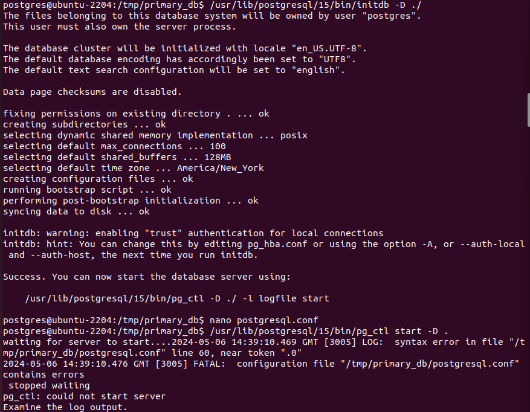
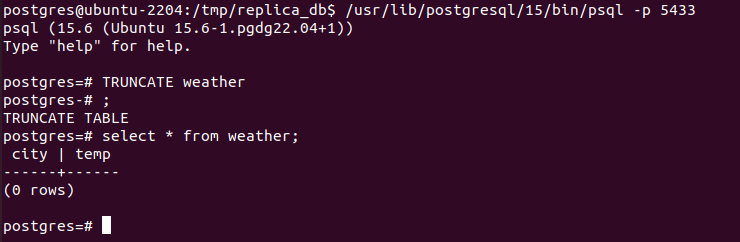

Zaczynamy od stworzenia folderu:

> mkdir primary_db

I w tym folderze wykonujemy:

> /usr/lib/postgresql/15/bin/initdb -D ./

Następnie zmodyfikowałem plik postgresql.conf i ustawiłem pola:

> listen_addres = '0.0.0.0'
> port = 5433

Następnie uruchomiłem instancje komendą:

> /usr/lib/postgresql/15/bin/pg_ctl start -D .

Następnie zalgowałem się do tej instancji w celu stworzenia usera repuser:

> CREATE ROLE repuser WITH REPLICATION, LOGIN;

todo zmiana konfiguracji

Następnia zrestartowałem serwis:

> /usr/lib/postgresql/15/bin/pg_ctl restart -D .

Następnie stworzyłem instancje repliki przy pomocy komendy:

> /usr/lib/postgresql/15/bin/pg_basebackup -h localhost -U repuser -p 5433 -D ./replica_db -R -C --slot=slot_name --checkpoint=fast

> ls -al

Następnie zmieniłem port w replice i wystartowałem instancje repliki

Po zalogowaniu się na primary instance i wywołaniu:

> select * from pg_stat_replication;

Natomiast po zalogowaniu się na backup instance i wywołaniu:

> select * from pg_stat_wal_receiver;

Następnie przetestowałem replikacje danych:

> psql -p 5433
> CREATE TABLE weather (city varchar(80), temp int);
> INSER INTO WEATHER ('Krakow', 26);

Sprawdźmy replike:

> psql -p 5434
> select * from weather

Sprawdzenie operacji truncate:

Sprawdzenie operacji delete:

Symulacja awari primary servera

przy pomocy komendy:

> pg_ctl stop -D ./primary_db

stopujemy primary server:

Jak widać dostajemy też errory z replica server

Zróbmy teraz ręcznego failovera przy pomocy komendy:

> pg_ctl promote -D ./replica_db

