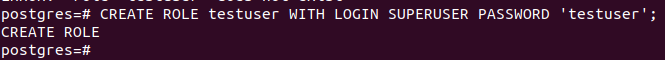
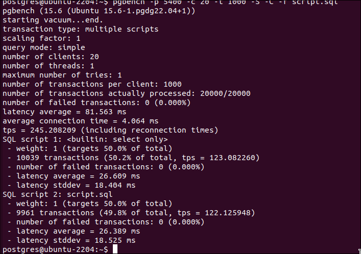
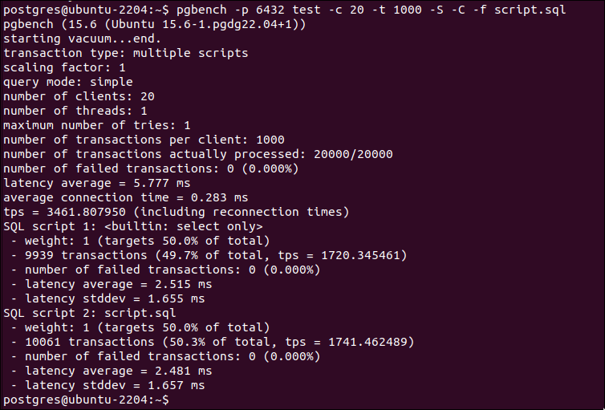

> ./initdb -D /tmp/test_db

Zmiana portu na:
```
port=5400
```

> pg_ctl -D /tmp/test_db -l /tmp/logfile start

> vi /etc/pgbouncer/pgbouncer.ini
```
test = host=localhost port=5400 dbname=postgres auth_user=testuser
auth_type = trust
```

W SQL:
> CREATE ROLE testuser WITH LOGIN SUPERUSER PASSWORD 'testuser';



> pgbouncer -d /etc/pgbouncer/pgbouncer.ini


> pgbench -p 5432 -i postgres


Uruchomienie benchmarka bezpośrednio na bazie
> pgbench -p 5400 -c 20 -t 1000 -S -C -f script.sql



Uruchomienie benchmarka za pośrednictwem pgbouncera
> pgbench -p 6432 test -c 20 -t 1000 -S -C -f script.sql


