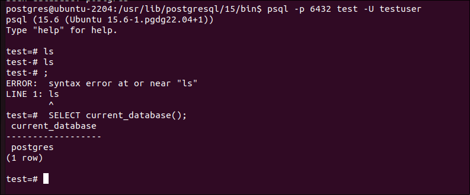
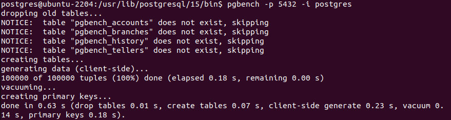

> ./initdb -D /tmp/test_db

Zmiana portu na:
```
port=5400
```

> pg_ctl -D /tmp/test_db -l /tmp/logfile start

> vi /etc/pgbouncer/pgbouncer.ini
```
test = host=localhost port=5400 dbname=postgres auth_user=testuser
auth_type = trust
```

W SQL:
> CREATE ROLE testuser WITH LOGIN SUPERUSER;


> pgbouncer -d /etc/pgbouncer/pgbouncer.ini




> pgbench -p 5400 -i postgres



> pgbench -p 5400 0c 20 -t 1000 -S postgres
astępnie uruchamiamy benchmark (polecenie pgbench) symulując działanie
20 aplikacji klienckich (-c) z których kazda powinna wykonać po 1000
transakcji (-t), benchmark wykonamy na bazie postgres (-S), dla każdej
transakcji istniejące polaczenie powinno zostać zamknięte i utworzone nowe
(-C), jako operacja wykonywana w ramach transkacji wskazujemy nasz
wcześniej utworzony „skrypt” (-f) i najpierw wykonujemy nasz benchmark
bezpośrednio na serwerze postgres (z pominieciem pgbouncera) a zatem
port na który się laczymy to 5432 (-p
